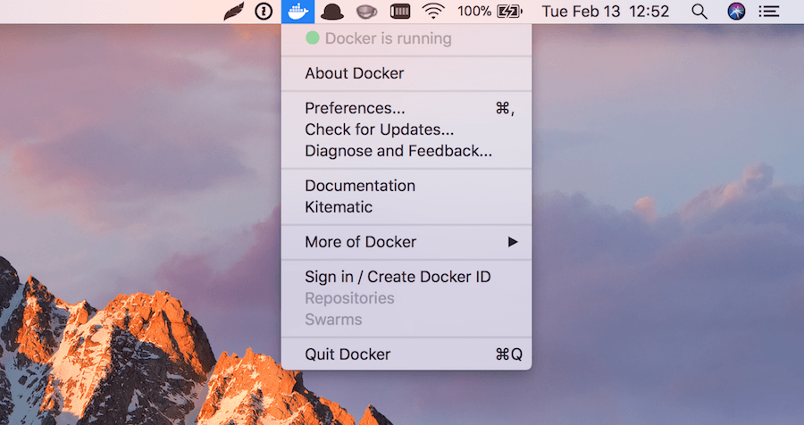

It's a bit inconvenience when working on a project that uses the Microsoft SQL Server while your dev machine is either Linux or macOS. I always ended up setting up and using a remote test database.

But now it's no longer the case. October last year, SQL Server 2017 for Linux finally went into general availability. It's container images are also available on [Docker hub](https://hub.docker.com/r/microsoft/mssql-server-linux/) for us to use. That means we can finally install SQL Server on macOS!



## Installing Docker

First, you're going to need Docker. If you haven't had it installed, heads up to the [Docker store](https://store.docker.com) website and download the [community edition for Mac](https://store.docker.com/editions/community/docker-ce-desktop-mac). Just follow the instructions, it's super easy to install.

Once it's installed, you'll have a new Docker icon on your menu bar. Click this icon and make sure that Docker is already.

{{}}

## Running SQL Server Container Image

Once you have Docker installed and running, open the terminal and run the following command to pull the latest version of SQL Server 2017 container image from Docker hub:

```bash
$ docker pull microsoft/mssql-server-linux:2017-latest
```

If you want to pull another version, just replace the `2017-latest` part with the desired tag. You can check all of the available tags on [Docker hub](https://hub.docker.com/r/microsoft/mssql-server-linux/tags/). For example, if want to pull the GA (General Availability) version instead, use the following command:

```bash
$ docker pull microsoft/mssql-server-linux:2017-GA
```

Once the image is pulled, you can run it on a new container using the following command:

```bash
$ docker run -d -p 1433:1433 --name awesome \
  -e 'ACCEPT_EULA=Y' -e 'MSSQL_SA_PASSWORD=P@55word' \
  microsoft/mssql-server-linux:2017-latest
```

- `-d`: Detached mode, run the container in the background.
- `-p`: Publish a container's port (second value) to the host (first value). In our case, SQL server is listening on port `1433` within the container and we expose it to the same port on the host.
- `--name`: Assign a name to the container, we named it `awesome` 😎.
- `-e`: Set environment variables. `ACCEPT_EULA=Y` to confirm your acceptance of the [licensing agreement](http://go.microsoft.com/fwlink/?LinkId=746388). `MSSQL_SA_PASSWORD=P@55word` set the password for the `sa` user (the default system administrator username). It must be at least 8 characters and contains three of the following categories: lowercase, uppercase, digits, and symbols.

To list all of the containers, run the following command:

```bash
$ docker ps -a
```

You should see the output similar to this:

```bash
CONTAINER ID  IMAGE                                     COMMAND                 CREATED         STATUS        PORTS                   NAMES
57e0a397b4d9  microsoft/mssql-server-linux:2017-latest  "/bin/sh -c /opt/mss…"  10 seconds ago  Up 5 seconds  0.0.0.0:1433->1433/tcp  awesome
```

Locate your `awesome` container and make sure that its `STATUS` column is `Up`. If the status is `Exited`, checkout the [troubleshooting guide](https://docs.microsoft.com/en-us/sql/linux/sql-server-linux-configure-docker#troubleshooting).

## Handy Tips & Tools

Congratulation! 🎉 You now have Microsoft SQL Server installed on your macOS machine! Here are some common Docker commands that might come in handy for you:

```bash
# Stop the `awesome` container
$ docker stop awesome

# Start the `awesome` container
$ docker start awesome

# Forcefully remove the `awesome` container
$ docker rm -f awesome

# Remove the pulled image
$ docker rmi microsoft/mssql-server-linux:2017-latest
```

It's a bit inconvenience to run the `sqlcmd` from within the container in order to work with the database. Luckily there are some tools that you can use for interfacing with SQL Server:

- [TablePlus](https://tableplus.io/): This is my favorite one. A native macOS application that works not only with MySQL and SQL Server databases but also Postgres and Redis!
- [SQL Operations Studio](https://docs.microsoft.com/en-us/sql/sql-operations-studio/download): This one is coming from Microsoft and can be run on Windows, macOS or Linux.
- [mssql for VS Code](https://marketplace.visualstudio.com/items?itemName=ms-mssql.mssql#overview): If you're using [Visual Studio Code](https://code.visualstudio.com/), this extension might come in handy.
- [sql-cli for Node](https://www.npmjs.com/package/sql-cli): If you're a fellow Javascript developer. You can install this `sql-cli` for Node globally. This way you'll have the quite similar `sqlcmd` feel.

Credits:
- Crates by Frank McKenna on [Unspash](https://unsplash.com/photos/tjX_sniNzgQ)
