PHP—akronim rekursif dari *PHP: Hypertext Preprocessor*)—merupakan bahasa pemrograman untuk web yang mulanya dikembangkan oleh Rasmus Lerdorf pada tahun 1994. PHP berjalan di sisi server (peladen) dan umumnya digunakan untuk membuat aplikasi berbasis web yang dinamis.

Meski sintaksis dan fiturnya kadang dikritik oleh programmer lain, PHP tetap populer dan mendominasi jagad internet. Perusahaan-perusahaan berbasis teknologi ternama mulai dari [Facebook](https://hhvm.com/), [Automattic](https://github.com/WordPress/WordPress) (Wordpress), [Slack](https://slack.engineering/taking-php-seriously-cf7a60065329), hingga [Wikipedia](https://en.wikipedia.org/wiki/Wikipedia:FAQ/Technical#What_software_is_used_to_run_Wikipedia?) masih setia dengan PHP yang sudah berumur lebih dari dua dekade ini. PHP pun kerap menjadi pilihan pertama untuk para pemula yang ingin belajar pemrograman.

Tutorial kali ini diperuntukan untuk pemula yang ingin belajar PHP serta dasar-dasar pemrograman. Apakah kamu siap menjadi pengembang PHP yang handal?


Sepanjang tutorial ini kita akan menemui sejumlah kotak dengan emoji seperti berikut:

* ⚠️ **Peringatan**: Berisi peringatan penting seputar keamanan, performa, dan potensi *bug*.
* 💡 **Informasi**: Berisi informasi tambahan seputar topik yang tengah dibahas.
* 👍🏻 **Tips & Trick**: Berisi tips dan trik yang berguna dalam membantu pekerjaan *programming* sehari-hari.
* 🎨 **Clean Code**: Berisi panduan penulisan kode yang baik.
* 📘 **Dokumentasi**: Berisi tautan ke dokumentasi atau artikel lain yang membahas lebih dalam suatu topik.



## Hello World

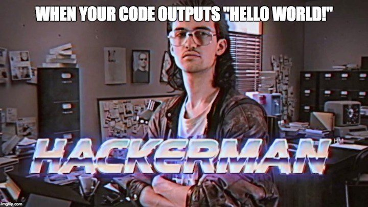

Langkah pertama, mari kita membuat program "Hello World" dalam PHP. Buka alamat website berikut: [repl.it/languages/php](https://repl.it/languages/php). Situs ini memungkinkan kita untuk menulis dan menjalankan program PHP secara *online* (daring). Tidak hanya PHP, situs ini juga mendukung sejumlah bahasa pemrograman lainnya: Java, Ruby, Python, hingga Haskell.

Tikan baris kode PHP berikut pada *input* (masukan) di sebelah kiri:

```php
echo 'Hello World!';
```

Selanjutnya, klik tombol dengan simbol "play" di bagian atas untuk menjalankan kode tersebut. *Output* (keluaran) dari program akan muncul di sebelah kanan layar. Jika berhasil, kita akan mendapatkan *output* teks berupa `Hello World!`.

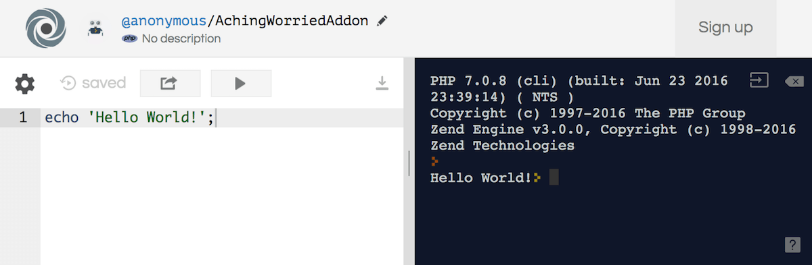

`echo` merupakan *keyword* dalam PHP untuk mencetak *string*. *String* adalah serangkaian karakter—dapat berupa huruf, angka, juga simbol. Dalam PHP, *string* harus diapit oleh tanda kutip tunggal (`'`) ataupun kutip ganda (`"`). Perbedaan keduanya akan dibahas lebih lanjut pada [bagian selanjutnya](#string). Penggunaan *string* tanpa kutip akan membuahkan *syntax error*.

```php
// Contoh string dengan kutip tunggal.
echo 'Aku string dengan kutip tunggal!';

// Contoh string dengan kutip ganda.
echo "Aku string dengan kutip ganda!";

// Tanpa kutip akan menghasilkan syntax error.
echo Aku pasti error;
```

> ⚠️ **Jangan lupa titik koma!**
>
> PHP mengharuskan setiap *statement* (baris instruksi) diakhiri dengan titik koma (`;`). Tanpa titik koma, program "Hello World" yang kita buat akan menghasilkan *syntax error*.

```php
// Tanpa diakhiri titik koma.
echo 'Hello World!'

// Error yang didapat:
syntax error, unexpected 'string' (T_STRING), expecting ',' or ';'
```

## Menginstal PHP

Sebelum mempelajari PHP lebih lanjut, mari kita menginstal PHP di komputer.

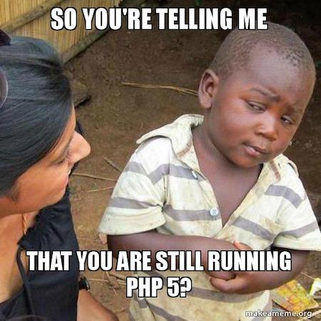

### Menginstal PHP di macOS

Beruntung macOS sudah menyertakan PHP di dalam sistem operasinya. Untuk mengecek instalasi PHP, buka aplikasi **iTerm** atau **Terminal**. Tikan perintah berikut di dalam terminal untuk mengecek versi PHP yang sudah terpasang:

```shell
$ php -v
```

Perintah di atas akan mencetak `output` berupa versi PHP yang terpasang:

```shell
PHP 7.2.4 (cli) (built: Mar 29 2018 15:19:46) ( NTS )
Copyright (c) 1997-2018 The PHP Group
Zend Engine v3.2.0, Copyright (c) 1998-2018 Zend Technologies
    with Zend OPcache v7.2.4, Copyright (c) 1999-2018, by Zend Technologies
```

#### Menginstal Homebrew

Biasanya versi PHP bawaan macOS sedikit tertinggal. Untuk menginstal versi teranyar, salah satu cara yang paling mudah adalah dengan menggunakan [Homebrew](https://brew.sh/). Homebrew ini merupakan *package manager* untuk macOS—layaknya dpkg pada Debian atau RPM pada Redhat.

Pertama, kita perlu menginstal aplikasi **Command Line Tools** dari Apple. Jalankan perintah berikut pada terminal:

```shell
$ xcode-select --install
```

Selanjutnya, tikan perintah berikut untuk menginstal Homebrew:

```shell
$ /usr/bin/ruby -e "$(curl -fsSL https://raw.githubusercontent.com/Homebrew/install/master/install)"
```

Setelah sukses menginstal Homebrew, kita bisa menggunakan perintah-perintah berikut:

```shell
# Untuk mengecek masalah pada instalasi Homebrew.
$ brew doctor

# Mencetak bantuan Homebrew.
$ brew help

# Memperbarui instalasi Homebrew dan daftar formulanya.
$ brew update
```

Sementara untuk mengorganisir formula (istilah *package* dalam Homebrew), kita bisa menjalankan peritah-perintah berikut:

```shell
# Untuk mencari formula.
$ brew search <teks pencarian>

# Untuk menginstal formula.
$ brew install <nama formula>

# Untuk menghapus instalasi formula.
$ brew uninstall <nama formula>

# Untuk memperbarui formula.
$ brew upgrade <name formula>

# Memperbarui semua formula yang sudah terpasang.
$ brew upgrade

# Mencetak semua formula yang sudah terpasang.
$ brew list
```

#### Memperbarui Homebrew

Untuk kamu yang sudah menginstal Homebrew sebelumnya, jangan lupa untuk menjalankan perintah berikut untuk memperbarui instalasi Homebrew beserta daftar formulanya:

```shell
$ brew update
```

#### Menginstal PHP dengan Homebrew

Jalankan perintah berikut di terminal untuk menginstal PHP:

```shell
$ brew install php
```

Setelah instalasi tuntas, *restart* terminal atau buka tab baru. Jalankan perintah berikut untuk memverifikasi versi PHP yang terpasang:

```shell
$ php -v
```

Pada saat artikel ini ditulis formula `php` akan menginstall PHP versi `7.2.4`.

> 💡 Saat tutorial ini ditulis, formula-formula pada `homebrew-php` tengah dalam proses penyatuan ke dalam *repository* utama [`homebrew-core`](https://github.com/Homebrew/homebrew-core). Dengan penyatuan ini kita tidak perlu lagi men-`tap` [`homebrew-php`](https://github.com/Homebrew/homebrew-php) untuk menginstall PHP. Ikuti diskusinya lebih lanjut [di sini](https://github.com/Homebrew/homebrew-php/issues/4721).

### Menginstal PHP di Ubuntu

Instalasi PHP pada Ubuntu dan distro Linux lainnya sangatlah mudah. *Package* PHP umumnya sudah tersedia pada *repository* bawaan. Pun begitu, versi PHP yang tersedia biasanya sedikit tertinggal.

Untuk mendapatkan PHP versi teranyar, kita bisa menambahkan PPA (Personal Package Archive) dari `ondrej/php`. Buka terminal dan jalankan perintah berikut:

```shell
$ sudo add-apt-repository ppa:ondrej/php
```

Setelah PPA ini berhasil ditambahkan, jangan lupa untuk memperbarui daftar *package* pada komputer dengan menjalankan perintah berikut:

```shell
$ sudo apt-get update
```

Gunakan perintah `apt-cache search` untuk mencari versi PHP yang diinginkan:

```shell
$ sudo apt-cache search php7.2
```

Jalankan perintah berikut untuk menginstall PHP versi 7.2:

```shell
$ sudo apt-get install php7.2 -y
```

Untuk memverifikasi versi PHP yang terpasang, jalankan perintah berikut di terminal:

```shell
$ php -v
```

### Menginstal PHP di Windows

Sayangnya penulis tidak berpengalaman dengan sistem operasi Windows. Untungnya ada sejumlah *bundle* aplikasi yang mudah untuk dipasang dan umumnya menyertakan paket komplit mulai dari PHP, web *server*, hingga *database*. Berikut beberapa pilihan populer:

#### XAMPP

[XAMPP](https://www.apachefriends.org) merupakan salah satu *bundle* aplikasi yang populer untuk bekerja dengan PHP di Windows. Selain PHP, dalam *bundle*-nya ia turut menyertakan Apache sebagai web server dan MariaDB (*fork* dari MySQL yang dikembangkan komunitas) untuk *database*-nya. XAMPP juga menyertakan phpMyAdmin untuk mempermudah kerja dengan database.

> 📘 Cek tutorial [Cara Menggunakan XAMPP untuk Menjalankan PHP & MySQL](https://www.niagahoster.co.id/blog/cara-menggunakan-xampp/) dari Niagahoster.

#### Laragon


Dibandingkan dengan XAMPP, [Laragon](https://www.laragon.org) relatif lebih modern dan menawarkan banyak fitur. Untuk web *server*, Laragon menyertakan Apache dan Nginx. Untuk *database*-nya, Laragon mengandalkan MySQL. Selain itu Laragon menyediakan beragam *tools* esensial: Git, Composer, Node.js hingga Yarn. Dengan Laragon kita juga dapat dengan mudah membuat proyek berbasis Wordpress, Symfony, Laravel hingga Drupal. Fitur lainnya yang menggiurkan adalah kemampuannya untuk membuat *virtual host* secara otomatis.

Cek [dokumentasi resmi Laragon](https://www.laragon.org/docs/install.html) untuk mempelajari cara menginstal dan ragam fitur yang ditawarkan.

#### Aplikasi Alternatif Lainnya

Selain dua *bundle* aplikasi di atas, masih banyak alternatif lainnya yang bisa kamu coba:

- [MAMP](https://www.mamp.info/) - *bundle* aplikasi PHP, Apache, Nginx, MySQL dan Python.
- [WampServer](http://www.wampserver.com/) - *bundle* aplikasi PHP, Apache dan MySql.
- [PHP for Windows](https://windows.php.net/download/) - jika kamu ingin menginstal PHP langsung dari *binaries* nya.

## Memilih Text Editor

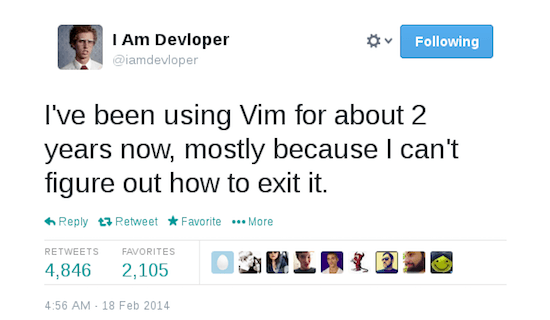

Yang kita butuhkan selanjutnya adalah *text editor* (editor teks) yang mumpuni. Ada banyak pilihan *text editor* di luar sana. Berikut adalah dua *text editor* yang cocok untuk pemula:

### Sublime Text

[Sublime Text](https://www.sublimetext.com/) merupakan salah satu *text editor* yang sangat populer. Ia tersohor karena ringan dan cepat, bahkan saat membuka file dengan ukuran yang sangat besar. Meski tak sepenuhnya gratis, ia memberikan waktu *trial* selamanya. Sayangnya, karena dikembangkan seorang diri, pembaruan aplikasinya sangat jarang.

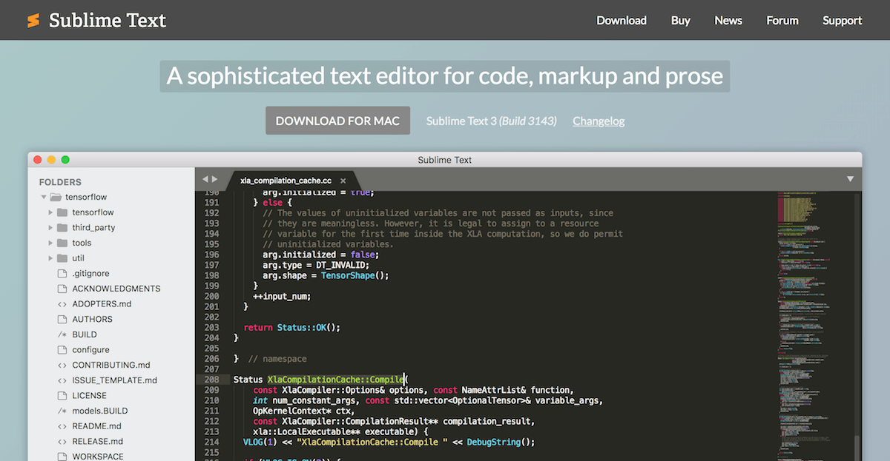

### Visual Studio Code

[Visual Studio Code](https://code.visualstudio.com/) atau VSCode merupakan *text editor* *open source* dari Microsoft yang akhir-akhir ini popularitasnya kian menanjak. Ia dikembangkan berdasarkan *text editor* [Atom](https://atom.io/) besutan Github. VSCode menawarkan fitur yang mutakhir untuk sebuah *text editor*: *auto-completion* dengan *IntelliSense*, *debugger*, integrasi Git, serta *built-in* terminal yang sangat responsif.

Dukungan komunitasnya juga sangat besar. Pengembangan *text editor*-nya sangat aktif serta banyak *extension* yang tersedia untuk mempermudah pekerjaan *coding* sehari-hari.

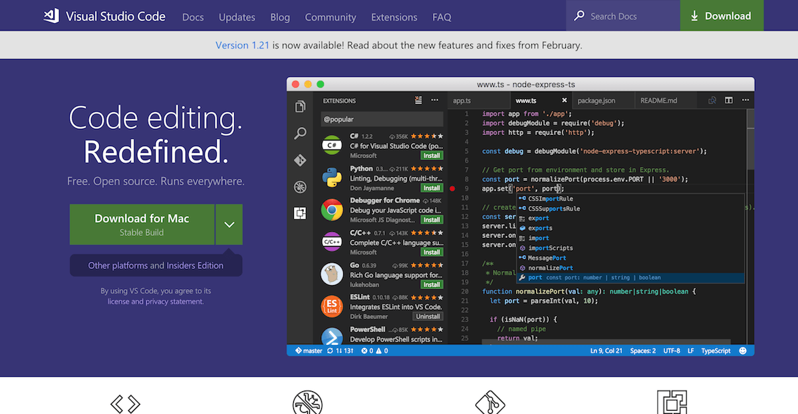

## Hello Again, World

Pada bagian sebelumnya, kita telah berhasil menjalankan kode PHP di situs [repl.it](https://repl.it). Dengan PHP yang sudah terpasang, mari kita belajar menjalankan kode PHP di komputer kita sendiri.

### PHP Interactive Shell

REPL sebenarnya merupakan akronim dari: Read–Eval–Print Loop. Ia berupa *interactive shell* dimana kita bisa memasukan kode yang akan langsung dieksekusi dan ditampilkan hasilnya di dalam *shell* itu sendiri. Banyak bahasa pemrograman yang menyediakan fitur seperti REPL ini, termasuk PHP.

Untuk menjalankan *interactive shell* dari PHP, buka terminal dan jalankan perintah berikut:

```shell
$ php -a
```

Jika perintah di atas berhasil, kita akan mendapati kursor berada di sebelah kanan teks `php >`. Tanda `php >` ini berarti `shell` siap untuk menerima masukan kode.

```shell
$ php -a
Interactive shell

php >
```

> 📘 **Tidak berhasil di Windows?**
>
> Bila perintah di atas tidak berjalan di Windows, ada kemungkinan lokasi dari aplikasi PHP yang terpasang tidak tidak terdaftar di *environtment variables*. Sayangnya penulis tidak familiar dengan sistem operasi yang satu ini. Sila baca tulisan dari web Petani Kode berikut: [Cara Menjalankan PHP Melalui CMD](https://www.petanikode.com/php-cmd/).

Tikan kode "Hello World" yang kita buat sebelumnya. Namun kali ini ganti teksnya dengan `Hello Again, World!`. Tekan `enter` untuk menjalankan kode. Jika berhasil kita akan mendapati teks tersebut tercetak di layar terminal:

```shell
php > echo 'Hello again, World!';
Hello again, World!
```

> 👍🏻 **Tab completion pada interactive shell**
>
> Jika hanya ada satu kemungkinan untuk *auto-completion*, menekan tombol *tab* satu kali akan otomatis melengkapi kode kita. Jika ada beberapa kemungkinan, tekan tombol `tab` dua kali untuk mencetak semua kemungkinan *auto-completion*.

### Menyimpan Kode PHP dalam File

Sekarang kita belajar menyimpan kode PHP di dalam *file*. Buka *text editor* yang telah kita pasang. Dengan *text editor*, buatlah sebuah *file* baru dan tikan kode PHP berikut:

```php
<?php
// 01_hello.php

echo 'Hello again, World!';

?>
```

Simpan *file* tersebut di lokasi yang mudah dicari; misalnya dalam direktori `belajar-php` di `Document`. Beri nama *file* tersebut: `01_hello.php`. Pastikan *file* tersimpan dengan ekstensi `.php`.

#### PHP Tags

Berbeda saat di dalam *interactive shell*, kode PHP dalam sebuah file harus diapit di antara tag pembuka `<?php` dan tag penutup `?>`. Ini karena di dalam PHP, kita diperbolehkan untuk menyisipkan jenis dokumen lain; dokumen HTML misalnya. Tag pembuka dan penutup ini akan memberitahu *parser* di mana kode PHP di mulai dan berakhir.

```php
<?php

echo 'Hello from PHP 🐘';

?>

<h1>Hello from HTML 👋</h1>

<?php

echo 'Hello again from PHP 🐘';

?>
```

Bila kode PHP di antara kedua tag hanya terdiri dari satu baris *statement*, kita bisa menempatkan tag pembuka dan penutup di baris yang sama seperti ini:

```php
<?php echo 'Hello from PHP 🐘'; ?>

<h1>Hello from HTML 👋</h1>

<?php echo 'Hello again from PHP 🐘'; ?>
```

> 📘 Baca lebih lanjut di dokumentasi: [PHP Tags](https://secure.php.net/manual/en/language.basic-syntax.phptags.php).

> ⚠️ **Mencampurkan kode PHP dan HTML adalah praktik yang buruk**
>
> Seperti contoh di atas, mencampurkan kode PHP dan HTML dianggap praktik yang tidak baik. Ia bisa menjadi indikasi kurangnya [*separation of concerns*](https://en.wikipedia.org/wiki/Separation_of_concerns). Serta merupakan salah satu celah keamanan yang bisa dieksploitasi—misalnya saat meng-`echo` data masukan dari pengguna lantas kita lalai men-*sanitize* input & tidak meng-*escape* output.
>
> Untuk saat ini, kita kesampingkan dulu. Karena topik ini relatif lebih sulit untuk pemula.

#### Lupakan Tag Penutup

Jika file tersebut hanya ada kode PHP di dalamnya, kita tidak perlu menuliskan tag penutup `?>`. Dan umumnya, ini yang dipraktikan sejumlah *developer* PHP. Mari kita hilangkan tag penutup dari file `01_hello.php` kita:

```php
<?php
// 01_hello.php

echo 'Hello again, World!';
```

Jangan lupa simpan perubahan di atas. Tugas kita sekarang adalah menjalankan file PHP tersebut!


> 💡 **Tag pembuka tidak akan disertakan pada contoh kode**
>
> Pada contoh-contoh kode berikutnya, kita sengaja tidak akan menyertakan tag pembuka `<?php` agar lebih ringkas. Jadi jika kamu menyalin contoh kode, jangan lupa untuk menambahkan kode pembuka.

### Menjalankan file PHP dengan Command Line

Salah satu cara untuk menjalankan file PHP adalah dengan melalui *command line* atau terminal. Buka terminal dan masuk ke dalam direktori tempat kamu menyimpan file `01_hello.php`.

```shell
$ cd ~/Documents/belajar-php
```

`cd` (akronim dari *change directory*) adalah perintah untuk merubah lokasi dari direktori kerja pada terminal. Arahkan pada direktori tempat kita menyimpan file `01_hello.php`. Penulis menggunakan sistem operasi macOS dan menyimpan file PHP tersebut di dalam direktori `belajar-php` pada `Documents`. Jika kamu menggunakan Windows dan menyimpannya pada `My Documents`, secara `default` lokasi `My Documents` berada di:

```shell
$ cd C:\Users\<nama user>\Documents\belajar-php
```

Setelah berada di dalam direktori `belajar-php`, tikan perintah berikut di terminal untuk menjalankan file `01_hello.php`:

```shell
$ php 01_hello.php
```

Jika berhasil, kita akan mendapatkan teks `Hello again, World!` tercetak di layar. Sebenarnya kita juga bisa menggunakan *absolute path* tanpa harus `cd` ke direktory `belajar-php`:

```shell
$ php ~/Documents/belajar-php/01_hello.php
```

> 📘 Baca lebih lanjut di dokumentasi: [Executing PHP files](https://secure.php.net/manual/en/features.commandline.usage.php).

### Menjalankan file PHP dengan Web Server

Cara kedua untuk menjalankan file PHP adalah dengan web server. Cara inilah yang paling umum digunakan.

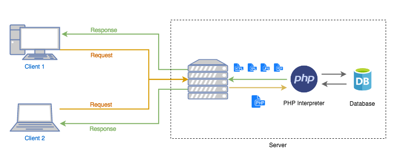

Bila disederhanakan, alurnya seperti ini:

1. *Client* memasukan alamat dari sebuah web pada peramban atau *browser*. Lalu *browser* mengirimkan *request* untuk sebuah laman web atau dokumen ini ke *server*.
2. *Request* dari *client* diterima web *server*. Apabila dokumen yang diminta berupa file statis (seperti file HTML, gambar, CSS, atau Javascript), umumnya web *server* dapat melayani permintaan dokumen tersebut secara langsung. Web *server* kemudian akan mengirimkan respon kepada *client* berupa dokumen yang diminta.
3. Namun bila dokumen yang diminta tersebut adalah file PHP, web *server* akan meneruskan file tersebut ke PHP *interpreter* untuk diproses terlebih dahulu.
4. Hasil keluaran dari file PHP inilah yang kemudian akan dikirimkan ke *client* oleh web *server*. Keluarannya dapat berupa teks, laman HTML, XML, JSON, hingga dokumen berupa PDF atau JPEG.

Ada banyak pilihan web *server* yang bisa kita gunakan. Sejak versi 5.4, PHP sendiri sudah menyertakan web *server* bawaan yang siap digunakan untuk kepentingan *development*. Untuk mempermudah, dalam tutorial ini kita cukup menggunakan web *server* bawaan PHP.

> ⚠️ **Web server bawaan PHP bukan untuk production!**
>
> Web *server* bawaan PHP ini berjalan dalam *single-threaded process* sehingga hanya mampu mengolah satu *request* dalam satu waktu. Web *server* bawaan ini hanya diperuntukan untuk kepentingan *development*. Untuk *production* gunakanlah web *server* yang performanya sudah teruji seperti Nginx atau Apache.

Buka kembali terminal, dan arahkan lokasi dari direktori kerja ke direktori tempat kita menyimpan file `01_hello.php`:

```shell
$ cd ~/Documents/belajar-php
```

Kemudian tikan perintah berikut untuk menjalankan web server bawaan PHP:

```shell
$ php -S localhost:8000
```

Bila berhasil, web server akan berjalan pada alamat `localhost` dan *port* `8000`. Keluaran seperti berikut akan tercetak pada layar terminal:

```shell
PHP 7.2.4 Development Server started at Sat Apr 20 19:01:12 2018
Listening on http://localhost:8000
Document root is /Users/risan/Documents/belajar-php
Press Ctrl-C to quit.
```

Buka *browser* dan masukan alamat [localhost:8000/01_hello.php](http://localhost:8000/01_hello.php). Kita akan mendapati teks `Hello again, World!` tercetak pada layar *browser*.

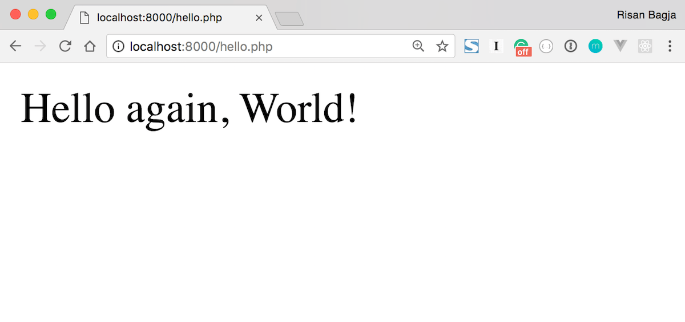

> 📘 Baca lebih lanjut di dokumentasi: [Built-in web server](https://secure.php.net/manual/en/features.commandline.webserver.php).

Dengan `echo`, kita juga bisa mencetak tag HTML. Ubah *file* `01_hello.php` seperti kode berikut dan coba jalankan kembali di *browser*. Teks `Hello again, World!` akan tercetak besar sekarang.

```php
<?php
// 01_hello.php

echo '<h1>Hello again, World!</h1>';
```

Dalam jaringan komputer, `localhost` berarti "komputer ini"—komputer yang tengah kita pakai. Secara *default*, `localhost` akan di-*resolve* ke dalam IP `127.0.0.1`. Dalam skema ini komputer kita menjadi *client* sekaligus *server*-nya.

Nomor `port` yang digunakan pun tidak harus `8000`, bisa `3000`, `4000` atau `9000`. Selama nomor *port* yang digunakan `>= 1024` dan tidak sedang digunakan oleh aplikasi lain.

> 💡 **Default Port untuk HTTP & HTTPS**
>
> Mungkin kamu bertanya-tanya: mengapa saat membuka laman facebook, kita tidak perlu mencantumkan nomor *port*? Cukup: `https://www.facebook.com`. Mengapa kita perlu mencantumkan nomor *port* pada contoh di atas?
>
> Ini karena web server Facebook dan situs-situs lainya menggunakan *port default* yang disediakan untuk HTTP & HTTPS. HTTP merupakan protokol yang menjadi fondasi komunikasi data pada jaringan internet. Layanan HTTP ini menggunakan *port* 80 sementara HTTPS menggunakan *port* 443.
>
> Apabila web server kita menggunakan *port* diluar `80` atau `443`, maka kita perlu mencantumkan nomor *port* yang digunakan; seperti pada contoh di atas: `localhost:8000`. Kamu bisa saja mengakses Facebook dengan mencantumkan *port*-nya: [`www.facebook.com:443`](https://www.facebook.com:443).

🎉 Selamat kamu telah berhasil menjalankan file PHP dengan web server!


### Latihan Membuat File PHP

Untuk latihan, buatlah *file* baru dengan nama `02_hello_php_html.php`. Tikan kode berikut:

```php
<?php echo 'Hello from PHP 🐘'; ?>

<h1>Hello from HTML 👋</h1>

<?php

echo '<h1>Hello from PHP again 🐘<h1>';
echo '';
```

Perhatikan kembali bagaimana kita menyisipkan dokumen HTML ke dalam file PHP. Juga cermati *tag* penutup php yang tidak disertakan di bagian akhir *file*.

Jangan lupa simpan *file* `02_hello_php_html.php` di atas dan coba jalankan pada *browser*, kita akan mendapatkan tampilan seperti berikut:


### Rangkuman Membuat File PHP

Dari subbab ini kita bisa menyimpulkan beberapa poin:

1. Kita bisa mencampurkan *file* PHP dengan dokumen lain (HTML misalnya).
2. Mencampurkan *file* PHP dengan dokumen HTML dianggap sebagai praktik yang buruk.
3. File PHP tidak butuh tag penutup (`?>`), kecuali kita ingin menyisipkan dokumen lain setelahnya.
4. Kita bisa mencetak tag HTML dalam kode PHP.
5. *Server* bawaan PHP hanya untuk kepentingan pengembangan, jangan gunakan untuk *production*!

## Pengetahuan Dasar Syntax PHP

### Komentar dalam PHP

*Comment* atau komentar adalah bagian yang tidak diikutsertakan dalam eksekusi sebuah program. Ia bertujuan sebagai catatan atau pengingat untuk pengembang.

Umumnya ia digunakan untuk:

* Menjelaskan alur program yang rumit.
* Justifikasi atau alasan mengapa kita menerapkan suatu algoritma atau solusi tertentu.
* Sebagai dokumentasi untuk sebuah kelas atau fungsi (akan kita bahas nanti).

Dalam PHP sendiri, komentar bisa satu baris ataupun lebih. Untuk komentar satu baris yang pendek, gunakan dua garis miring: `//`

```php
// Bisa dalam baris tersendiri.
echo 'Hello, World 🌏';

echo 'Hello, Tatooine 👽'; // Atau sebaris dengan kode.
```

Untuk komentar satu baris, PHP juga mendukung komentar *ala shell-style* dengan tanda pagar: `#`. Pun begitu umumnya *developer* PHP jarang menggunakannya.

```php
# Komentar ala shell-style.
echo 'Hello, Alderaan 👋';

echo 'Hello, Dagobah 🤺'; # Jarang digunakan developer PHP.
```

Bila komentarnya cukup panjang, kita bisa menuliskannya dalam beberapa baris; mengapitnya dengan tanda `/*` dan `*/`:

```php
/* Contoh komentar multi-baris.
Gunakan jika kamu harus menuliskan komentar yang panjang. */
echo 'Hello, Naboo 👸🏻';
```

Komentar multi-baris ini umumnya digunakan untuk mendokumentasikan suatu kelas atau metode seperti berikut:

```php
/**
 * Get the version number of the application.
 *
 * @return string
 */
public function version()
{
    return static::VERSION;
}
```

> 🎨 **Hati-hati dalam menuliskan komentar!**
>
> Meski berguna sebagai catatan atau pengingat, komentar pada kode bisa jadi sebuah indikasi kurangnya tingkat *readibility* (keterbacaan) dari kode yang kita tulis. Kode yang baik harus mudah dibaca dan mudah dipahami tujuannya, meski tanpa komentar.
>
> Baca lebih lanjut di buku [Clean Code](https://www.amazon.com/Clean-Code-Handbook-Software-Craftsmanship/dp/0132350882) karya Robert C. Buku ini sangat direkomendasikan untuk para *programmer*. Salah satu bahasannya adalah tentang penggunaan komentar.


### PHP itu Case Insensitive, Tapi

Hampir semua penulisan *syntax* pada PHP itu *case insensitive*—huruf kecil atau huruf besar tidak berpengaruh. Mulai dari *keywords* (seperti `echo`, `if`, `for`, dan lainnya), nama-nama fungsi, hingga nama-nama kelas; semuanya *case insensitive*. Perhatikan ragam penulisan kode-kode berikut (tak perlu khawatir jika kodenya tidak dimengerti).

```php
echo 'Hello, World!';
EcHo 'Hello, World!'; // Hasilnya sama-sama valid.

echo strtoupper('Huruf Besar'); // Fungsi merubah ke huruf besar.
echo StrToUPPer('Huruf Besar'); // Nama fungsi case insensitive.

$dateTime1 = new DateTime(); // Kelas untuk tanggal dan waktu.
$dateTime2 = new dATeTiMe(); // Nama kelas pun case insensitive.

echo $dateTime1->getTimestamp(); // Metode untuk mendapatkan unix timestamp.
echo $dateTime2->GetTiMEsTAmp(); // Nama metode pun case insensitve.
```

Tapi lain halnya dengan *variable*. *Variable* pada PHP itu *case sensitive*—di mana besar kecilnya huruf berpengaruh.

```php
$message = 'Hello, World!';

echo $message; // Berhasil mencetak output tanpa pesan error.
echo $mEssAge; // Akan membuahkan pesan error.
```

> 🎨 **Konsistensi dalam penulisan kode itu penting**
>
> Meski hampir semua *syntax* dalam PHP itu *case insensitive*. Konsistensi penulisan besar-kecilnya huruf juga penting. Untuk *keywords* seperti `echo` juga fungsi-fungsi bawaan seperti `strtoupper()`, selalu gunakan huruf kecil. Untuk nama-nama kelas, gunakan *studly caps* seperti `DateTime`. Sementara untuk nama *method*, gunakan *camel case* seperti `getTimestamp()`.
>
> Komunitas PHP sendiri memiliki standard penulisan kode yang dituangkan dalam panduan: [PSR-1](https://www.php-fig.org/psr/psr-1/) dan [PSR-2](https://www.php-fig.org/psr/psr-2/).

### Latihan Dasar Syntax PHP

Sebagai latihan buatlah *file* baru dengan nama `03_basic_syntax.php` lalu tikan kode berikut:

```php
<?php
// 03_comments_and_case_sensitivity.php

// This is a one-line comment.
echo 'Hello, World 🌏'; // Comment can be inline right after the code.

# This is shell-style comment example.
# The following code proves that PHP keyword is case insensitive.
ECHO 'HELLO SUN 🌞';

/*
This is a multiple-lines comment example.
PHP is case-insensitive except for a variable name!
Thus $message and $MESSAGE are two different variables.
*/
$message = 'hello lower case!';
$MESSAGE = 'HELLO UPPER CASE!';

echo $message;
echo $MESSAGE;
```

Perhatikan kembali tiga cara penulisan komentar di atas. Cermati juga bahwa PHP *case-sensitive* untuk penamaan *variable* saja.

### Rangkuman Komentar dan Case Sensitivity dalam PHP

Dari subbab ini kita bisa menyimpulkan poin-poin berikut:

1. Komentar tidak diikutsertakan dalam eksekusi kode.
2. Dalam PHP ada tiga cara untuk menuliskan komentar: dengan tanda `//`, *shell-style* dengan tanda `#`, serta `/*...*/` untuk komentar multi-baris.
3. Hati-hati dalam menuliskan kode, karena ia bisa menjadi indikasi rendahnya tingkat *readibility* dari kode yang kita tuliskan.
4. PHP itu *case-insenstive*, kecuali untuk penulisan nama *variable*.
5. Meski PHP *case-insensitive*, konsistensi dalam penulisan kode itu sangat penting. Selalu gunakan huruf kecil untuk *keyword* atau fungsi-fungsi bawaan PHP, gunakan *studly caps* untuk nama kelas dan *camel case* untuk nama metode.

## Variable dalam PHP

*Variable* berfungsi untuk menampung sebuah infomasi atau data. Data yang ditampung bisa beragam macamnya: *string*, angka, larik dan lainnya (akan kita bahas di bab selanjutnya). Dalam PHP tidak ada *syntax* khusus untuk mendeklarasikan sebuah *variable*, kita cukup mengawali nama *variable* dengan tanda dolar (`$`).

```php
$name = 'Luke Skywalker'; // Variable menampung data string berupa nama.

$price = 15000.5; // Variable menampung data angka berupa harga.

$phpIsAwesome = true; // Variable menampung data boolean.

$oddNumbers = [1, 9, 7]; // Variable menampung larik angka-angka ganjil.
```

Dan sesuai dengan namanya, nilai dari *variable* bisa diubah:

```php
$name = 'Anakin Skywalker';

$name = 'Luke Skywalker'; // Nilai variable bisa diubah.

$name = 11; // Bahkan bisa diubah dengan tipe data lainnya.
```

> 🎨 **Tulislah kode dalam Bahasa Inggris**
>
> Usahakan untuk selalu menggunakan Bahasa Inggris dalam menulis kode; mulai dari nama *variable*, nama kelas, hingga komentar. *Keyword* serta fungsi-fungsi bawaan PHP pun ditulis dalam Bahasa Inggris. Dengan begitu kode yang kita buat akan terbaca lebih natural karena menggunakan satu bahasa yang sama. Istilah-istilah teknikal pun umumnya lebih mudah dipahami jika ditulis dalam Bahasa Inggris.
>
> Contoh kode-kode pada tutorial ini pun akan menggunakan Bahasa Inggris.

### Menuliskan Nama Variable

Untuk penamaan *variable* sendiri, kita bisa menggunakan huruf, angka atau *underscore* (`_`). Namun nama *variable* tidak boleh didahului oleh angka.

```php
// Nama variable valid dengan huruf, angka & underscore.
$R2_D2_Voice = 'beep beep';

// Nama variable boleh diawali dengan underscore.
$_yoda = 'Do or do not. There is no try';

// Nama variable hanya boleh didahului huruf atau underscore.
// Akan membuahkan syntax error 😜
$1direction = 'story of my life';
```

#### ⚠️ Nama variable case sensitive

Perlu diingat bahwa nama *variable* dalam PHP bersifat *case sensitive*—dimana besar-kecilnya huruf berpengaruh. Dengan begitu `$name`, `$NAME` atau `$Name` adalah tiga buah *variable* yang berbeda.

```php
$name = 'Anakin Skywalker';

// Menghasilkan error: Notice: Undefined variable: NAME
echo $NAME;

// Menghasilkan error juga.
echo $Name;
```

#### 💡 *Camel Case* vs *Snake Case*

Umumnya *developer* PHP menulisankan nama *variable* dengan gaya *camel case* atau *snake case*:

```php
// Contoh camel case.
$shipName = 'Milenium Falcon';

// Contoh snake case.
$ship_name = 'Milenium Falcon';
```

*Framework* atau kerangka kerja PHP yang populer seperti [Symfony](https://symfony.com) dan [Laravel](https://laravel.com), menerapkan gaya `camelCase` di dalam *code base*-nya. Sementara *framework* [CodeIgniter](https://codeigniter.com/) juga *platform* blog [Wordpress](https://wordpress.org) menggunakan gaya `snake_case`.

Penulis sendiri, diluar CodeIgniter dan Wordpress, selalu menerapkan gaya penulisan `camelCase`—meniru panduan [PSR-1](https://www.php-fig.org/psr/psr-1/) dalam aturan penulisan nama *method*.

#### ️⚠️ Gunakan nama variable yang deskriptif

Sebagai *programmer*, waktu yang kita habiskan untuk membaca kode jauh lebih besar daripada menuliskan kode itu sendiri. Oleh karenanya gunakan nama *variable* yang singkat namun tetap deskriptif dan mudah dipahami. Nama *variable* yang panjang namun mudah dipahami kegunaanya, justru jauh lebih baik daripada nama *variable* yang singkat tapi membingungkan.

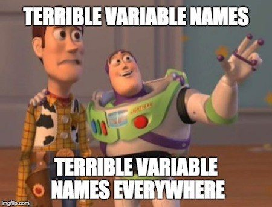

Perhatikan kode berikut:

```php
$price = 1000;
$x = 4; // Quantity.
$disc = 50; // Discount percentage.

$total = $price * $x;
// Total with discount.
$total = $total - ($total * ($disc / 100));
```

Tanpa komentar, akan sulit bagi kita memahami konteks kode di atas. Apa itu `$x`? Apa itu `$disc`? Kita bisa perbaiki tingkat *readibility* dari kode di atas hanya dengan memberikan nama *variable* yang deskriptif.

```php
$pricePerItem = 1000;
$quantity = 4;
$discountPercentage = 50;

$subTotal = $pricePerItem * $quantity;
$total = $subTotal - ($subTotal * ($discountPercentage / 100));
```

Dengan pemberian nama yang deskriptif konteks kode di atas menjadi jelas: menghitung total pembayaran beserta diskon yang diterapkan. Kita bahkan tidak perlu menambahkan komentar untuk menjelaskan konteks kode di atas. Ingat, komentar bisa jadi indikasi jika kode yang kita tulis rendah tingkat *readibility*-nya.

### Mencetak Nilai Variable

Contoh kode-kode *variable* di atas, tidak akan mencetak apapun bila dijalankan. Untuk mencetak nilai *variable*, kita bisa gunakan `echo` tanpa kutip tunggal:

```php
$name = 'Luke Skywalker';

echo $name;
```

#### Kutip Tunggal vs Kutip Ganda

Kutip tunggal akan mencetak *string* apa adanya. Sementara kutip ganda mampu mencetak nilai *variable* yang diapitnya.

```php
$name = 'Luke';

echo '$name, I am your father'; // Mencetak: $name, I am your father

echo "$name, I am your father"; // Mecetak: Luke, I am your father
```

Dengan kutip ganda, kita juga bisa mengapit *variable* dengan tanda kurung kurawal: `{` dan `}`. Dengan begitu kita bisa memisahkan *variable* dengan karakter biasa:

```php
$jediName = 'Luke';
$lightsaberColor = 'blue';

// Mencetak: Luke's lightsaber is blue
echo "{$jediName}'s lightsaber is {$lightsaberColor}";
```

Selain itu, dengan kutip ganda kita bisa mencetak [*escaped characters*](https://secure.php.net/manual/en/language.types.string.php#language.types.string.syntax.double) dengan mendahuluinya dengan garis miring (`\`):

```php
$ship = 'Milenium Falcon';
$rentPrice = 15000;

// \n => menyisipkan baris baru
// \$ => mencetak tanda dolar
echo "Ship: $ship\nRent Price: \$$rentPrice";
```

Apabila dijalankan lewat *Command Line* kita akan mendapatkan keluaran seperti berikut:

```shell
Ship: Milenium Falcon
Rent Price: $15000
```

> 💡 Apabila dijalankan lewat web *server*, baris baru (`\n`) yang disisipkan tidak akan tampak pada *browser*. Ini terjadi karena *browser* memperlakukan respon dari web server sebagai dokumen HTML—dimana baris baru harus direpresentasikan dengan tag `<br>`.

### Variable Scope

*Variable scope* berarti cakupan dari sebuah *variable*. *Scope* dari suatu *variable* akan bergantung pada lokasi dimana ia dideklarasikan. *Scope* juga mempengaruhi di bagian mana saja *variable* tersebut bisa diakses. Dalam PHP sendiri *variable scope* bisa dikelompokan ke dalam dua kategori: *local scope* dan *global scope*.

#### Local Scope

*Variable* yang dideklarasikan di dalam sebuah fungsi atau metode akan bersifat *local*. *Variable* tersebut tidak akan bisa diakses dari luar fungsi atau metode dimana ia dideklarasikan.

```php
function printCatImage()
{
    // $catImageUrl berada dalam local scope
    // sehingga hanya bisa diakses dalam fungsi printCatImage() saja.
    $catImageUrl = 'http://thecatapi.com/api/images/get?format=src&type=gif';

    echo "";
}

// Mengakses $catImageUrl di luar fungsi printCatImage() akan membuahkan error
// Undefined variable: catImageUrl
echo $catImageUrl;
```

#### Global Scope

Sementara variable yang dideklarasikan di luar sebuah fungsi atau metode, tergolong dalam *global scope*. Secara *default*, ia pun hanya bisa diakses dari luar sebuah fungsi atau metode.

```php
// $catEmojis berada di global scope
// Secara default hanya bisa diakses dari luar fungsi atau metode.
$catEmojis = '😸😹😻😽';

function printCatEmojis()
{
    // Akan menghasilkan error karena $catEmojis hanya tersedia di global
    // scope, tapi tidak dalam local scope dari printCatEmojis().
    echo $catEmojis;
}

// Memanggil fungsi printCatEmojis() yang akan menghasilkan error.
printCatEmojis();
```

Kita bisa mengakses *variable global* dari dalam *local* scope dengan menggunakan *keyword* `global`:

```php
$catEmojis = '😸😹😻😽';

function printCatEmojis()
{
    // Gunakan keword global untuk mengakses variable global dari dalam local scope.
    global $catEmojis;

    echo $catEmojis;
}

// Akan mencetak emoji kucing: 😸😹😻😽
printCatEmojis();
```

Cara lainnya untuk mengakses *variable* *global* dari dalam *local* scope adalah dengan menggunakan *predefined variable* `$GLOBALS`:

```php
$catEmojis = '😸😹😻😽';

function printCatEmojis()
{
    // Menggunakan predefined variable $GLOBALS.
    echo $GLOBALS['catEmojis'];
}

// Akan mencetak emoji kucing: 😸😹😻😽
printCatEmojis();
```


> ⚠️ **Jangan mengandalkan global variable**
>
> Menggunakan *global variable* di dalam sebuah fungsi atau metode merupakan praktik yang buruk. Kode di dalam fungsi tersebut menjadi bergantung pada kondisi di luar cakupanya. Bayangkan jika ada fungsi lain yang mengubah nilai dari `$catEmojis` di atas, hasil keluaran dari fungsi `printCatEmojis()` menjadi tidak *reliable*. *Programmer* juga dipaksa untuk memahami konteks aplikasi secara keseluruhan saat ingin memodifikasi `printCatEmojis()`.

### Superglobals

*Superglobals* adalah sejumlah *variable* standard bawaan PHP yang dapat diakses di dalam semua *scope*.

* [`$GLOBALS`](https://secure.php.net/manual/en/reserved.variables.globals.php): berisi *variable* yang dideklarasikan dalam *global scope*.
* [`$_SERVERS`](https://secure.php.net/manual/en/reserved.variables.server.php): berisi informasi mengenai *server* dan *environment* dimana file PHP tersebut dieksekusi.
* [`$_GET`](https://secure.php.net/manual/en/reserved.variables.get.php): berisi parameter URL.
* [`$_POST`](https://secure.php.net/manual/en/reserved.variables.post.php): berisi parameter yang dikirim dengan metode HTTP POST.
* [`$_FILES`](https://secure.php.net/manual/en/reserved.variables.files.php): berisi *file-file* yang diunggah dengan metode HTTP POST.
* [`$_REQUEST`](https://secure.php.net/manual/en/reserved.variables.request.php): berisi data-data dari HTTP *request*, gabungan data dari `$_GET`, `$_POST` dan `$_COOKIES`.
* [`$_SESSION`](https://secure.php.net/manual/en/reserved.variables.session.php): berisi semua *variable session*.
* [`$_ENV`](https://secure.php.net/manual/en/reserved.variables.environment.php): berisi *environment variable*.
* [`$_COOKIES`](https://secure.php.net/manual/en/reserved.variables.cookies.php): berisi *variable-variable* untuk HTTP *cookies*.

Untuk saat ini kita tidak perlu memusingkan sejumlah *superglobals* di atas.

### Latihan Variable

Sebagai latihan, buatlah *file* baru dengan nama `04_variables.php`. Coba tikan dan pahami kode berikut:

```php
<?php

function printR2D2()
{
    $name = 'R2-D2';
    global $R2_D2_Price;

    echo "🤖 $name voice: {$GLOBALS['R2_D2_Voice']} price: \$$R2_D2_Price<br>";
}

$R2_D2_Voice = 'Grrr Grrr Grrr...';
$R2_D2_Price = 100;
printR2D2(); // 🤖 R2-D2 voice: Grrr Grrr Grrr... price: $100

$R2_D2_Voice = 'Beep boop baap...';
$R2_D2_Price = 2500.75;
printR2D2(); // 🤖 R2-D2 voice: Beep boop baap... price: $2500.75
```

Perhatikan karakter apa saja yang valid untuk sebuah nama *variable* di dalam PHP. Cermati juga bagaimana dua cakupan *variable* dalam PHP bekerja.

### Rangkuman Variable

Dari subbab ini kita bisa simpulkan beberapa hal:

1. *Variable* digunakan untuk menyimpan sebuah informasi atau data.
2. Nama dari sebuah *variable* hanya boleh terdiri dari huruf, angka dan *underscore*. Pun begitu nama *variable* tidak boleh didahului dengan angka.
3. Berikanlah nama *variable* yang deskriptif. Lebih baik nama *variable* yang panjang tapi mudah dipahami tujuannya daripada nama *variable* yang pendek namun sulit dipahami fungsinya.
4. Dalam PHP ada dua jenis cakupkan *variable*: *local scope* dan *global scope*. *Variable* yang dideklarasikan di dalam sebuah fungsi atau metode memiliki *local scope*. Sebaliknya *variable* di luar fungsi atau metode tergolong ke dalam *global scope*.
5. Untuk mengakses *variable global* di dalam sebuah fungsi atau metode, kita bisa menggunakan *keyword* `global` atau dengan memanfaatkan *variable* `$_GLOBALS`.
6. Mengandalkan *variable global* di dalam sebuah fungsi atau metode dianggap sebagai praktik yang buruk. Praktik ini membuat kode di dalamnya bergantung pada kondisi di luar cakupannya.

## Konstanta dalam PHP

Bahasa PHP juga menyediakan *constant* atau konstanta. Berbeda dengan *variable*, nilai dari konstanta tidak bisa diubah. Dalam PHP, konstanta dideklarasikan dengan menggunakan perintah `define`. Aturan penamaannya pun sama seperti *variable*:

* Nama konstanta bisa terdiri dari: huruf, angka, atau *underscore*.
* Nama konstanta boleh diawali dengan huruf atau *underscore*, tapi tidak boleh didahului oleh angka.

```php
define('MESSAGE', 'Help me, Obi-Wan Kenobi.');
echo MESSAGE;

define('r2_d2_weight', 100);
echo r2_d2_weight;

define('_POOP', '💩');
echo _POOP;
```

Selain menggunakan `define`, kita juga bisa mendeklarasikan konstanta dengan *keyword*: `const`.

```php
const MESSAGE = 'Help me, Obi-Wan Kenobi.';

echo MESSAGE;
```

> 🎨 **Gunakan huruf besar dan snake-case untuk konstanta**
>
> Meski diperbolehkan untuk  menggunakan huruf kecil, banyak *developer* PHP yang sepakat untuk selalu menggunakan huruf besar dengan gaya *snake case* untuk penamaan konstanta (contoh: `DATABASE_NAME`). Ini sejalan dengan aturan [PSR-1](https://www.php-fig.org/psr/psr-1/#41-constants) tentang penulisan nama konstanta di dalam sebuah kelas.

### Cakupan Konstanta

Konstanta memiliki cakupan seperti [*Superglobals*](#superglobals), ia dapat diakses dari *global* dan *local scope*.

```php
define('CAT_EMOJIS', '😸😹😻😽');;

function printCatEmojis()
{
    echo CAT_EMOJIS;
}

printCatEmojis();
```

### Tipe Data untuk Konstanta

Pada PHP versi 5, nilai dari konstanta yang dideklarasikan dengan perintah `define` harus bertipe [skalar](#tipe-data-skalar) (`boolean`, `integer`, `float`, dan `string`) atau [`NULL`](#null). Semenjak PHP versi 7, kita juga bisa menggunakan tipe data [*array*](#array).

```php
define('IS_AWESOME', true);
define('MAXIMUM_POWER', 100);
define('PI', 3.14);
define('DATABASE_NAME', 'death_star');

// PHP versi 7.
define('JEDI', ['Yoda', 'Windu', 'Kenobi']);
```

Sementara untuk *keyword* *const*, kita bisa menggunakan tipe data *array* sejak PHP versi 5.6:

```php
const IS_AWESOME = true;
const MAXIMUM_POWER = 100;
const PI = 3.14;
const DATABASE_NAME = 'death_star';

// Sejak PHP versi 5.6
const JEDI = ['Yoda', 'Windu', 'Kenobi'];
```

### Case-Sensitivity pada Konstanta

Secara *default*, konstanta yang dideklarasikan dengan perintah `define` bersifat *case-sensitive*. `PI` dan `pi` pada contoh kode berikut merupakan dua konstanta yang berbeda:

```php
define('PI', 3.14);
define('pi', 3.14159);

echo PI; // 3.14
echo pi; // 3.14159
```

Pun begitu, kita bisa mengatur agar konstanta yang dideklarasikan bersifat *case-insensitive* dengan memberikan nilai `true` sebagai argumen ketiga dari `define`:

```php
define('PI', 3.14, true);

echo PI; // 3.14
echo pi; // 3.14
```

Sementara konstanta yang dideklarasikan dengan *keyword* *const* selalu bersifat *case-sensitive*.

```php
const PI = 3.14;

echo PI; // 3.14
echo pi; // Pesan kesalahan: Notice: Use of undefined constant pi
```

### Predefined & Magic Constants

PHP dan beragam ekstensinya menyediakan sejumlah konstanta yang bisa kita gunakan. Berikut beberapa contoh konstanta yang disediakan oleh *core* PHP:

| Constant      | Deskripsi                                      |
| ------------- |----------------------------------------------- |
| `PHP_VERSION` | Versi PHP yang digunakan                       |
| `PHP_OS`      | Sistem operasi yang ditargetkan oleh PHP       |
| `PHP_SAPI`    | *Server* API yang digunakan                    |
| `PHP_INT_MAX` | Nilai maksimum dari *integer*                  |
| `E_ERROR`     | Untuk *fatal run-time error*                   |
| `E_WARNING`   | Untuk *run-time warning*                       |
| `E_PARSE`     | Untuk *compile-time parse error*               |
| `E_ALL`       | Untuk mengaktifkan semua *error* dan *warning* |
| `true`        | Cek subbab [`boolean`](#boolean)               |
| `false`       | Cek subbab [`boolean`](#boolean)               |
| `null`        | Cek subbab [`null`](#null)                     |

Cek daftar konstanta yang disediakan oleh *core* PHP di dokumentasi: [Core Predefined Constants](https://secure.php.net/manual/en/reserved.constants.php#reserved.constants.core).

> 💡 Dalam PHP, nilai `true`, `false`, dan `null` merupakan konstanta dan penulisannya *case-insenstive* (`true` dan `TRUE` adalah konstanta yang sama).

PHP juga memiliki beberapa *magic constant*—konstanta yang nilainya berganti tergantung dimana ia digunakan.

| Constant       | Deskripsi                                        |
| -------------- |------------------------------------------------- |
| `__DIR__`      | Lokasi direktori dari *file* PHP yang dieksekusi |
| `__FILE__`     | Lokasi dari *file* PHP yang dieksekusi           |
| `__FUNCTION__` | Nama fungsi dimana fungsi dipanggil              |
| `__CLASS__`    | Nama kelas dimana konstanta dipanggil            |

Cek daftar *magic constant* lainnya di dokumentasi PHP: [Magic Constants](https://secure.php.net/manual/en/language.constants.predefined.php).

### Latihan Konstanta

Sebagai latihan buat *file* baru dengan nama `05_constants.php`. Tikan kode berikut dan perhatikan bagaimana kita bisa mendeklarasikan konstanta dalam PHP:

```php
<?php

define('IS_ACTIVE', true);
define('MAXIMUM_FAILED_ATTEMPTS', 3);
define('PI', 3.14159);
define('GOOGLE_URL', 'https://google.com');
define('COLORS', ['red', 'green', 'blue']);

const FAILED_STATUS = false;
const MINIMUM_BALANCE = -10;
const MINIMUM_PURCHASE = 25.5;
const DUCKDUCKGO_URL = 'https://duckduckgo.com';
const EVEN_NUMBERS = [2, 4, 6, 8];

echo PHP_VERSION; // 7.2.4
echo __FILE__; // /path/to/05_constants.php
```

### Rangkuman Konstanta

Berikut beberapa poin yang bisa kita simpulkan dari subbab ini:

* Berbeda dengan *variable*, nilai dari konstanta tidak bisa diubah.
* Dalam PHP konstanta bisa dideklarasikan dengan perintah `define` atau *keyword* `const`.
* Nama konstanta dapat terdiri dari huruf, angka, atay *underscore*. Pun begitu nama konstanta tidak boleh diawali dengan angka.
* Dianjurkan untuk menggunakan huruf besar dengan gaya *snake case* untuk penulisan konstanta.
* Konstanta memiliki cakupan seperti [*superglobals*](#superglobals), ia bisa diakses dari *global scope* ataupun *local scope*.
* Secara *default* nama konstanta bersifat *case-sensitive*, namun kita bisa mengubahnya menjadi *case-insensitive* dengan memberikan nilai `true` sebagai argumen ketiga dari perintah `define`.
* `true`, `false`, dan `null` merupakan salah satu konstanta yang disediakan *core* PHP.

## Tipe Data dalam PHP

PHP mendukung 10 tipe data yang bisa dibagi ke dalam 3 kategori:

1. Empat tipe data Skalar:
    * [Boolean](#boolean)
    * [Integer](#integer)
    * [Float](#float)
    * [String](#string)
2. Empat tipe data *Compound* atau gabungan:
    * [Array](#array)
    * [Object](#object)
    * [Callable](#callable)
    * [Iterable](#iterable)
3. Dua tipe data spesial:
    * [Resource](#resource)
    * [NULL](#null)

Selain itu PHP juga memiliki beberapa [tipe data *pseudo*](#tipe-data-pseudo) yang sebetulnya tidak diimplementasikan dalam PHP namun kerap digunakan dalam dokumentasi.

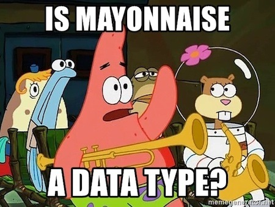

### Tipe Data Skalar

Tipe data skalar adalah tipe data yang hanya mengandung satu nilai. Ada empat tipe data skalar dalam PHP:

#### Boolean

Boolean merupakan tipe data yang paling sederhana. Ia berguna untuk mengekspresikan sebuah nilai kebenaran: `true` atau `false`.

```php
$isAwesome = true;

if ($isAwesome) {
    echo 'You are awesome! 😎'; // Tercetak bila isAwesome = true
} else {
    echo 'Sorry, you are not awesome. 😔'; // Tercetak bila isAwesome = false
}
```

#### Integer

*Integer* merupakan tipe data untuk bilangan bulat. Rentang *integer* sangat bergantung pada *platform*-nya. Untuk sistem 32-bit rentang angkanya mulai dari `-2,147,483,648` hingga `2,147,483,647`. Sementara untuk sistem 64-bit, rentang angkanya mencapai ± 9,2 juta triliyun.

```php
$price = 125000;
$daysWithoutInstantNoodles = 0;
$accountBalance = -30;
```

Kita bisa juga menuliskan data *integer* dengan notasi basis bilangan lainnya:

* Oktal (basis 8): dahului bilangan dengan angka `0`.
* Heksadesimal (basis 16): dahului bilangan dengan `0x`.
* Biner (basis 2): dahului bilangan dengan `0b`.

```php
echo 0100; // Oktal => 64
echo 0xFF; // Heksadesimal => 255
echo 0b101; // Biner => 5
```

#### Float

*Float* atau dikenal juga sebagai *double* merupakan tipe data untuk bilangan pecahan desimal.

```php
$pi = 3.14;
$temperatureInCelsius = -30.5;
```

Kita juga bisa mengekspresikan tipe data *float* dalam bentuk ekponensial:

```php
echo 1.5e3; // 1.5 * 10^3 = 1500
echo 1.5-3; // 1.5 * 10^-3 = 0.0015
```

> ⚠️ **Jangan gunakan float untuk mengecek kesetaraan nilai**
>
> Untuk tipe data *float*, PHP sendiri menerapkan standard [IEEE 754](https://en.wikipedia.org/wiki/IEEE_754) dimana *error* maksimum karena proses pembulatannya sebesar `1.11e-16`.
>
> Selain itu karena keterbatasan komputer, angka pecahan seperti `0.1` atau `0.7`; tidak bisa direpresentasikan dengan baik. Oleh karenanya hindari penggunaan *float* untuk mengecek kesetaraan nilai.

Perhatikan contoh kode di bawah, persamaan yang seharusnya menghasilkan nilai `true`, justru menghasilkan `false`.

```php
var_dump(1 - 0.7 === 0.3); // false

var_dump(0.1 + 0.7 === 0.8); // false
```

#### String

*String* merupakan tipe data untuk serangkaian karakter—bisa berupa huruf, angka, juga simbol. Ada empat cara untuk menuliskan data *string* dalam PHP:

1. Dengan kutip tunggal
2. Dengan kutip ganda
3. Dengan *syntax Heredoc*
4. Dengan *syntax Nowdoc*

**1. Dengan kutip tunggal:**

```php
echo 'Hello there!';

// Tidak bisa mencetak variable.
$general = 'Kenobi';
echo 'Hello $general'; // Hello $general

// Mencetak variable dengan concatenation.
echo 'Hello '. $general . '!'; // Hello Kenobi!

// Mencetak tanda kutip tunggal.
echo 'You can\'t win Anakin!'; // You can't win Anakin!

// Mencetak tanda kutip ganda.
// Yoda said "Do or do not, there is no try"
echo 'Yoda said "Do or do not, there is no try"';

// Tidak bisa mencetak escaped-characters.
// Tercetak tanpa baris baru: Never gonna give you up\nNever gonna let you down
echo 'Never gonna give you up\nNever gonna let you down';
```

**2. Dengan kutip ganda**

Cara kedua adalah dengan menggunakan kutip ganda. Dengan kutip ganda, kita bisa mencetak *variable* maupun [*escaped-characters*](https://secure.php.net/manual/en/language.types.string.php#language.types.string.syntax.double).

```php
echo "Hello there!";

// Bisa mencetak variable.
$general = 'Kenobi';
echo "Hello $general"; // Hello Kenobi

// Memisahkan variable dengan string lainnya.
echo "{$general}'s lightsaber is blue."; // Kenobi's lightsaber is blue

// Mencetak tanda kutip tunggal.
echo "You can't win Anakin!"; // You can't win Anakin!

// Mencetak tanda kutip ganda.
// Yoda said "Do or do not, there is no try"
echo "Yoda said \"Do or do not, there is no try\"";

// Bisa mencetak escaped-characters. \n akan mencetak baris baru.
echo "Never gonna give you up\nNever gonna let you down";
```


**3. Dengan syntax Heredoc**

Cara ketiga adalah dengan *syntax heredoc*—menggunakan tanda `<<<`. Ia bekerja bekerja seperti tanda kutip ganda, sehingga kita bisa mencetak *variable* ataupun *escaped-characters*.

```php
$general = 'Kenobi';

echo <<<EOD
Hi There!
Hello $general!
\t— Star Wars Episode 3
EOD;
```

Label yang digunakan tidak harus selalu `EOD`, kita bisa menggunakan label apa saja selama diakhiri dengan label yang sama. Aturan penamaanya sama seperti *variable*.

```php
echo <<<_Conversation_1
Hi There!
_Conversation_1;
```

Perhatikan juga bahwa tidak boleh ada karakter lain pada baris yang sama setelah label pembuka:

```php
// Isi string harus berada di baris baru.
echo <<<EOD Hi There!
Hello Kenobi!
EOD;
```

Juga tidak boleh ada spasi atau tab sebelum label penutup:

```php
echo <<<EOD
Hi There!
    EOD; // Tidak boleh ada spasi atau tab.
```

**4. Dengan syntax Nowdoc**

Cara keempat adalah dengan *syntax nowdoc*. Sama-sama menggunakan tanda `<<<`, namun label pembukanya diapit oleh kutip tunggal. Ia bekerja seperti kutip tunggal untuk *heredoc*, sehingga kita tidak bisa mencetak *variable* ataupun *escaped-characters*.

```php
echo <<<'EOD'
Hi There!
Hello Kenobi!
EOD;
```

### Tipe Data Compound

Kategori tipe data yang kedua adalah *compound*. Dinamakan *compound* karena tipe data ini bisa terdiri dari satu atau lebih tipe data lainnya.

#### Array

Tipe data *array* atau larik adalah tipe data yang bisa menampung deretan data lainnya. Setiap elemen data dalam *array* dipisahkan oleh koma (`,`). Ada dua cara untuk mendeklarasikan sebuah *array*:

1. Dengan *keyword* `array()`
2. Dengan *short array syntax* (`[]`)

**1. Dengan keyword `array()`**

Cara pertama adalah dengan menggunakan konstruksi bahasa `array()`:

```php
$siths = array('Darth Vader', 'Darth Maul', 'Kylo Ren');

// Mencetak array $siths.
print_r($siths);
```

> 👍🏻 **Mencetak array dengan fungsi `print_r`**
>
> `print_r` adalah fungsi yang dapat kita gunakan untuk mencetak sebuah ekspresi atau *variable* sehingga isi informasi dari *variable* tersebut mudah dibaca oleh manusia. `print_r` sangat berguna untuk mencetak struktur dari sebuah *array*.

**2. Dengan short array syntax**

Cara kedua adalah dengan *short array syntax*, dimana deretan data diapit di antara kurung siku: `[` dan `]`. *Syntax* ringkas ini tersedia sejak PHP versi 5.4.

```php
$siths = ['Darth Vader', 'Darth Maul', 'Kylo Ren'];

// Mencetak array $siths.
print_r($siths);
```

> 💡 **array() vs short syntax**
>
> Tidak ada konsensus resmi antara deklarasi *array* dengan `array()` atau *short syntax*. Namun umumnya setiap *framework* memiliki panduan penulisan kode tersendiri. Symfony misalnya memilih menggunakan *language construct* `array()`. Sementara Laravel lebih memilih menggunakan *short syntax*.

Tidak hanya *string*, *array* juga bisa menampung beragam tipe data lainnya: *integer*, *boolean*, *string*, bahkan *array* lainnya.

```php
// Array dengan data-data boolean.
$states = [true, false, true];

// Array dengan data-data integer.
$oddNumbers = [1, 3, 5, 7];

// Array dengan data-data float.
$prices = [100.0, 42.5, 60.75];

// Tipe data dalam array tidak harus satu jenis.
$mixedItems = ['Random', 10, 12.5, true];

// Array berisi array lainnya.
$characters = [
    ['Darth Vader', 'Darth Maul', 'Kylo Ren'],
    ['Obi-Wan Kenobi', 'Luke Skywalker', 'Rey']
];
```

Kita akan pelajari *array* lebih lanjut di bagian lainnya.

#### Object

*Object* atau objek ini merupakan hasil inisiasi dari sebuah kelas. Kita bisa menganggap kelas sebagai *blueprint* atau cetak birunya, sementara objek merupakan benda nyata dari *blueprint* tersebut. Dalam PHP kita menginisiasi sebuah kelas dengan *keyword* `new`:

```php
// Menginisiasi kelas DateTime dan menyimpan referensi objeknya di dalam
// variable $dateTime.
$dateTime = new DateTime();
```

Kita akan bahas lebih jauh tentang objek di tutorial lainnya.

#### Callable

*Callable* (sebelumnya dikenal dengan *callback*) merupakan tipe data yang nilainya bisa dipanggil layaknya sebuah fungsi. Kita bisa menggunakan fungsi [`call_user_func()`](https://secure.php.net/manual/en/function.call-user-func.php) untuk memanggil sebuah *callable*.

```php
// Untuk fungsi-fungsi bawaan PHP, callable dapat berupa string.
// Sama dengan memanggil fungsi: rand()
echo call_user_func('rand'); // Mencetak angka acak.

// Callable dapat berupa array dimana item 1 berupa objek dan item 2 berupa
// nama metode yang ingin dipanggil.
// Sama dengan memanggil: $dateTime->getTimestamp()
$dateTime = new DateTime();
echo call_user_func([$dateTime, 'getTimestamp']);
```

Masih banyak cara-cara lainnya untuk mendeklarasikan sebuah *callable*, cek [dokumentasi *callable*](https://secure.php.net/manual/en/language.types.callable.php) untuk lebih lengkapnya.

#### Iterable

*Iterable* merupakan tipe data baru yang bisa digunakan semenjak PHP versi 7.1. *Iterable* tergolong *pseudo-type* sehingga tidak ada cara khusus untuk mendeklarasikannya. *Array* dan semua kelas yang mengimplementasikan [*interface* Traversable](https://secure.php.net/manual/en/class.traversable.php) tergolong dalam tipe data *iterable*. Tipe data *iterable* ini bisa digunakan dalam *foreach loop* serta *yield* dalam *generator*.

### Tipe Data Spesial

#### Resource

*Resource* merupakan tipe data yang spesial karena ia menyimpan referensi pada *resource* eksternal. *Resource* eksternal ini bisa beragam: koneksi FTP, sesi *cURL*, koneksi ke database, *pointer* ke sebuah file, dan lain sebagainya.

```php
// Membuka file test.txt untuk dibaca.
$resource = fopen('test.txt', 'r');

// Mencetak isi file.
echo fgets($resource);

// Menutup file pointer.
flose($resource);
```

#### NULL

*NULL* berarti sebuah *variable* tidak memiliki nilai. Kita bisa menggunakan fungsi `is_null()` untuk mengecek jika sebuah *variable* memiliki nilai atau tidak.

```php
$emptyness = null;

echo is_null($emptyness);
```

### Tipe Data Pseudo

Tipe data *pseudo* adalah tipe data yang sebetulnya tidak ada dalam implementasi bahasa PHP, namun sering digunakan di dalam dokumentasi PHP:

* `mixed`: Jika data dapat memiliki beragam tipe data.
* `number`: Jika data dapat memiliki tipe data `integer` atau `float`.
* `array|object`: Jika data dapat berupa `array` atau `object`.
* `void`: Menandakan jika fungsi/metode tidak mengambalikan apa-apa (diimplementasikan pada PHP versi 7.1 untuk [*return type*](#deklarasi-tipe-data-pada-kembalian-fungsi)).

### Type Juggling

Dalam PHP, kita tidak bisa secara eksplisit mengatur tipe data dari sebuah *variable* saat dideklarasikan. Tipe data dari sebuah *variable* bisa berubah-ubah tergantung dari bagaimana ia digunakan. Istilah ini dikenal sebagai *type juggling*:

```php
// Mulanya $num adalah string.
$num = '10';

// Sekarang $num adalah integer dengan nilai: 50
$num = $num * 5;

// Sekarang $num menjadi float dengan nilai: 25
$num = $num * 0.5;

// Mulanya $name adalah string.
$name = 'Luke';

// Sekarang $name menjadi integer dengan nilai: 0
$name = $name * 1000;
```

### Type Casting

*Type casting* digunakan untuk mengubah sebuah tipe data ke dalam tipe data lainnya.

```php
$str = '100.5'; // $str berupa string.
$num1 = (int) $str; // Mengubah string menjadi integer: 100
$num2 = (float) $str; // Mengubah string menjadi float: 100.5
$bool = (bool) $str; // Mengubah string menjadi boolean: true
$arr = (array) $str; // Mengubah string menjadi array: ["100.5"]
$obj = (object) $str; // Mengubah string menjadi objek: stdClass
```

Beberapa contoh hasil *type casting* yang kadang bisa membingungkan:

```php
var_dump((bool) 0); // Mengubah integer 0 ke dalam boolean: false
var_dump((bool) -12); // Mengubah integer negatif ke dalam boolean: true
var_dump((bool) -1.5); // Mengubah float negatif ke dalam boolean: true

var_dump((bool) ''); // Mengubah string kosong ke dalam boolean: false
var_dump((bool) ' '); // Mengubah string yang hanya mengandung spasi ke dalam boolean: true

var_dump((bool) []); // Mengubah array kosong ke dalam boolean: false

var_dump((float) []); // Mengubah array kosong ke dalam float: 0.0
var_dump((float) [1, 2]); // Mengubah array ke dalam float: 1.0
var_dump((float) ''); // Mengubah string kosong ke dalam float: 0.0
var_dump((float) ' '); // Mengubah string yang hanya mengandung spasi ke dalam float: 0.0
var_dump((float) 'hello12'); // Mengubah string yang didahului huruf ke dalam float: 0.0
var_dump((float) '12hello'); // Mengubah string yang didahului angka ke dalam float: 12.0
```

> 👍🏻 **Mencetak tipe data dan nilai dengan `var_dump`**
>
> `var_dump` merupakan fungsi bawaan PHP untuk mencetak nilai sekaligus tipe data dari satu atau beberapa ekspresi. Meski sederhana, `var_dump` kerap digunakan dalam proses *debugging*.

### Latihan Tipe Data

Untuk latihan, buatlah *file* PHP baru dengan nama `06_data_types.php`. Tikan kode di bawah yang menggunakan beberapa tipe data sekaligus:

```php
<?php

// Boolean.
$isCool = true;

if ($isCool) {
    echo "You are cool! 😎<br>";
} else {
    echo "You are not cool. 😔<br>";
}

// Integer.
$daysWithoutInstantNoodles = 120;
$accountBalance = -50000;

echo "Days without instant noodles: $daysWithoutInstantNoodles 🍜<br>";
echo "Account balance: $accountBalance 💸<br>";

// Float.
$pi = 3.14159;
$temperatureInCelsius = -29.5;
var_dump(1 - 0.7 === 0.3);

echo "PI: $pi 🥧<br>";
echo "Temperature in Iceland: {$temperatureInCelsius}° Celcius ️⛄<br>";

echo 'Limitation in float: 1 - 0.7 == 0.3 >> ';
var_dump(1 - 0.7 == 0.3);
echo ' 🤔<br>';

// String.
$yodaQuote = 'Do or do not, there is no try';
echo "Yoda said \"$yodaQuote\" 🐨<br>";

// Array.
$siths = ['Darth Vader', 'Darth Maul', 'Kylo Ren',];
print_r($siths);
echo ' 👹<br>';

// NULL
$emptyness = null;
echo 'Emptyness: ';
var_dump($emptyness);
echo ' 👻<br>';
```

Apabila kita jalankan kode di atas pada *browser*, kita akan mendapatkan hasil seperti berikut:

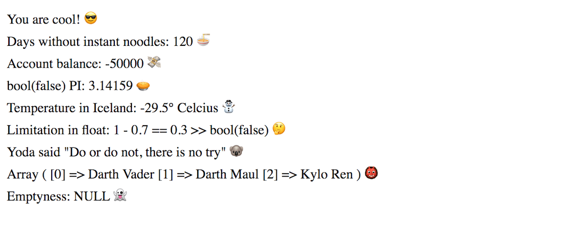

Buat kembali *file* PHP baru dan beri nama `07_type_juggling_casting.php`. Cobalah kode berikut untuk mendemonstrasikan *type juggling* dan *type casting* yang kadang membingungkan dalam PHP:

```php
<?php

// Type juggling.
var_dump('10 ewok' * 5); // int(50)
var_dump('ewok 10' * 5); // int(0)
var_dump('-10.5 power' + 0.5); // float(10)

// Type casting.
var_dump((bool) 0); // bool(false)
var_dump((bool) -12); // bool(true)
var_dump((bool) -1.5); // bool(true)
var_dump((bool) ''); // bool(false)
var_dump((bool) '   '); // bool(true)
var_dump((bool) []); // bool(false)
var_dump((bool) [false]); // bool(true)

var_dump((float) ''); // float(0)
var_dump((float) ' '); // float(0)
var_dump((float) 'hello12'); // float(0)
var_dump((float) '-12.5hello'); // float(-12.5)
```

### Rangkuman Tipe Data

Dari pembahasan subbab tipe data ini, kita bisa simpulkan beberapa poin berikut:

* `Boolean` adalah tipe data sederhana yang hanya memiliki dua kemungkinan kondisi: `true` atau `false`.
* `Integer` adalah tipe data untuk bilangan bulat, baik negatif ataupun positif.
* `Float` adalah tipe data untuk bilangan pecahan desimal.
* Karena keterbatasan komputer untuk merepresentasikan bilangan pecahan, jangan lakukan perbandingan dengan `float`.
* `String` adalah tipe data untuk serangkaian karakter: bisa berupa huruf, angka, atau simbol.
* Kita bisa menyisipkan *variable* ke dalam sebuah `string` yang dideklarasikan dengan kutip ganda ataupun *syntax heredoc*.
* `Array` adalah tipe data yang bisa menampung deretan data lainnya.
* `Null` merupakan tipe data spesial yang menunjukan ketiadaan nilai pada sebuah *variable*.
* Dalam PHP kita tidak bisa secara eksplisit menentukan tipe data dari sebuah *variable*. Tipe data dari sebuah *variable* berubah-ubah tergantung dari bagaimana ia digunakan—proses ini disebut *type juggling*.
* Dengan *type casting* kita bisa mengubah suatu tipe data ke dalam tipe data yang lain.

## Operator

Sesuai namanya, operator digunakan untuk melakukan sebuah operasi pada satu atau beberapa nilai/*variable*.

### Operator Aritmetika

| Contoh     | Nama Operator | Hasil                                    |
| ---------- |---------------| ---------------------------------------- |
| `+$a`      | Identitas     | Ubah `$a` menjadi `integer` atau `float` |
| `-$a`      | Negasi        | Ubah `$a` menjadi bilangan negatif       |
| `$a + $b`  | Penambahan    | Penjumlahan `$a` dan `$b`                |
| `$a - $b`  | Pengurangan   | Pengurangan `$a` dan `$b`                |
| `$a * $b`  | Perkalian     | Perkalian antara `$a` dan `$b`           |
| `$a / $b`  | Pembagian     | Pembagian anatara `$a` dan `$b`          |
| `$a % $b`  | Modulus       | Sisa bagi antara `$a` dan `$b`           |
| `$a ** $b` | Pemangkatan   | `$a` pangkat `$b`                        |

Berikut adalah contoh penggunaanya:

```php
$pi = '3.14'; // Mulanya $pi adalah string.
var_dump(+$pi); // Dengan operator plus (+) kita bisa mendapatkan float: 3.14

var_dump(10 / 2); // Integer: 5
var_dump(10 / 3); // Float: 3.333
var_dump(10 / 2.0); // Float: 5.0

var_dump(10 % 2); // Integer: 0
var_dump(10 % 3); // Integer: 1
var_dump(10 % 7); // Integer: 3

var_dump(5 ** 2); // Integer: 25
var_dump(5 ** 3); // Integer: 125
```

### Operator Assignment

Operator *assignment* (`=`) digunakan untuk memasukan sebuah nilai ke dalam sebuah *variable*. Kita sudah menggunakannya berkali-kali:

```php
$jedi = 'Luke Skywalker';
```

Untuk mepersingkat, kita juga bisa menggabungkan tanda `=` dengan operator artimetika:

| Contoh      | Sama dengan     |
| ----------- |---------------- |
| `$a += $b`  | `$a = $a + $b`  |
| `$a -= $b`  | `$a = $a - $b`  |
| `$a *= $b`  | `$a = $a * $b`  |
| `$a /= $b`  | `$a = $a / $b`  |
| `$a %= $b`  | `$a = $a % $b`  |
| `$a **= $b` | `$a = $a ** $b` |

```php
$a = 10;
$a += 40;
var_dump($a); // 50

$a = 10;
$a -= 40;
var_dump($a); // -30

$a = 10;
$a *= -5;
var_dump($a); // -50

$a = 10;
$a /= 2;
var_dump($a); // 5

$a = 10;
$a %= 7;
var_dump($a); // 3

$a = 10;
$a **= 2;
var_dump($a); // 100
```

### Operator Increment & Decrement

Operator *increment* digunakan untuk menambah nilai *variable* sebesar satu. Sebaliknya operator *decrement* digunakan untuk mengurangi nilai *variable* sebesar satu.

| Contoh | Nama Operator    | Hasil                                                  |
| ------ | ---------------- | ------------------------------------------------------ |
| `++$a` | *Pre-increment*  | Tambah `$a` sebesar 1 lalu kembalikan hasilnya         |
| `$a++` | *Post-increment* | Kembalikan nilai `$a` terlebih dahulu baru ditambah 1  |
| `--$a` | *Pre-decrement*  | Kurangi `$a` sebesar 1 lalu kembalikan hasilnya        |
| `$a--` | *Post-decrement* | Kembalikan nilai `$a` terlebih dahulu baru dikurangi 1 |

Perhatikan kode berikut untuk membedakan antara *pre* dan *post*:

```php
$num = 100;
echo ++$num; // 101

$num = 100;
echo $num++; // Yang tercetak tetap: 100
echo $num; // 101

$num = 100;
echo --$num; // 99

$num = 100;
echo $num--; // Yang tercetak tetap: 100
echo $num; // 99
```

### Operator Bitwise

Sesuai namanya, operator *bitwise* digunakan untuk melakukan operasi pada level bit.

| Contoh     | Nama Operator      |
| ---------- | ------------------ |
| `$a & $b`  | And                |
| `$a | $b`  | Or                 |
| `$a ^ $b`  | Xor (Exclusive or) |
| `~ $a`     | Not                |
| `$a << $b` | Shift left         |
| `$a >> $b` | Shift right        |

```php
var_dump(decbin(0b1010 & 0b1001)); // 1000
var_dump(decbin(0b1010 | 0b1001)); // 1011
var_dump(decbin(0b1111 ^ 0b1000)); // 111

var_dump(~10); // -11

var_dump(5 << 1); // 10
var_dump(5 << 2); // 20
var_dump(5 << 3); // 40

var_dump(5 << 1); // 10
var_dump(5 << 2); // 20
var_dump(5 << 3); // 40

var_dump(200 >> 1); // 100
var_dump(200 >> 2); // 50
var_dump(200 >> 3); // 25
```

Penulis pribadi jarang bahkan hampir tidak pernah menggunakan operator *bitwise* saat bekerja dengan kode PHP sehari-hari. Contoh aplikatif dari penggunaan *bitwise* operator ini bisa dilihat dari cara mengatur *error reporting* pada PHP:

```php
// Tampilkan semua jenis error kecuali tipe "notice".
error_reporting(E_ALL & ~E_NOTICE);

// Hanya tampilkan:
// - fatal run-time error
// - run-time warning
// - compile-time parse error
error_reporting(E_ERROR | E_WARNING | E_PARSE);
```

### Operator Perbandingan

Operator perbandingan digunakan untuk membandingkan kedua nilai. Dalam PHP ada beberapa operator perbandingan yang bisa kita gunakan.

| Contoh      | Nama Operator         |
| ----------- | --------------------- |
| `$a == $b`  | Sama                  |
| `$a === $b` | Identik               |
| `$a != $b`  | Tidak sama            |
| `$a <> $b`  | Tidak sama            |
| `$a !== $b` | Tidak identik         |
| `$a < $b`   | Kurang dari           |
| `$a > $b`   | lebih dari            |
| `$a <= $b`  | Kurang dari atau sama |
| `$a >= $b`  | Lebih dari atau sama  |
| `$a <=> $b` | Spaceship             |

Operator `==` akan menghasilkan nilai `true` jika kedua nilai memiliki nilai yang sama setelah diterapkan [*type juggling*](#type-juggling). Sementara operator `===` hanya akan bernilai `true` jika nilai dan tipe data keduanya sama.

```php
var_dump('10' == 10); // true
var_dump('ewok' == 0); // true
var_dump('10 ewok' == 10); // true
var_dump('10 ewok' === 10); // false
var_dump(10 === 10); // true
```

Hal serupa juga berlaku untuk `!=` dan `!==`.

```php
var_dump('10' != 10); // false
var_dump('10' !== 10); // true
```

*Type juggling* juga berlaku untuk operator perbandingan lainnya:

```php
var_dump('10 ewok' > 5); // true
var_dump('10 ewok' >= 10); // true
var_dump(10 < '10'); // false
var_dump(10 <= '10'); // true
```

Operator *spaceship* (`<=>`) baru tersedia sejak PHP versi 7. *Type juggling* juga diterapkan saat menggunakan operator ini. Operator *spaceship* ini bisa menghasilkan nilai *integer* dengan tiga kemungkinan:

1. `0` jika nilai kedua sisi sama.
2. `1` jika nilai di sisi kiri lebih besar dariapada sisi kanan.
3. `-1` jika nilai di sisi kiri lebih kecil daripada sisi kanan.

```php
var_dump(10 <=> 10); // 0
var_dump(10 <=> 5); // 1
var_dump(10 <=> 99); // -1

var_dump('10 ewok' <=> 10); // 0
var_dump('10 ewok' <=> 5); // 1
```

Penerapan *type juggling* pada beberapa operator perbandingan kadang dapat membuat kita bingung. Cek table perbandingan untuk beragam tipe data di dokumentasi PHP: [Type Comparison Tables](https://secure.php.net/manual/en/types.comparisons.php).

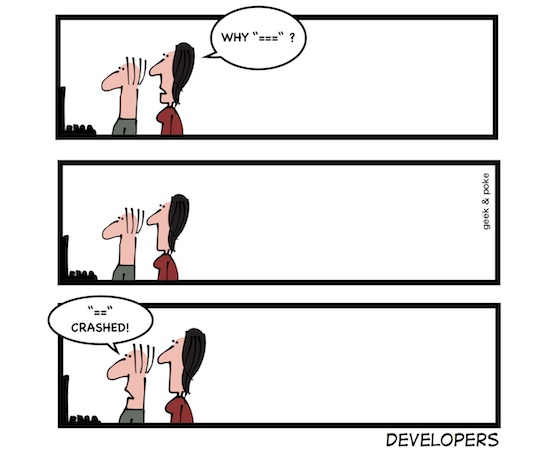

### Operator Logika

Ada enam jenis operator logika yang bisa kita gunakan di dalam PHP:

| Contoh      | Nama          | Hasil                                                 |
| ----------- |---------------| ----------------------------------------------------- |
| `!$a`       | Not  | `true` jika `$a` bernilai `false`                              |
| `$a AND $b` | And  | `true` jika `$a` dan `$b` bernilai `true`                      |
| `$a && $b`  | And  | `true` jika `$a` dan `$b` bernilai `true`                      |
| `$a OR $b`  | Or   | `true` jika salah satu atau keduanya bernilai `true`           |
| `$a || $b`  | Or   | `true` jika salah satu atau keduanya bernilai `true`           |
| `$a XOR $b` | Xor  | `true` jika `$a` atau `$b` bernilai `true` tapi tidak keduanya |

Operator `AND` dan `&&` memiliki fungsi yang serupa, pun begitu operator `&&` memiliki prioritas yang lebih tinggi dibandingkan operator `AND`. Begitu pula dengan operator `OR` dan `||`—operator `||` memiliki prioritas lebih tinggi daripada `OR`. Cek [prioritas operator](#prioritas-operator).

Perhatikan keluaran dari kode di bawah ini:

```php
var_dump(!true); // false
var_dump(!false); // true

var_dump(true && false); // false
var_dump(true && true); // true

var_dump(true || false); // true
var_dump(true || true); // true
var_dump(false || false); // false

var_dump(true XOR false); // true
var_dump(true XOR true); // false
```

*Type juggling* akan diterapkan bila kita menggunakan tipe data lain selain `boolean`:

```php
var_dump(!''); // true
var_dump(!'   '); // false

var_dump(!0); // true
var_dump(!-10); // false
var_dump(!0.0); // true
var_dump(!0.5); // false
var_dump(!'0'); // true

var_dump(![]); // true
var_dump(![1, 2]); // false

var_dump(10 && 'ewok'); // true
var_dump(10 && ''); // false
```

### Operator Ternary

Operator *ternary* (`?:`) bekerja seperti struktur kontrol [`if...else`](#percabangan-dengan-if-elseif-dan-else).

```php
(expression1) ? (expression2) : (expression3)
```

Baris di atas akan dievaluasi sebagai `expression2` apabila `expression1` bernilai `true` setelah diterapkan *type juggling*. Sebaliknya, bila `expression1` bernilai `false`, maka `expression3` yang akan dievaluasi. Perhatikan contoh berikut:

```php
$jedi = 'yoda';

// Output: Do or do not there is no try.
echo $jedi === 'yoda' ? 'Do or do not there is no try.' : 'Hello there!';
```

Karena `expression1` bernilai `true`, maka kita akan mendapatkan keluaran berupa `'Do or do not...`. Coba ubah nilai dari *variable* `$jedi`.

```php
$jedi = 'kenobi';

// Output: Hello there!
echo $jedi === 'yoda' ? 'Do or do not there is no try.' : 'Hello there!';
```

Sejak PHP versi 5.3, bagian `expression2` bersifat opsional:

```php
(expression1) ?: (expression3)
```

Baris di atas akan dievaluasi sebagai `expression1` apabila ia bernilai `true` setelah diterapkan *type juggling*. Bilai bernilai `false`, maka `expression3` yang akan dievaluasi. Perhatikan contoh berikut:

```php
$jedi = 'Kenobi';

$name = $jedi ?: 'John Doe';

echo $name; // Kenobi
```

Apabila *variable* `$jedi` bernilai `false` (setelah *type juggling*), maka nilai `John Doe` lah yang akan diberikan pada `$name`:

```php
$jedi = '';

$name = $jedi ?: 'John Doe';

echo $name; // John Doe
```

### Null Coalescing Operator

Ada juga *null coalescing operator* (`??`) yang tersedia sejak PHP versi 7:

```php
(expression1) ?? (expression2)
```

Baris di atas akan dievaluasi menjadi `expression2`, apabila `expression1` bernilai `null`. Apabila `expression1` tidak bernilai `null`, maka `expression1` yang akan dievaluasi.

```php
$jedi = 'Kenobi';

$name = $jedi ?? 'John Doe';

echo $name; // Kenobi
```

Namun jika `$jedi` bernilai `null`, maka `$name` akan bernilai `John Doe`:

```php
$jedi = null;

$name = $jedi ?? 'John Doe';

echo $name; // John Doe
```

### Operator String

Ada dua operator *string* yang bisa kita gunakan: `.` dan `.=`. Keduanya sama-sama berfungsi untuk menggabungkan dua buah `string`:

```php
echo 'Luke' . ' ' . 'Skywalker'; // Luke Skywalker

$name = 'Luke';
$name .= ' Skywalker';
echo $name; // Luke Skywalker
```

### Operator Array

PHP juga menyediakan beberapa operator yang bisa digunakan untuk *array*:

| Contoh      | Nama         |
| ----------- |--------------|
| `$a + $b`   | Union        |
| `$a == $b`  | Equality     |
| `$a === $b` | Identity     |
| `$a != $b`  | Inequality   |
| `$a <> $b`  | Inequality   |
| `$a !== $b` | Non-Identity |

Operator `+` akan menggabungkan kedua *array*. Jika kedua *array* memiliki *key* yang sama, maka nilai dari sisi kiri akan digunakan:

```php
print_r([0,1] + [4,4,4]); // [0, 1, 4]

print_r(['name' => 'John'] + ['age' => 20]); // ['name' => 'John', 'age' => 20]
```

Operator `==` akan menghasilkan `true` jika kedua memiliki pasangan *key*/*value* yang sama setelah diterapkan *type juggling*. Sementara operator `===`, selain mengecek kesamaan nilai, ia juga akan mengecek tipe data serta urutuannya.

```php
var_dump([1,2] == [true,'2']); // true
var_dump(['name' => 'John', 'age' => 20] == ['age' => '20', 'name' => 'John']); // true
var_dump(['name' => 'John'] == ['name' => 'john']); // false

var_dump([1,2] === [true,'2']); // false
var_dump(['name' => 'John', 'age' => 20] === ['age' => 20, 'name' => 'John']); // false
var_dump(['name' => 'John', 'age' => 20] === ['name' => 'John', 'age' => 20]); // true
```

Adapun operator `!=`, `<>` dan `!==` merupakan kebalikan dari operator `==` dan `===`.

### Operator Tipe

PHP memiliki satu operator tipe: `instanceof`—ia digunakan untuk mengecek apakah sebuah *variable* merupakan *instance* dari sebuah kelas ataupun kelas turunannya.

```php
$date = new DateTime();
var_dump($date instanceof DateTime); // true
var_dump($date instanceof Exception); // false

$err = new RuntimeException('Some error');
var_dump($err instanceof RuntimeException); // true
var_dump($err instanceof Exception); // true
```

### Error Control Operator

PHP memiliki satu operator untuk mengendalikan *error*: `@`—sesuai namanya ia digunakan untuk "menelan" pesan kesalahan yang bisa terjadi pada sebuah ekspresi. Misalnya kita ingin membuka *file* bernama `unicorn.txt`:

```php
$file = fopen('unicorn.txt', 'r');
```

Jika *file* `unicorn.txt` ini tidak ada, kita akan mendapatkan pesan *warning* seperti di bawah (dengan catatan kita menyertakan *level* `E_WARNING` pada konfigurasi [`error_reporting`](https://secure.php.net/manual/en/errorfunc.configuration.php#ini.error-reporting) PHP).

```php
Warning: fopen(unicorn.txt): failed to open stream: No such file or directory in /foo.php on line 3
```

Untuk menekan pesan *error* seperti di atas, kita bisa gunakan operator `@`:

```php
$file = @fopen('unicorn.txt', 'r');
```

Umumnya operator ini dikombinasikan dengan perintah `die` atau `exit` untuk menghentikan eksekusi program.

```php
$file = @fopen('unicorn.txt', 'r') OR die('Unicorn does not exists ️☹');
```

### Execution Operator

PHP memiliki satu *execution operator* berupa *backtick* (`` ` ``). Operator ini memiliki fungsi yang sama persis dengan fungsi [`shell_exec`](https://secure.php.net/manual/en/function.shell-exec.php). Isi diantara *backtick* akan dieksekusi sebagai perintah pada *shell* atau terminal.

Operator ini juga akan mengembalikan `string` yang merupakan *output* terminal dari perintah yang dieksekusi.

```php
echo `pwd`; // Mencetak direktori kerja.
echo `ls`; // Mencetak daftar direktori dan file pada direktori kerja.
echo `cat unicorn.txt`; // Mencetak isi file unicorn.txt
```

> ⚠️ **Hati-hati dalam menggunakan execution operator**
>
> Hati-hati dalam menggunakan *input* dari pengguna untuk menjalankan *execution operator* atau fungsi `shell_exec`. Operator ini bisa menjadi celah keamanan yang dieksploitasi untuk menjalankan perintah yang berbahaya pada *server* kita.

### Prioritas Operator

Setiap operator dalam PHP memiliki tingkat prioritas yang berbeda. Sama seperti apa yang telah kita pelajari di bangku sekolah dasar, operasi perkalian `*` akan didahulukan sebelum operasi penjumlahan `+`:

```php
var_dump(2 + 10 * 5); // 52

var_dump(5 * 10 ** 2); // 500
```

Cek dokumentasi PHP untuk daftar lengkap prioritas operator: [Operator Precedence](https://secure.php.net/manual/en/language.operators.precedence.php).

Kita juga bisa menggunakan tanda kurung `(...)` untuk mengelompokan operasi. Ini sangat berguna saat kita ragu dengan prioritas operator yang akan dijalankan.

```php
var_dump((2 + 10) * 5); // 60

var_dump((5 * 10) ** 2); // 2500
```

### Latihan Menggunakan Operator

Untuk melatih penggunaan operator, buatlah *file* PHP baru dan beri nama `08_operators.php`:

```php
<?php

// Arithmetic operators.
var_dump((10 + 20 - 5) * 4); // 100
var_dump(10 / 4); // 2.5
var_dump(10 % 4); // 2
var_dump(10 % 2); // 0
var_dump(-10 % 7); // -3
var_dump(5 ** 2); // 25

// Assignment operators.
$a = 100;
$a += 100;
var_dump($a); // 200

$a = 100;
$a -= 150;
var_dump($a); // -50

$a = 10;
$a *= -2.5;
var_dump($a); // -25.0

$a = 10;
$a /= 2;
var_dump($a); // 5

$a = 10;
$a %= 4;
var_dump($a); // 2

$a = 2;
$a **= 4;
var_dump($a); // 16

// Increment & decrement.
$num = 100;
var_dump(++$num); // 101

$num = 100;
var_dump($num++); // 100
var_dump($num); // 101

$num = 100;
var_dump(--$num); // 99

$num = 100;
var_dump($num--); // 100
var_dump($num); // 99

// Comparison operators.
var_dump('10' == 10); // true
var_dump('10 klingon' == 10); // true
var_dump('klingon 10' == 0); // true
var_dump('   1' == 0); // false

var_dump('10' === 10); // false
var_dump(10.0 === 10); // false
var_dump(10 === 10); // true

var_dump(10 >= 10.0); // true
var_dump('10 klingon' > 10); // false
var_dump('10 klingon' >= 10); // true
var_dump(-10 <= -11); // false

var_dump(10.0 <=> 10); // 0
var_dump(10 <=> 5); // 1
var_dump(10 <=> 99); // -1
var_dump('10 klingon' <=> 9); // 1

// Logical operators.
var_dump(!true); // false
var_dump(!100); // false
var_dump(!0.0); // true

var_dump(true && false); // false
var_dump(true && true); // true
var_dump(!0.0 && 'Romulan'); // true

var_dump(true || false); // true
var_dump(true || true); // true
var_dump(false || false); // false
var_dump(!0 || false); // true
```

### Rangkuman Operator dalam PHP

Dari subbab operator ini, kita bisa simpulkan beberapa poin utama:

* Operator aritmetik digunakan untuk melakukan operasi aritmetik seperti penambahan, perkalian hingga pemangkatan.
* Operator *assignment* digunakan untuk memberikan nilai pada suatu *variable*. Untuk mempersingkat, operator ini bisa digabungkan dengan operator aritmetik.
* Operator *increment* digunakan untuk menambah nilai dari *variable* sebesar satu. Sebaliknya *decrement* digunakan untuk mengurangi nilai *variable* sebesar satu.
* Operator *bitwise* digunakan untuk melakukan operasi pada tingkatan bit.
* Operator `==` dan `!=` akan membandingkan nilai setelah diterapkan *type juggling*. Sementara `===` dan `!==` akan mempertimbangkan nilai sekaligus tipe datanya.
* Setiap operator dalam PHP memiliki tingkat prioritas yang berbeda-beda. Contohnya operator `*` akan didahulukan sebelum operator `+` atau `-`.

## Percabangan dengan If Elseif dan Else


### Keyword If

*Keyword* `if` digunakan untuk mengatur alur eksekusi program, dimana suatu blok kode (`body`) hanya akan dieksekusi bila syarat yang ditentukan dipenuhi (`condition`).

```php
if (condition)
    body
```

Misal kita ingin mencetak sebuah pesan jika nama pengguna adalah `yoda`:

```php
$name = 'yoda';

if ($name === 'yoda')
    echo 'Do or do not there is no try.';
```

Pesan `Do or do not...` hanya akan tercetak jika nilai `$name` sama dengan `yoda`. Coba ubah nilai `$name` dengan `jar jar binks`, pesan `Do or do not...` tidak akan tercetak.

Ingat bahwa PHP tidak memedulikan spasi. Jadi blok kode `body` yang hanya terdiri dari satu *statement* saja, bisa ditempatkan dalam baris yang sama:

```php
$name = 'yoda';

if ($name === 'yoda') echo 'Do or do not there is no try.';
```

Namun apabila blok kode `body` lebih dari satu *statement*, kita harus menggunakan kurang kurawal `{...}` seperti berikut:

```php
$name = 'yoda';

if ($name === 'yoda') {
    echo "Do or do not there is no try.\n";
    echo 'Hmmmmm';
}
```

Perhatikan bagaimana kode di antara kurung kurawal menjorok ke dalam. Indentasi seperti ini tidak diperlukan, tapi sangat dianjurkan karena mempermudah kita untuk membedakan bagian yang termasuk ke dalam blok `if`.

> 🎨 **Gunakan 4 spasi untuk indentasi**
>
> Indentasi sangatlah penting. Dengannya kita dapat dengan mudah membedakan blok kode yang satu dengan yang lainnya. Panduan penulisan kode [PSR-2](https://www.php-fig.org/psr/psr-2/#24-indenting) menganjurkan kita untuk meninggalkan tab dan menggunakan 4 spasi sebagai indentasi. Hal ini umumnya dapat dengan mudah diatur pada *text editor*.

Kita juga bisa menyisipkan blok `if` di dalam blok `if` lainnya:

```php
$name = 'yoda';
$age = 900;

if ($name === 'yoda') {
    echo "Do or do not there is no try.\n";

    if ($age >= 900) {
        echo 'When 900 years old, you reach. Look as good, you will not.';
    }
}
```

Pesan `When 900 years old...` hanya akan tercetak bila `$name` adalah `yoda` dan `$age` lebih dari atau sama dengan `900`. Coba ubah nilai `$age` menjadi `899` atau `901`. Perhatikan juga *body* untuk blok `if` yang kedua menjorok sebesar 8 spasi.

> 🎨 **Selalu gunakan kurung kurawal meski hanya 1 statement**
>
> Mengikuti [panduan *control structures*](https://www.php-fig.org/psr/psr-2/#5-control-structures) pada PSR-2, dianjurkan untuk selalu menggunakan kurung kurawal dan indentasi meski *body* dari blok `if` hanya terdiri dari satu *statement*.

### Yoda Condition

Yoda adalah karakter dalam Star Wars yang memiliki gaya bicara yang tidak biasa. Dimana frasa-frasa dalam kalimatnya sering ditukar posisinya.


*Yoda condition*—atau dikenal juga dengan *Yoda notation*—merupakan istilah dalam pemrograman dimana dua bagian dari sebuah ekspresi kondisi ditukar. Nilai yang konstan ditempatkan di sebelah kiri operator dan nilai atau *variable* yang diperiksa ditempatkan di bagian kanan operator.

Menggunakan contoh sebelumnya, string `yoda` bersifat konstan sementara nilai dari *variable* `$name` dapat berubah:

```php
if ('yoda' === $name) {
    echo 'Do or do not there is no try.';
}
```

Gaya penulisan seperti ini untuk menghindari kesalahan yang bisa fatal akibatnya karena *programmer* lupa untuk menggunakan [operator perbandingan](#operator-perbandingan) (`==` atau `===`) dan justru menggunakan [operator *assignment*](#operator-assignment) (`=`).

```php
$balance = 1000000;

if ($balance = 0) {
    echo 'There is no money in your account. 😫';

    // Codes for closing user's account...
}
```

Bayangkan apabila rekening pengguna yang awalnya `1000000` kini menjadi `0` karena salah menggunakan operator. Dengan penulisan gaya Yoda, kita terhindar dari ketidaksengajaan memasukan nilai ke sebuah *variable* saat lupa menggunakan operator perbandingan.

```php
$balance = 1000000;

if (0 = $balance) {
    echo 'There is no money in your account. 😫';

    // Codes for closing user's account...
}
```

Meski penggunaan operator yang salah, `$balance` dari pengguna tetap aman di `1000000`.

> 🎨 **Gaya Yoda di framework Symfony**
>
> Salah satu *framework* PHP yang mengadopsi Yoda *condition* adalah Symfony. Yoda *condition* hanya diterapkan untuk operator: `==`, `===`, `!=` dan `!==`. Operator perbandingan lainnya seperti `>`, `>=`, `<`, dan `<=` tetap menggunakan notasi biasa.

### Keyword Else

Kita bisa menggunakan *keyword* `else` jika ada blok kode yang ingin dieksekusi saat kondisi pada blok `if` tidak terpenuhi.

```php
$name = 'jar jar binks';

if ('yoda' === $name) {
    echo 'Do or do not there is no try.';
} else {
    echo 'You are not Yoda.';
}
```

Apabila kode di atas dijalankan, kita akan mendapatkan keluaran: `You are not Yoda.`. Ini terjadi karena nilai `$name` bukanlah `yoda`.

### Keyword Elseif

Kita bisa menggunakan *keyword* `elseif` atau `else if` bila ingin mengecek alternatif kondisi lainnya saat kondisi pada blok `if` tidak terpenuhi. Misal kita juga ingin menampilkan pesan khusus saat `$name` adalah `darth vader`:

```php
$name = 'darth vader';

if ('yoda' === $yoda) {
    echo 'Do or do not there is no try.';
} elseif ('darth vader' === $name) {
    echo 'I am your Father.';
}
```

Apabila dijalankan, kode di atas akan mencetak `I am your Father.`.

Kita bisa juga menambahkan *keyword* `else` untuk menangani kemungkinan nilai `$name` yang bukan `yoda` dan bukan pula `darth vader`:

```php
$name = 'jar jar binks';

if ('yoda' === $name) {
    echo 'Do or do not there is no try.';
} elseif ('darth vader' === $name) {
    echo 'I am your Father.';
} else {
    echo 'Who are you?';
}
```

*Keyword* `if` harus menjadi yang pertama, diikuti oleh `elseif` dan diakhiri dengan `else`. Kita bisa juga menggunakan *keyword* `elseif` lebih dari satu kali:

```php
$name = 'leia';

if ('yoda' === $name) {
    echo 'Do or do not there is no try.';
} elseif ('darth vader' === $name) {
    echo 'I am your Father.';
} elseif ('leia' === $name) {
    echo "Help me Obi-Wan Kenobi, you're my only hope.";
} else {
    echo 'Who are you?';
}
```

> 🎨 **Gunakan `elseif` dan jangan gunakan `else if`**
>
> *Keyword* `elseif` dan `else if` memiliki fungsi yang serupa. Namun bila merujuk pada panduan penulisan kode [PSR-2](https://www.php-fig.org/psr/psr-2/#51-if-elseif-else), dianjurkan untuk selalu menggunakan `elseif` ketimbang padanannya `else if`.

### Gaya Lain Penulisan If Elseif dan Else

Selain menggunakan kurung kurawal seperti pada contoh di atas. Blok `if`, `elseif`, dan `else` juga bisa ditulisan dengan titik koma (`:`):

```php
$name = 'jar jar binks';

if ('yoda' === $name):
    echo 'Do or do not there is no try.';
elseif ('darth vader' === $name):
    echo 'I am your Father.';
else:
    echo 'Who are you?';
endif;
```

Perhatikan juga bahwa penulisan blok `if` dengan gaya seperti ini, harus diakhiri dengan *keyword* `endif`. Penulisan seperti ini tidak dianjurkan dalam [PSR](https://www.php-fig.org/psr/psr-2/#51-if-elseif-else). Pun begitu penulisan seperti umum ditemukan dalam templat Wordpress.

### Type Juggling diterapkan Pada Kondisi

Perlu diingat juga bahwa [*type juggling*](#type-juggling) diterapkan pada pemeriksaan kondisi. Ekspresi pada kondisi `if` ataupun `elseif` akan diubah kedalam tipe data `boolean`.

```php
// Condition is TRUE ✅
if (-1) {
    echo 'Condition is TRUE ✅';
} else {
    echo 'Condition is FALSE ❌';
}

// Condition is FALSE ❌
if ('0') {
    echo 'Condition is TRUE ✅';
} else {
    echo 'Condition is FALSE ❌';
}

// Condition is FALSE ❌
if (0.0) {
    echo 'Condition is TRUE ✅';
} else {
    echo 'Condition is FALSE ❌';
}

// Condition is TRUE ✅
if ('0.0') {
    echo 'Condition is TRUE ✅';
} else {
    echo 'Condition is FALSE ❌';
}

// Condition is FALSE ❌
if ('') {
    echo 'Condition is TRUE ✅';
} else {
    echo 'Condition is FALSE ❌';
}

// Condition is TRUE ✅
if ('   ') {
    echo 'Condition is TRUE ✅';
} else {
    echo 'Condition is FALSE ❌';
}
```

### Latihan Percabangan dengan If Else dan Elseif

Untuk latihan, buat kembali contoh pada [subbab `elseif`](#keyword-elseif) dengan tambahan satu `elseif` lainnya:

```php
<?php

$name = 'han solo';

if ('yoda' === $name) {
    echo 'Do or do not there is no try.';
} elseif ('darth vader' === $name) {
    echo 'I am your Father.';
} elseif ('leia' === $name) {
    echo "Help me Obi-Wan Kenobi, you're my only hope.";
} elseif ('han solo' === $name) {
    echo 'I have a bad feeling about this.';
} else {
    echo 'Who are you?';
}
```

Simpan dengan nama `09_if_elseif_else.php`. Jalankan *file* PHP di atas dan coba ganti nilai dari *variable* `$name`.

### Rangkuman If Elseif dan Else

Dari subbab ini kita bisa simpulkan beberapa poin berikut:

* Kode pada blok `if` akan dieksekusi jika kondisinya terpenuhi (bernilai `true`).
* Kode pada blok `elseif` akan dieksekusi jika kondisinya terpenuhi sementara kondisi pada blok `if` serta blok-blok `elseif` sebelumnya tidak terpenuhi.
* Kode pada blok `else` akan dieksekusi bila kondisi pada blok `if` serta blok-blok `elseif` sebelumnya tidak terpenuhi.
* Selalu gunakan kurung kurawal meski `body` dari blok `if` hanya terdiri dari satu *statement*.
* Meski tidak diharuskan, indentasi pada bagian `body` sangat dianjurkan agar kode mudah dibaca.
* Yoda *condition* diterapkan pada ekpresi kondisi; dimana nilai yang konstan diletakan pada sisi kiri operator dan nilai *variable* yang bisa berubah-ubah pada sisi kanan operator. Ini untuk menghindari akibat fatal dari kesalahan penulisan operator perbandingan (`==` dan `===`) dengan operator *assignment* (`=`).
* *Type juggling* diterapkan juga pada kondisi `if` dan `elseif`.

## Percabangan dengan Switch

Fungsi dari *keyword* `switch` hampir sama dengan `if`. `switch` bisa kita gunakan apabila sebuah ekspresi (`expression`) memiliki beberapa kemungkinan `output`:

```php
switch (expression) {
    case output_1:
        // Kode yang dieksekusi jika expression == output_1
        break;
    case output_2:
        // Kode yang dieksekusi jika expression == output_2
        break;
        ...
    default:
        // Kode yang dieksekusi jika tidak ada output yang cocok
}
```

Berikut contoh implementasinya:

```php
$name = 'darth vader';

switch ($name) {
    case 'yoda':
        echo 'Do or do not there is no try.';
        break;
    case 'darth vader':
        echo 'I am your Father.';
        break;
    case 'leia':
        echo "Help me Obi-Wan Kenobi, you're my only hope.";
        break;
}
```

Kode di atas akan mencetak keluaran `I am your Father.`. Coba ganti nilai *variable* `$name` dengan `yoda` atau `leia`, keluaran apa yang tercetak?

### Keyword Break dalam Switch

Blok `switch` dijalankan dari atas ke bawah. Bila ada nilai `case` yang cocok, PHP akan mulai mengeksekusi kode setelahnya. *Keyword* `break` ini berguna untuk memberitahu PHP kapan harus berhenti mengeksekusi kode dalam blok tersebut.

Untuk memahaminya coba jalankan kode berikut:

```php
$name = 'darth vader';

switch ($name) {
    case 'yoda':
        echo "Do or do not there is no try.\n";
    case 'darth vader':
        echo "I am your Father.\n";
    case 'leia':
        echo "Help me Obi-Wan Kenobi, you're my only hope.";
}
```

Tanpa menggunakan `break`, kita akan mendapatkan keluaran seperti berikut:

```text
I am your Father.
Help me Obi-Wan Kenobi, you're my only hope.
```

Tanpa `break`, kode dalam blok untuk `leia` ikut tereksekusi juga. Apabila kita ganti nilai `$name` dengan `yoda`, kita akan mendapatkan keluaran seperti berikut:

```text
Do or do not there is no try.
I am your Father.
Help me Obi-Wan Kenobi, you're my only hope.
```

Untuk contoh kita sebelumnya, tentu keadaan seperti ini tidak diinginkan. Namun ada pula kasus dimana *keyword* `break` sengaja tidak disertakan. Ini umumnya diterapkan apabila beberapa `case` mengeksekusi kode yang sama. Perhatikan contoh berikut:

```php
$product = 'cucumber';

switch ($product) {
    case 'chicken':
        echo 'meat';
        break;
    case 'beef':
        echo 'meat';
        break;
    case 'carrot':
        echo 'vegetable';
        break;
    case 'cucumber':
        echo 'vegetable';
        break;
    case 'spinach':
        echo 'vegetable';
        break;
}
```

Karena `chicken` dan `beef` harus mengeksekusi kode yang sama, begitu pula dengan `carrot`, `cucumber` dan `spinach`, kita bisa menyederhanakan kode di atas menjadi:

```php
$product = 'cucumber';

switch ($product) {
    case 'chicken':
    case 'beef':
        echo 'meat';
        break;
    case 'carrot':
    case 'cucumber':
    case 'spinach':
        echo 'vegetable';
        break;
}
```

### Keyword Default dalam Switch

*Keyword* `default` dapat kita gunakan untuk menangani kemungkinan saat semua `case` tidak ada yang cocok.

```php
$name = 'jar jar binks';

switch ($name) {
    case 'yoda':
        echo 'Do or do not there is no try.';
        break;
    case 'darth vader':
        echo 'I am your Father.';
        break;
    case 'leia':
        echo "Help me Obi-Wan Kenobi, you're my only hope.";
        break;
    default:
        echo 'Who are you?';
        break;
}
```

Karena tidak ada `case` yang cocok untuk `jar jar binks`, maka blok `default` akan dieksekusi. *Keyword* `default` pun harus ditempatkan di paling akhir. Karena ditempatkan di paling akhir, sebetulnya *keyword* `break` pada `default` tidak diperlukan.

### Keterbatasan Switch

Tidak semua permasalahan percabangan cocok diselesaikan dengan `switch`. `case` pada blok `switch` tidak bisa menerima sebuah ekspresi dan hanya bisa menerima sebuah nilai. `switch` cocok untuk masalah percabangan yang kemungkinan kondisinya diskret atau *categorical*—seperti pada pengelompokan jenis makanan pada contoh sebelumnya.

`switch` tidak cocok jika kemungkinan kondisinya bersifat kontinu atau dalam rentang tertentu. Misalnya untuk masalah pengecekan nilai dengan rentang `0` sampai `100`—dimana murid dinyatakan lulus jika nilainya lebih dari `50`. Kode di bawah ini tidak akan bisa dijalankan:

```php
$score = 51;

switch ($score) {
    case <= 50:
        echo 'Failed!';
        break;
    default:
        echo 'Passed!';
        break;
}
```

Kita tidak bisa menggunakan ekspresi pada `case`. Sehingga kita harus menuliskan semua kemungkinan `case` untuk `$score`:

```php
$score = 51;

switch ($score) {
    case 0:
    case 1:
    case 2:
        ...
    case 50:
        echo 'Failed!';
        break;
    default:
        echo 'Passed!';
        break;
}
```

Bayangkan jika `$score` memiliki rentang dari `0—1000`! Kasus seperti ini dapat dengan mudah diselesaikan dengan `if...else`:

```php
$score = 51;

if ($score <= 50) {
    echo 'Failed!';
} else {
    echo 'Passed!';
}
```

### Latihan Percabangan Switch

Sebagai latihan, ubah kode pada [latihan `if elseif else`](#latihan-percabangan-dengan-if-else-dan-elseif) sebelumnya ke dalam bentuk `switch`. Simpan ubahan *file* tersebut dengan nama `10_switch.php`.

```php
<?php

$name = 'han solo';

switch ($name) {
    case 'yoda':
        echo 'Do or do not there is no try.';
        break;
    case 'darth vader':
        echo 'I am your Father.';
        break;
    case 'leia':
        echo "Help me Obi-Wan Kenobi, you're my only hope.";
        break;
    case 'han solo':
        echo 'I have a bad feeling about this.';
        break;
    default:
        echo 'Who are you?';
        break;
}
```

### Rangkuman Percabangan Switch

Pada subbab `switch` ini dapat kita simpulkan beberapa hal:

* `switch` digunakan untuk menyelesaikan masalah percabangan yang kemungkinan kondisinya bersifat diskret dan bukan kontinu.
* Saat ada `case` yang cocok, *keyword* `break` digunakan untuk memberitahu PHP kapan harus berhenti mengeksekusi kode pada blok tersebut.
* *Keyword* `default` digunakan untuk menangani kemungkinan kondisi diluar `case` yang dideklarasikan sebelumnya.

## Perulangan dengan While

Perulangan digunakan untuk mengeksekusi suatu blok kode berkali-kali selama kondisi yang disyaratkan terpenuhi. Salah satu *keyword* perulangan yang bisa kita gunakan dalam PHP adalah `while`:

```php
while (condition)
    body
```

Blok `body` akan dieksekusi berulang kali selama `condition` terpenuhi (bernilai `true`). Berikut contoh sederhananya:

```php
$num = 0;

while ($num < 5)
    echo 'Number: ' . $num++ . "\n";
```

Apabila kode di atas dijalankan, kita akan mendapatkan keluaran seperti berikut:

```shell
Number: 0
Number: 1
Number: 2
Number: 3
Number: 4
```

Sama halnya dengan blok `if`, meski hanya ada satu *statement* pada blok `body`, dianjurkan untuk selalu menggunakan kurung kurawal dan indentasi:

```php
$num = 0;

while ($num < 5) {
    echo 'Number: ' . $num++ . "\n";
}
```

Pada contoh di atas, nilai dari *variable* `$num` bertambah satu disetiap perulangan. Perulangan baru berhenti saat nilai `$num` mencapai `5`. Kita juga bisa membalik perulangan di atas:

```php
$num = 4;

while ($num >= 0) {
    echo 'Number: ' . $num-- . "\n";
}
```

Kita akan mendapatkan *output* seperti berikut:

```shell
Number: 4
Number: 3
Number: 2
Number: 1
Number: 0
```

### Infinite Loop pada Perulangan While

*Infinite loop* atau perulangan tak hingga bisa terjadi pada `while` jika kondisi yang disyaratkan selalu bernilai `true`—mengakibatkan kode pada blok `body` dieksekusi terus menerus. Umumnya ini terjadi karena kita lupa untuk mengubah nilai *variable* yang digunakan pada syarat kondisi perulangan:

```php
$num = 0;

while ($num < 5) {
    echo $num + 1;
}
```

Pada contoh kode di atas, nilai dari `$num` tetap `0`. Blok `body` akan dieksekusi terus menerus dan kita akan mendapati deretan angka `1` tercetak di terminal.

### Keyword Break pada Perulangan While

Dalam blok `while`, kita juga bisa menggunakan *keyword* `break` untuk keluar dari perulangan—meski `condition` masih bernilai `true`.

```php
$num = 0;

while (true) {
    echo 'Number: ' . $num++ . "\n";

    if ($num >= 5) {
        break;
    }
}
```

Meski ekspresi kondisi selalu bernilai `true`, pada blok `body` kita mengecek nilai *variable* `$num`. Apabila nilai `$num` lebih dari atau sama dengan `5`, kita hentikan perulangan dengan menggunakan *keyword* `break`. Berikut keluaran dari kode di atas:

```shell
Number: 0
Number: 1
Number: 2
Number: 3
Number: 4
```

### Keyword Continue pada Perulangan While

Ada juga *keyword* `continue`—ia digunakan untuk menghentikan eksekusi kode pada siklus perulangan yang tengah berlangsung dan melanjutkan perulangan pada iterasi berikutnya (selama kondisi masih bernilai `true` tentunya).

```php
$num = 0;

while ($num < 10) {
    $num++;

    if (0 !== $num % 2) {
        continue;
    }

    echo "Number: $num\n";
}
```

Pada contoh kode di atas, kode `Number: $num\n` tidak akan dieksekusi apabila `$num` bernilai ganjil. Apabila kode di atas dijalankan, kita akan mendapatkan keluaran seperti di bawah ini:

```shell
Number: 2
Number: 4
Number: 6
Number: 8
Number: 10
```

### Gaya Lain Penulisan Perulangan While

Perulangan `while` juga memiliki alternatif penulisan yang lain:

```php
$num = 0;

while ($num < 5):
    echo 'Number: ' . $num++ . "\n";
endwhile;
```

Perhatikan bagaimana kurung kurawal pembuka digantikan dengan titik dua (`:`) dan kurung kurawal penutup diganti dengan `endwhile`. Meski diperbolehkan, penulisan seperti ini tidak dianjurkan oleh panduan [PSR-2](https://www.php-fig.org/psr/psr-2/#53-while-do-while).

Apabila dijalankan, kode di atas akan menghasilkan *output* yang sama:

```shell
Number: 0
Number: 1
Number: 2
Number: 3
Number: 4
```

### Type Juggling pada Perulangan While

Seperti pada `if` dan `elseif`, *type juggling* juga diberlakukan pada kondisi blok `while`:

```php
// Condition is TRUE. ✅
while (-1) {
    echo 'Condition is TRUE.';
    break;
}

// Won't be executed. ❌
while ('0') {
    echo 'Condition is TRUE.';
    break;
}

// Won't be executed. ❌
while (0.0) {
    echo 'Condition is TRUE.';
    break;
}

// Condition is TRUE. ✅
while ('0.0') {
    echo 'Condition is TRUE.';
    break;
}

// Won't be executed. ❌
while ('') {
    echo 'Condition is TRUE.';
    break;
}

// Condition is TRUE. ✅
while ('   ') {
    echo 'Condition is TRUE.';
    break;
}
```

### Latihan Perulangan While

Untuk melatih penggunaan `while`, buatlah program untuk mencetak bilangan ganjil antara `0` sampai `10`. Beri nama *file* baru ini dengan `11_while_loop.php`.

```php
<?php

// Approach #1
$num = 0;

while ($num <= 10) {
    if (0 !== $num % 2) {
        echo "Odd number: $num\n";
    }

    $num++;
}

// Approach #2 - Bad example, not straight forward for our simple case.
$num = 0;

while (true) {
    if (0 !== $num % 2) {
        echo "Odd number: $num\n";
    }

    if ($num++ >= 10) {
        break;
    }
}

// Approach #3 - Bad example too, not straight forward for our simple case.
$num = 0;

while ($num <= 10) {
    if (0 === $num % 2) {
        $num++;
        continue;
    }

    echo 'Odd number '. $num++ . "\n";
}

// Approach #4 - with increment of 2.
$num = 1;

while ($num < 10) {
    echo "Odd number: $num\n";
    $num += 2;
}
```

Selanjutnya dengan perulangan `while`, buatlah program yang dapat mencetak keluaran seperti berikut pada terminal:

```shell
*
**
***
****
*****
******
*******
********
*********
**********
```

Simpan *file* ini dengan nama `12_while_loop_triangle.php`.

```php
<?php

$row = 0;

while ($row < 10) {
    $row++;
    $col = 0;
    $stars = '';

    while ($col < $row) {
        $col++;
        $stars .= '*';
    }

    echo "$stars\n";
}
```

### Rangkuman Perulangan While

Beberapa hal yang dapat kita rangkum dari subbab `while`:

* Blok `body` pada perulangan `while` akan terus dieksekusi selama kondisi yang disyaratkan terpenuhi (bernilai `true`).
* *Infinite loop* dapat terjadi saat kondisi yang disyaratkan selalu bernilai `true` dan tidak ada mekanisme yang diterapkan untuk keluar dari perulangan tersebut (tidak menggunakan *keyword* `break`).
* *Infinite loop* umumnya terjadi karena kita lupa untuk mengubah nilai *variable* yang digunakan pada syarat kondisi perulangan, akibatnya kondisi yang diterapkan selalu bernilai `true`.
* *Keyword* `break` digunakan untuk keluar dari perulangan.
* *Keyword* `continue` digunakan untuk menghentikan eksekusi pada siklus perulangan yang tengah berlangsung dan melanjutkan perulangan pada iterasi berikutnya (selama kondisi perulangannya masih bernilai `true`).

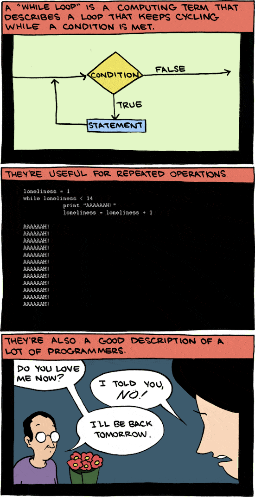

## Perulangan Do-While

Perulangan dengan `do-while` hampir sama dengan `while`, hanya saja pengecekan kondisi (`condition`) pada `do-while` dilakukan pada bagian akhir di setiap perulangan—setelah `body` dieksekusi.

```php
do {
    body
} while(condition);
```

Berikut contoh implementasinya:

```php
$num = 0;

do {
    echo 'Number: ' . $num++ . "\n";
} while ($num < 5);
```

Apabila kode di atas dijalankan, kita akan mendapatkan keluaran seperti di bawah:

```shell
Number: 0
Number: 1
Number: 2
Number: 3
Number: 4
```

Struktur `do-while` yang mengecek kondisi perulangan setelah blok `body`, menjamin kode pada blok `body` dieksekusi setidaknya satu kali—meski kondisi perulangannya tidak terpenuhi.

```php
$num = 0;

do {
    echo 'I will be executed once.';
} while ($num > 100);
```

Meski nilai `$num` tidak memenuhi syarat perulangan, blok `body` pada kode di atas tetap dieksekusi sebanyak satu kali. Kita akan mendapatkan keluaran seperti di bawah:

```shell
I will be executed once.
```

Berbeda dengan perulangan `while`, jika kondisi tidak terpenuhi pada perulangan pertama, kode pada blok `body` tidak akan dijalankan sama sekali:

```php
$num = 0;

while ($num > 100) {
    echo "I won't be executed.";
}
```

Salah satu contoh pemanfaatannya adalah pada aplikasi *command line*, dimana kita meminta sebuah *input* dari pengguna dengan syarat tertentu.

```php
$evenNumber = null;

do {
    $evenNumber = readline('Please enter an even number: ');
} while($evenNumber % 2 !== 0);

echo "You entered: $evenNumber";
```

Apabila dijalankan pada terminal, kode di atas akan meminta masukan angka genap dari pengguna. Perulangan `do-while` baru akan berhenti saat pengguna memasukan angka genap. Fungsi [`readline`](https://secure.php.net/manual/en/function.readline.php) digunakan untuk membaca satu baris masukan dari pengguna.

```shell
Please enter an even number: 1
Please enter an even number: 7
Please enter an even number: 8
You entered: 8
```

Dengan perulangan `while` kita harus menggunakan fungsi `readline` di dua tempat:

```php
$evenNumber = readline('Please enter an even number: ');

while ($evenNumber % 2 !== 0) {
    $evenNumber = readline('Please enter an even number: ');
};

echo "You entered: $evenNumber";
```

Atau harus menggunakan pengecekan kondisi yang lebih rumit:

```php
$evenNumber = null;

while($evenNumber === null || $evenNumber % 2 !== 0) {
    $evenNumber = readline('Please enter an even number: ');
};

echo "You entered: $evenNumber";
```

### Infinite Loop pada Perulangan Do-While

Seperti pada `while`, *infinite loop* umumnya terjadi pada `do-while` karena kita lupa untuk mengubah nilai *variable* yang digunakan pada pengecekan kondisi:

```php
$num = 0;

do {
    echo $num + 1;
} while ($num < 5);
```

Kode di atas akan terus menerus mencetak angka `1`. Kondisi `$num < 5` akan selalu bernilai `true` pada tiap perulangan karena *variable* `$num` tidak berubah dan selalu bernilai `0`.

### Keyword Break pada Perulangan Do-While

Sama halnya dengan blok `while`, kita juga bisa menggunakan *keyword* `break` pada `do-while` untuk keluar dari perulangan.

```php
$num = 0;

do {
    echo 'Number: ' . $num++ . "\n";

    if ($num >= 5) {
        break;
    }
} while (true);
```

Pada kode di atas, perulangan `do-while` akan berhenti saat nilai `$num` lebih dari atau sama dengan `5`. Kita akan mendapatkan keluaran seperti berikut:

```shell
Number: 0
Number: 1
Number: 2
Number: 3
Number: 4
```

### Keyword Continue pada Perulangan Do-While

*Keyword* `continue` pun dapat kita gunakan dalam blok `do-while`. Fungsinya sama: untuk menghentikan eksekusi kode pada perulangan yang tengah berlangsung dan langsung melanjutkan perulangan pada iterasi berikutnya (selama kondisinya masih `true`).

```php
$num = 0;

do {
    $num++;

    if (0 !== $num % 2) {
        continue;
    }

    echo "Number: $num\n";
} while ($num < 10);
```

Pada contoh di atas, blok kode `echo "Number: $num\n"` tidak akan dieksekusi saat nilai dari `$num` ganjil. Hasilnya kita akan mendapatkan keluaran berupa angka-angka genap:

```shell
Number: 2
Number: 4
Number: 6
Number: 8
Number: 10
```

### Latihan Perulangan Do-While

Untuk latihan, ubah kode pada [latihan perulangan `while`](#latihan-perulangan-while) dengan menggunakan *keyword* `do-while` lalu simpan dengan nama `13_do_while_loop.php`.

```php
<?php

// Approach #1
$num = 0;

do {
    if (0 !== $num % 2) {
        echo "Odd number: $num\n";
    }

    $num++;
} while ($num <= 10);

// Approach #2 - Bad example, not straight forward for our simple case.
$num = 0;

do {
    if (0 !== $num % 2) {
        echo "Odd number: $num\n";
    }

    if ($num++ >= 10) {
        break;
    }
} while (true);

// Approach #3 - Bad example too, not straight forward for our simple case.
$num = 0;

do {
    if (0 === $num % 2) {
        $num++;
        continue;
    }

    echo 'Odd number: '. $num++ , "\n";
} while ($num <= 10);

// Approach #4 - with increment of 2.
$num = 1;

do {
    echo "Odd number: $num\n";
    $num += 2;
} while ($num < 10);
```

Dengan memanfaatkan `do-while`, buat juga program untuk mencetak keluaran seperti berikut:

```shell
*
**
***
****
*****
******
*******
********
*********
**********
```

Simpan *file* ini dengan nama `14_do_while_loop_triangle.php`.

```php
<?php

$row = 0;

do {
    $row++;
    $col = 0;
    $stars = '';

    do {
        $col++;
        $stars .= '*';
    } while ($col < $row);

    echo "$stars\n";
} while ($row < 10);
```

### Rangkuman Perulangan Do-While

Dari subbab `do-while` ini bisa kita simpulkan poin-poin berikut:

* Perulangan `do-while` mirip dengan `while`, hanya saja pengecekan kondisi dilakukan pada bagian akhir—setelah blok `body` dieksekusi.
* Perulangan `do-while` menjamin kode pada blok `body` dieksekusi satu kali meski kondisi perulangannya tidak terpenuhi.
* Sama seperti `while`, kita bisa menggunakan *keyword* `break` dan `continue` pada perulangan `do-while`.

## Perulangan dengan For

*Keyword* perulangan lainnya yang bisa kita gunakan adalah `for`.

```php
for (expression1, condition, expression2)
    body
```

Sebuah blok perulangan `for`, bisa dibagi kedalam 4 bagian:

1. `expression1`: Sebuah ekspresi yang akan dijalankan hanya satu kali di awal perulangan. Ekspresi ini akan tetap dijalankan meski kondisi yang disyaratkan tidak terpenuhi. Umumnya digunakan untuk menginisiasi *variable* yang digunakan dalam perulangan.
2. `condition`: Ekspresi kondisi yang menjadi syarat untuk perulangan.
3. `expression2`: Ekspresi yang akan dieksekusi di tiap akhir perulangan. Umumnya digunakan untuk mengubah nilai *variable* yang digunakan dalam perulangan.
4. `body`: Blok kode yang akan dieksekusi jika `condition` terpenuhi (bernilai `true`).

Contoh sederhana penggunaanya:

```php
for ($i = 0; $i < 5; $i++)
    echo "Number: $i\n";
```

Apabila kode di atas dijalankan, kita akan mendapat keluaran seperti berikut:

```shell
Number: 0
Number: 1
Number: 2
Number: 3
Number: 4
```

Apabila blok `body` hanya terdiri dari satu *statment*, kita tidak diharuskan untuk menggunakan kurung kurawal (`{...}`). Pun begitu, panduan [PSR-2](https://www.php-fig.org/psr/psr-2/#54-for) menganjurkan kita untuk selalu menggunakan kurung kurawal dan indentasi 4 spasi untuk blok `for`:

```php
for ($i = 0; $i < 5; $i++) {
    echo "Number: $i\n";
}
```

Kita juga bisa melakukan perulangan "mundur"—dari angka `4` ke angka `0`:

```php
for ($i = 4; $i >= 0; $i--) {
    echo "Number: $i\n";
}
```

Apabila kode di atas dijalankan, kita akan mendapatkan hasil seperti berikut:

```shell
Number: 4
Number: 3
Number: 2
Number: 1
Number: 0
```

Bagian `expression2`, tidak melulu harus menggunakan operator *increment* atau *decrement*. Kita bisa menggunakan operator *assignment* seperti pada contoh berikut:

```php
for ($i = 1; $i <= 10; $i += 2) {
    echo "Odd number: $i\n";
}
```

Apabila kode di atas dijalankan, kita akan mendapatkan keluaran berupa deretan angka ganjil:

```shell
Odd number: 1
Odd number: 3
Odd number: 5
Odd number: 7
Odd number: 9
```

### Keyword Break pada Perulangan For

Sama halnya seperti perulangan `while` atau `do-while`, kita juga bisa menggunakan *keyword* `break` pada perulangan `for`. Keyword `break` ini digunakan untuk keluar dari perulangan:

```php
for ($i = 0; $i <= 10; $i++) {
    if ($i >= 4) {
        break;
    }

    echo "Number: $i\n";
}
```

Apabila dijalankan, kode di atas akan mencetak angka `0` sampai `3` saja:

```shell
Number: 0
Number: 1
Number: 2
Number: 3
```

Hal ini terjadi karena saat nilai *variable* `$i` sama dengan `4`, *keyword* `break` akan dieksekusi sehingga perulangan terhenti.

### Keyword Continue pada Perulangan For

*Keyword* `continue` juga memiliki fungsi yang sama pada blok perulangan `for`. Ia akan berhenti mengeksekusi kode pada perulangan yang tengah berlangsung dan langsung melanjutkanya pada iterasi perulangan berikutnya (selama `condition` masih `true`).

```php
for ($i = 1; $i <= 10; $i++) {
    if (0 !== $i % 2) {
        continue;
    }

    echo "Even number: $i\n";
}
```

Apabila kode di atas dijalankan, kita akan mendapatkan deretan angka genap:

```shell
Even number: 2
Even number: 4
Even number: 6
Even number: 8
Even number: 10
```

### Gaya Lain Penulisan Perulangan For

Perulangan `for` juga memiliki alternatif gaya penulisan lainnya:

```php
for ($i = 0; $i < 5; $i++):
    echo "Number: $i\n";
endfor;
```

Apabila kode di atas dijalankan, kita akan mendapatkan keluaran yang serupa:

```shell
Number: 0
Number: 1
Number: 2
Number: 3
Number: 4
```

Meski diperbolehkan, panduan [PSR-2](#https://www.php-fig.org/psr/psr-2/#54-for) menganjurkan untuk selalu menggunakan versi dengan kurung kurawal (`{...}`). Pun begitu, gaya penulisan seperti ini acap kali kita temukan pada templat-templat Wordpress.

### Tiga Ekspresi dalam Perulangan For Bersifat Opsional

Tahukan kamu bahwa tiga ekspresi dalam `for`: `expression1`, `condition` dan `expression2` bersifat opsional atau bisa ditinggalkan?

Contoh kode berikut akan mengakibatkan *infinite loop*, dimana nilai `$i` terus bertambah di tiap perulangan. Akan tercetak: `123456....` dan seterusnya.

```php
$i = 0;

for (;;) {
    echo $i++;
}
```

Kita juga boleh hanya menyediakan sebagian dari ekspresi yang digunakan *keyword* `for`:

```php
$i = 0;

for (;$i < 5;) {
    echo $i++;
}
```

Kode di atas akan mencetak: `1234`. Perhatikan kembali contoh implementasi perulangan `for` kita yang pertama:

```php
for ($i = 0; $i < 5; $i++) {
    echo "Number: $i\n";
}
```

Kode perulangan di atas, bisa juga diubah ke dalam bentuk seperti di bawah ini (tentu kode di bawah jauh lebih sulit untuk dipahami):

```php
$i = 0;

for (;;) {
    if ($i >= 5) {
        break;
    }

    echo "Number: $i\n";
    $i++;
}
```

### Latihan Perulangan For

Untuk latihan buatlah *file* baru dengan nama `15_for_loop.php`. Kemudian tikan kode berikut untuk mencetak angka-angka ganjil antara `0` sampai `10`:

```php
<?php

// Approach #1
for ($i = 0; $i <= 10; $i++) {
    if (0 !== $i % 2) {
        echo "Odd number: $i\n";
    }
}

// Approach #2 - Bad example too, not straight forward for our simple case.
for ($i = 0; $i <= 10; $i++) {
    if (0 === $i % 2) {
        continue;
    }

    echo "Odd number: $i\n";
}

// Approach #3 - with increment of 2.
for ($i = 1; $i <= 10; $i += 2) {
    echo "Odd number: $i\n";
}
```

Selanjutnya, dengan menggunakan perulangan `for`, buatlah program yang dapat mencetak keluaran seperti berikut:

```shell
*
**
***
****
*****
******
*******
********
*********
**********
```

Simpan *file* dengan nama `16_for_loop_triangle.php`.

```php
for ($row = 1; $row <= 10; $row++) {
    $stars = '';

    for ($col = 0; $col < $row; $col++) {
        $stars .= '*';
    }

    echo "$stars\n";
}
```

### Rangkuman Perulangan For

Poin-poin yang dapat kita simpulkan dari subbab `for` ini adalah:

* `expression1` yang menjadi bagian pertama dari perulangan `for` akan dijalankan satu kali  di awal perulangan. Ia akan tetap dieksekusi meski kondisi yang disyaratkan tidak terpenuhi.
* `condition` yang merupakan bagian kedua dari perulangan `for` berisi ekspresi yang menjadi syarat perulangan.
* `expression2`—bagian ketiga dari perulangan `for`—akan dieksekusi ditiap akhir siklus perulangan.
* Kode pada blok `body` akan dieksekusi terus menerus selama kondisi perulangan terpenuhi (bernilai `true`).
* *Keyword* `break` dapat digunakan untuk keluar dari perulangan meski kondisi yang disyaratkan masih terpenuhi.
* *Keyword* `continue` digunakan untuk menghentikan eksekusi kode pada perulangan yang tengah berlangsung dan melanjutkannya pada iterasi perulangan berikutnya (selama kondisi perulangan masih bernilai `true`).
* Ketiga ekspresi pada `for`: `expression1`, `condition`, dan `expression2` bersifat opsional.

## Fungsi dalam PHP

*Function* atau fungsi merupakan salah satu konsep yang sangat penting untuk kita pahami. Fungsi digunakan untuk mengelompokan sejumlah *statement* atau baris kode yang melakukan suatu pekerjaan spesifik. Misal kita ingin membuat sebuah fungsi yang dapat mencetak emoji buah-buahan:

```php
function printFruitEmojis()
{
    echo "🍏🍌🍉\n";
}
```

Apabila kode di atas dijalankan, kita tidak akan mendapatkan *output* apa-apa. Untuk mengeksekusi kode di dalam fungsi `printFruitEmojis`, kita harus memanggilnya dengan: `printFruitEmojis()`.

```php
function printFruitEmojis()
{
    echo "🍏🍌🍉\n";
}

// Memanggil fungsi.
printFruitEmojis();
```

Apabila kode di atas dijalankan, kita akan mendapatkan emoji buah-buahan tercetak di terminal:

```shell
🍏🍌🍉
```

Kita juga bisa berkali-kali memanggil fungsi `printFruitEmojis`:

```php
function printFruitEmojis()
{
    echo "🍏🍌🍉\n";
}

printFruitEmojis();
printFruitEmojis();
printFruitEmojis();
```

*Output* pada terminal:

```shell
🍏🍌🍉
🍏🍌🍉
🍏🍌🍉
```

### Memanggil Fungsi

Dalam PHP, kita bisa memanggil sebuah fungsi bahkan bila ia baru dideklarasikan setelahnya:

```php
printFruitEmojis();

function printFruitEmojis()
{
    echo "🍏🍌🍉\n";
}
```

Apabila kode di atas dijalankan, kita tetap akan mendapatkan emoji buah-buahan sebagaimana mestinya:

```shell
🍏🍌🍉
```

Meski begitu, fungsi yang dideklarasikan di dalam blok `if`, baru bisa dipanggil apabila kode di dalam blok `if` tersebut dieksekusi (kondisi bernilai `true`).

```php
$loveFruits = true;

// Memanggil printFruitEmojis di sini akan menghasilkan error:
// Uncaught Error: Call to undefined function printFruitEmojis()
// printFruitEmojis();

if ($loveFruits) {
    function printFruitEmojis()
    {
        echo "🍏🍌🍉\n";
    }
}

// Bisa dipanggil setelah blok if dan jika $loveFruits = true.
printFruitEmojis();
```

Begitupun deklarasi fungsi yang berada di dalam fungsi lainnya. Fungsi yang berada di dalam, baru bisa dipanggil apabila fungsi luarnya telah dipanggil.

```php
// Memanggil printFruitEmojis di sini akan menghasilkan error:
// Uncaught Error: Call to undefined function printFruitEmojis
// printFruitEmojis();

getHealthyFoods();

// Bisa dipanggil setelah memanggil fungsi getHealthyFoods terlebih dahulu.
printFruitEmojis();

function getHealthyFoods()
{
    echo "👍🏻👍🏻👍🏻\n";

    function printFruitEmojis()
    {
        echo "🍏🍌🍉\n";
    }
}
```

### Aturan Penulisan Fungsi

Nama sebuah fungsi bisa terdiri dari huruf, angka, ataupun *underscore* (`_`). Pun begitu, nama fungsi tidak boleh didahului oleh angka. Berikut contoh nama-nama fungsi yang valid dalam PHP:

```php
function printFruitEmojis()
{
    //
}

function Print17FoodEmojis()
{
    //
}

function print_13_food_emojis()
{
    //
}

function _PRINT_some_EMOJIS()
{
    //
}
```

#### Nama Fungsi Bersifat Case-Insensitive

Tidak seperti *variable*, nama fungsi bersifat *case-insensitive*. Sehingga fungsi `printFruitEmojis` dapat juga dipanggil dengan cara `printfruitemojis()` ataupun `PRINTFRUITEMOJIS()`.

```php
function printFruitEmojis()
{
    echo "🍏🍌🍉\n";
}

// These are all the same.
printFruitEmojis();
printfruitemojis();
PRINTFRUITEMOJIS();
PrintFRUITemojis();
```

> 🎨 **Konsistensi itu penting**
>
> Meski penulisan nama fungsi bersifat *case-insensitve*, namun ingat bahwa konsistensi penulisan kode itu penting. Saat memanggil sebuah fungsi, pastikan penulisan besar-kecilnya huruf sesuai dengan saat ia dideklarasikan.

#### Panduan Penulisan Deklarasi Fungsi

Penulisan kurung kurawal pada fungsi pun tidak harus berada di baris yang baru. Semua contoh deklarasi fungsi di bawah ini valid dalam PHP:

```php
function printFruitEmojis()
{
    echo "🍏🍌🍉\n";
}

function printCatEmojis() {
    echo "😸😹😻\n";
}

function printFoodEmojis() { echo "🍔🍕🍡\n"; }

function printVegetableEmojis () {
    echo "🥦🍆🌶\n";
}
```

> 💡 **Tidak ada panduan resmi penulisan fungsi dari PSR**
>
> Tidak ada panduan resmi penulisan fungsi dari [PSR-2](https://www.php-fig.org/psr/psr-2/#7-conclusion). Pun begitu kita bisa melihat contoh penulisan fungsi pada dokumen [PSR-1](https://www.php-fig.org/psr/psr-1/#23-side-effects) yang juga mengacu pada [panduan penulisan metode pada PSR-2](https://www.php-fig.org/psr/psr-2/#43-methods).

Berdasarkan panduan PSR-1 dan PSR-2, aturan penulisan metode dapat dirumuskan ke dalam poin-poin berikut:

* Nama metode dituliskan dengan gaya *camel case* (`camelCase`). (PSR-1)
* Tidak boleh ada spasi antara nama metode dengan tanda kurung `()`.
* Kurung kurawal pembuka harus berada di baris baru setelah nama metode.
* Kurung kurawal penutup harus berada di baris baru setelah `body` dari metode.

Contoh penulisan fungsi yang mengikuti panduan penulisan metode di atas:

```php
function printCatEmojis()
{
    echo "😸😹😻\n";
}

function printFoodEmojis()
{
    echo "🍔🍕🍡\n";
}

function printVegetableEmojis()
{
    echo "🥦🍆🌶\n";
}
```

#### Tidak Boleh Menggunakan Nama Fungsi yang Sama

PHP tidak mendukung *function overloading*. Kita tidak bisa mendeklarasikan ulang fungsi yang sudah ada. Karenanya kita tidak bisa mendeklarasikan dua fungsi dengan nama yang sama—meski besar-kecil hurufnya berbeda (ingat nama fungsi bersifat *case-insensitive*):

```php
function printFruitEmojis()
{
    echo "🍏🍌🍉\n";
}

function PrintFruitEMOJIS()
{
    echo "🍋🍇🍈\n";
}
```

Apabila kode di atas dijalankan, kita akan mendapatkan *error* seperti di bawah ini:

```shell
Cannot redeclare PrintFruitEMOJIS()
```

#### Gunakan Nama Fungsi yang Deskriptif

Sama seperti *variable*, usahakan untuk selalu memilih nama fungsi yang singkat namun deskriptif. Nama fungsi yang sedikit panjang namun deskriptif, akan jauh lebih baik daripada nama yang singkat namun sulit dipahami fungsinya. Usahakan juga untuk menggunakan kata kerja, seperti: `printSomething`, `calculateSomething`, `getSomething`, dan sebagainya. Perhatikan contoh pemanggilan fungsi-fungsi berikut:

```php
// Send monthly sales report to email.
send($email);

// Get the report in excel format from $start to $end.
getReport($start, $end);

// Apply discount to total.
discount($total, 0.1);

// Calculate total amount from the given array items.
getTotal($items);
```

Nama-nama fungsi yang dipanggil di atas bisa diubah menjadi lebih deskriptif. Sehingga dari namanya saja kegunaan dari fungsi tersebut mudah untuk dipahami. Dengan pilihan nama yang deskriptif, kita juga tidak memerlukan komentar penjelas seperti pada kode di atas.

```php
sendMonthlySalesReportViaEmail($recipient);

getExcelReportForDateRange($startDate, $endDate);

applyDiscount($total, 0.1);

calculateTotalFromItems($items);
```

### Konsep Code Reuse

Tujuan utama dari pengelompokan sejumlah baris kode ke dalam sebuah fungsi adalah untuk *code reuse*—penggunaan kembali kode yang sama. Melelahkan bukan jika kita harus menyalin ulang kode yang sama berkali-kali?

Sebagai contoh, kita akan menggunakan kode pada [latihan perulangan `for`](#latihan-perulangan-for) untuk mencetak dua buah segitiga:

```php
// Print a triangle.
for ($row = 1; $row <= 10; $row++) {
    $chars = '';

    for ($col = 0; $col < $row; $col++) {
        $chars .= '*';
    }

    echo "$chars\n";
}

echo "\nTWO TRIANGLES\n\n";

// Print a triangle.
for ($row = 1; $row <= 10; $row++) {
    $chars = '';

    for ($col = 0; $col < $row; $col++) {
        $chars .= '*';
    }

    echo "$chars\n";
}
```

Apabila kode di atas dijalankan, kita akan mendapatkan dua segitiga pada terminal:

```shell
*
**
***
****
*****
******
*******
********
*********
**********

TWO TRIANGLES

*
**
***
****
*****
******
*******
********
*********
**********
```

Bisa kita lihat bahwa kode yang digunakan untuk mencetak segitiga yang pertama dan yang kedua sama percis. Seandainya *client* ingin mengganti karakter bintang (`*`) dengan emoji buah semangka (`🍉`). Kita harus mengganti karakter bintang di dua tempat yang berbeda.

```php
// Print a triangle.
for ($row = 1; $row <= 10; $row++) {
    $chars = '';

    for ($col = 0; $col < $row; $col++) {
        $chars .= '🍉';
    }

    echo "$chars\n";
}

echo "\nTWO TRIANGLES\n\n";

// Print a triangle.
for ($row = 1; $row <= 10; $row++) {
    $chars = '';

    for ($col = 0; $col < $row; $col++) {
        $chars .= '🍉';
    }

    echo "$chars\n";
}
```

Karena hanya ada di dua tempat, penggantian karakter bintang ke emoji semangka terbilang mudah. Namun bayangkan jika kode untuk mencetak segitiga ini ada di puluhan atau ratusan tempat yang berbeda! Saatnya menggunakan fungsi!

```php
function printTriangle()
{
    for ($row = 1; $row <= 10; $row++) {
        $chars = '';

        for ($col = 0; $col < $row; $col++) {
            $chars .= '🍉';
        }

        echo "$chars\n";
    }
}

printTriangle();
echo "\nTWO TRIANGLES\n\n";
printTriangle();
```

Dengan mengelompokannya ke dalam fungsi `printTriangle`, kode yang kita tulispun jauh lebih ringkas. Kitapun dapat dengan mudah mengakomodir perubahan pada kode pencetak segitiga. Pemilihan nama fungsi yang deskriptif juga membuat kode yang kita tuliskan menjadi lebih mudah untuk dipahami.

Apabila kode di atas dijalankan, kita akan mendapatkan keluaran seperti di bawah ini:

```shell
🍉
🍉🍉
🍉🍉🍉
🍉🍉🍉🍉
🍉🍉🍉🍉🍉
🍉🍉🍉🍉🍉🍉
🍉🍉🍉🍉🍉🍉🍉
🍉🍉🍉🍉🍉🍉🍉🍉
🍉🍉🍉🍉🍉🍉🍉🍉🍉
🍉🍉🍉🍉🍉🍉🍉🍉🍉🍉

TWO TRIANGLES

🍉
🍉🍉
🍉🍉🍉
🍉🍉🍉🍉
🍉🍉🍉🍉🍉
🍉🍉🍉🍉🍉🍉
🍉🍉🍉🍉🍉🍉🍉
🍉🍉🍉🍉🍉🍉🍉🍉
🍉🍉🍉🍉🍉🍉🍉🍉🍉
🍉🍉🍉🍉🍉🍉🍉🍉🍉🍉
```

Kita bisa *refactor* fungsi `printTriangle` dengan mengeluarkan *variable* `$chars` dari dalam perulangan `for`. Dengan begitu perintah `echo` cukup dieksekusi satu kali di akhir fungsi.

```php
function printTriangle($size)
{
    $chars = '';

    for ($row = 1; $row <= $size; $row++) {
        for ($col = 0; $col < $row; $col++) {
            $chars .= '🍉';
        }

        $chars .= "\n";
    }

    echo $chars;
}
```

### Fungsi dengan Parameter

Kita dapat memberikan informasi kepada sebuah fungsi. Informasi atau data yang diberikan ini biasa disebut dengan istilah "argumen". Sebagai contoh, kita akan menggunakan fungsi `printTriangle`. Misal kita ingin agar fungsi `printTriangle` dapat menerima parameter `$size` yang menentukan panjang dan lebar dari segitiga yang dicetak.

```php
function printTriangle($size)
{
    $chars = '';

    for ($row = 1; $row <= $size; $row++) {
        for ($col = 0; $col < $row; $col++) {
            $chars .= '🍉';
        }

        $chars .= "\n";
    }

    echo $chars;
}
```

Sekarang, untuk memanggil fungsi `printTriangle`, kita harus memberikan argumen untuk parameter `$size` juga:

```php
printTriangle(5);

echo "\nTWO TRIANGLES\n\n";

printTriangle(3);
```

Apabila dijalankan, kita akan mendapatkan segitga berukuran `5x5` dan `3x3`:

```php
🍉
🍉🍉
🍉🍉🍉
🍉🍉🍉🍉
🍉🍉🍉🍉🍉

TWO TRIANGLES

🍉
🍉🍉
🍉🍉🍉
```

> 💡 **Parameter vs Argumen**
>
> Parameter adalan nama *variable* yang digunakan dalam deklarasi fungsi: `$size`. Sedangkan argumen adalah data yang kita berikan pada fungsi, dalam kasus kita di atas: nilai `5` dan `3`. Pun begitu, umumnya istilah argumen dan parameter ini dapat saling ditukarkan.

#### Fungsi dengan Beberapa Parameter

Fungsi juga dapat menerima argumen lebih dari satu. Setiap argumen yang diberikan harus dipisahkan oleh koma (`,`). Misal fungsi `printTriangle` kini menerima parameter kedua bernama `$character` untuk menentukan karakter apa yang digunakan untuk mencetak segitiga.

```php
function printTriangle($size, $character)
{
    $chars = '';

    for ($row = 1; $row <= $size; $row++) {
        for ($col = 0; $col < $row; $col++) {
            $chars .= $character;
        }

        $chars .= "\n";
    }

    echo $chars;
}

printTriangle(5, '🍕');
echo "\nTWO TRIANGLES\n\n";
printTriangle(3, '🥝');
```

Perhatikan bahwa urutan argumen yang diberikan harus sama dengan urutan parameter pada deklarasi fungsinya (parameter `$size` dulu, baru `$character`). Apabila kode di atas dijalankan, kita akan mendapatkan *output* seperti di bawah:

```shell
🍕
🍕🍕
🍕🍕🍕
🍕🍕🍕🍕
🍕🍕🍕🍕🍕

TWO TRIANGLES

🥝
🥝🥝
🥝🥝🥝
```

### Fungsi Variadic

Fungsi *variadic* adalah fungsi yang jumlah argumennya tidak tentu. Bisa satu, dua, tiga, seratus, atau berapa saja. Parameter dari fungsi *variadic* dideklarasikan dengan menambahkan Operator `...`.

```php
function printSum(...$numbers)
{
    $total = 0;

    foreach ($numbers as $number) {
        $total += $number;
    }

    echo "$total\n";
}

printSum(100); // 100
printSum(1, 2, 3); // 6
printSum(5, 10, 25, 10, -5); // 45
```

Pada contoh di atas, kita dapat memanggil fungsi `printSum` dengan 1, 3, dan 5 argumen sekaligus. Semua argumen yang diberikan dapat diakses di dalam fungsi `sum` sebagai parameter `$numbers`—perhatikan bagaimana kita menggunakan tiga titik (`...`) pada deklarasi parameter `$numbers`. Parameter `$numbers` adalah sebuah [*array*](#array) yang berisi deretan argumen yang diberikan. *Keyword* `foreach` digunakan untuk melakukan perulangan dengan data `array`, kita akan membahas topik ini pada bagian lain.

Apabila kode di atas dijalankan, kita akan mendapatkan keluaran berupa hasil penjumlahan untuk setiap argumen yang diberikan:

```shell
100
6
45
```

Untuk membuktikan bahwa parameter pada fungsi *variadic* berupa *array*, coba jalankan kode berikut:

```php
function printNumbers(...$numbers)
{
    print_r($numbers);
}

printNumbers(5, 10, 25, 10, -5);
```

Kita akan mendapatkan keluaran seperti di bawah:

```shell
Array
(
    [0] => 5
    [1] => 10
    [2] => 25
    [3] => 10
    [4] => -5
)
```

#### Parameter Fungsi Variadic dengan Parameter Lainnya

Kita bisa juga menggabungkan parameter biasa dengan parameter untuk fungsi *variadic*. Pastikan saja bahwa parameter untuk fungsi *variadic* dideklarasikan paling akhir:

```php
function printSum($message, ...$numbers)
{
    $total = 0;

    foreach ($numbers as $number) {
        $total += $number;
    }

    echo "$message: $total\n";
}

printSum('❤️ Total', 100);
printSum('💛 Total', 1, 2, 3);
printSum('💚 Total', 5, 10, 25, 10, -5);
```

Apabila kode di atas dijalankan, kita akan mendapatkan keluaran seperti berikut:

```shell
❤️ Total: 100
💛 Total: 6
💚 Total: 45
```

#### Fungsi Variadic untuk Versi PHP Lama

Operator `...` yang dapat digunakan sebagai parameter untuk fungsi *variadic* mulai ada sejak PHP versi 5.6. Untuk PHP versi sebelum itu, kita harus menggunakan fungsi [`func_get_args()`](https://secure.php.net/manual/en/function.func-get-args.php) untuk mendapatkan semua argumen yang diberikan sebagai `array`.

```php
function printSum()
{
    $numbers = func_get_args();
    $total = 0;

    foreach ($numbers as $number) {
        $total += $number;
    }

    echo "$total\n";
}

printSum(100); // 100
printSum(1, 2, 3); // 6
printSum(5, 10, 25, 10, -5); // 45
```

Apabila kode di atas dijalankan, kita akan mendapatkan hasil yang sama:

```shell
100
6
45
```

Selain itu ada juga fungsi [`func_num_args()`](http://php.net/manual/en/function.func-num-args.php) untuk mendapatkan jumlah argumen yang diberikan. Dan [`func_get_arg()`](http://php.net/manual/en/function.func-get-arg.php) untuk mendapatkan argumen berdasarkan indeksnya.

```php
function printSum()
{
    $total = 0;
    $totalArguments = func_num_args();
    $message = func_get_arg(0); // Argument pertama adalah "$message"

    // Argumen kedua dan sisanya adalah "$numbers".
    for ($i = 1; $i < $totalArguments; $i++) {
        $total += func_get_arg($i);
    }

    echo "$message: $total\n";
}

printSum('❤️ Total', 100);
printSum('💛 Total', 1, 2, 3);
printSum('💚 Total', 5, 10, 25, 10, -5);
```

Apabila kode di atas dijalankan, kita akan mendapatkan keluaran yang serupa:

```shell
❤️ Total: 100
💛 Total: 6
💚 Total: 45
```

### Nilai Default Argumen pada Fungsi

Sebuah fungsi bisa juga memiliki nilai *default* untuk argumennya. Misal parameter `$character` pada fungsi `printTriangle` memiliki nilai *default* berupa emoji semangka (`🍉`).

```php
function printTriangle($size, $character = '🍉')
{
    $chars = '';

    for ($row = 1; $row <= $size; $row++) {
        for ($col = 0; $col < $row; $col++) {
            $chars .= $character;
        }

        $chars .= "\n";
    }

    echo $chars;
}
```

Sekarang kita bisa memanggil fungsi `printTriangle` tanpa memberikan argumen kedua untuk parameter `$character`.

```php
// Tanpa memberikan argumen kedua.
printTriangle(5);

echo "\nTWO TRIANGLES\n\n";

// Tetap bisa mengatur karakter yang dicetak.
printTriangle(3, '🥝');
```

Apabila dijalankan, kita akan mendapatkan keluaran seperti berikut:

```php
🍉
🍉🍉
🍉🍉🍉
🍉🍉🍉🍉
🍉🍉🍉🍉🍉

TWO TRIANGLES

🥝
🥝🥝
🥝🥝🥝
```

#### Nilai Default Harus berupa Ekspresi Konstan

Nilai *default* yang diberikan kepada parameter bisa memiliki tipe data: `boolean`, `integer`, `float`, `string`, `array`, atau `null`. Berikut adalah contoh-contoh nilai *default* yang valid:

```php
// Default value berupa boolean.
function removeTemporaryDirectory($force = false)
{
    //
}

// Default value berupa integer.
function boilTheWater($maxTemperature = 100)
{
    //
}

// Default value berupa float.
function applyWelcomeDiscount($discount = 0.05)
{
    //
}

// Default value berupa string.
function sayHello($message = 'Hello there!')
{
    //
}

// Default value berupa array.
function getRandomCharacter($characters = ['Yoda', 'Spock', "Teal'c"])
{
    //
}

// Default value berupa null.
function getConfiguration($default = null)
{
    //
}
```

Nilai *default* tidak bisa berupa objek dari sebuah kelas:

```php
// Akan menghasilkan error!
function printDate($date = new DateTime())
{
    //
}
```

Nilai *default* juga terbatas pada ekspresi yang bersifat konstan—jadi kita tidak bisa melibatkan *variable* lain atau memanggil fungsi lain.

```php
// ✅ Valid karena ekspresi bersifat konstan tanpa variable.
function isItAwesome($isAwesome = 'cool' == '😎')
{
    //
}

$isCoolDefault = 'cool' == '😎';

// ❌ Error karena ekspresi melibatkan variable.
function isItCool($cool = $isCoolDefault)
{
    //
}

// ❌ Error karena ekspresi melibatkan pemanggilan fungsi.
function getRandomNumber($max = rand())
{
    //
}
```

#### Parameter dengan Nilai Default Harus Ditempatkan Diakhir

Perlu diperhatikan bahwa parameter yang memiliki nilai *default*, harus selalu ditempatkan di akhir.

```php
// ✅ Valid.
function printTriangle($size, $character = '🍉')
{
    //
}

// ❌ Tidak valid.
function printTriangle($character = '🍉', $size)
{
    //
}

// ✅ Valid karena $size memiliki nilai default juga.
function printTriangle($character = '🍉', $size = 5)
{
    //
}
```

### Passing by Value vs Passing by Reference

Secara *default* argumen yang diberikan pada sebuah fungsi merupakan data salinan saja. Sehingga perubahan nilai argumen di dalam fungsi tidak akan mempengaruhi nilai orisinal dari argumen yang diberikan. Dalam pemrograman proses ini disebut: *passing by value*. Perhatikan contoh berikut:

```php
function printLoveMessage($message)
{
    $message .= " ❤️💛💚\n";
    echo $message;
}

$myMessage = 'Hello World';
printLoveMessage($myMessage); // Hello World ❤️💛💚
echo $myMessage; // Hello World
```

Di dalam fungsi `printLoveMessage` kita mengubah nilai dari parameter `$message` yang diberikan dengan menambahkan tiga karakter emoji. Pun begitu, nilai dari *variable* `$myMessage` yang dijadikan argumen tetaplah sama meski fungsi `printLoveMessage` telah dipanggil. Hal ini terjadi karena salinan dari *variable* `$myMessage` lah yang diberikan pada fungsi `printLoveMessage`.

Cara lain untuk memberikan argumen kepada sebuah fungsi adalah dengan *passing by reference*. Bukan salinan yang diberikan, namun referensi datanya langsung. Ini membuat perubahan argumen di dalam fungsi akan turut mengubah sumber aslinya. Agar referensi dari argumen yang diberikan kepada fungsi, gunakan simbol `&` di depan nama parameter.

```php
function printLoveMessage(&$message)
{
    $message .= " ❤️💛💚\n";
    echo $message;
}

$myMessage = 'Hello World';
printLoveMessage($myMessage); // Hello World ❤️💛💚
echo $myMessage; // Hello World ❤️💛💚
```

Apabila kode di atas dijalankan, kita bisa melihat bahwa nilai dari *variable* `$myMessage` ikut berubah. Ini terjadi karena yang diberikan pada fungsi `printLoveMessage` merupakan referensi data dari argumen `$myMessage`. Sehingga perubahan pada parameter `$message` di dalam blok fungsi akan turut mengubah nilai dari `$myMessage`.

> ⚠️ **Sebisa mungkin hindari pass by reference**
>
> Meski dimungkinkan, sebisa mungkin hindari memberikan argumen dengan cara *pass by reference*. Dengan *pass by reference* fungsi kita memiliki potensi untuk memodifikasi *variable* di luar cakupannya. Kasusnya sama persis seperti saat menggunakan global *variable*. Kita harus ekstra hati-hati. Salah saja memodifikasi argumen yang diberikan dengan cara *pass by reference*, efeknya bisa beruntun di tempat-tempat lain dimana nilai argumen tersebut diandalkan.

#### Argumen berupa Objek Diberikan dengan cara Passing By Reference?

Salah satu pemahaman keliru yang kerap muncul dalam tutorial-tutorial PHP adalah: "Secara *default* argumen berupa objek diberikan dengan cara *passing by reference*". Pernyataan ini tidak sepenuhnya benar.

Ketika sebuah objek di-*assign* ke dalam sebuah *variable*. *Variable* tersebut hanya akan menyimpan *object identifier*-nya saja dan bukan nilai objek yang sebenarnya. *Object identifier* ini dapat digunakan untuk mengakses objek yang sebenarnya. Saat *variable* objek ini dijadikan argumen, nilai dari *variable* ini akan disalin (*pass by value*) sebelum diberikan kepada fungsi. Jadi bukan referensi datanya yang diberikan, namun tetap salinan dari nilai *variable* tersebut.

Karena salinan yang diberikan pada fungsi menyimpan nilai *object identifier* yang sama, maka salinan ini juga akan merujuk pada objek yang sama pula. Karenanya memberikan objek sebagai argumen akan nampak seperti "*pass by reference*"—mengubah objek dalam fungsi akan turut mengubah nilai orisinalnya di luar fungsi. Perhatikan kode berikut:

```php
function backToTheFuture($date) {
    $date->setDate(2045, 10, 21);
}

$myDate = new DateTime('2075-12-01');

echo $myDate->format('d F Y') . "\n"; // 01 December 2075

backToTheFuture($myDate);

echo $myDate->format('d F Y'); // 21 October 2045
```

Perhatikan bagaimana nilai dari *variable* `$myDate` berubah dari `01 December 2075` menjadi `21 October 2045` setelah dijadikan argumen untuk fungsi `backToTheFuture`—padahal kita tidak menggunakan simbol `&` untuk *pass by reference*. Ini karena *variable* `$myDate` sebetulnya hanya menampung *object identifier* dari *instance* `DateTime`. Sehingga salinannya yang diberikan pada fungsi `backToTheFuture` juga akan merujuk pada *instance* `DateTime` yang sama.

### Fungsi dengan Nilai Kembalian

*Keyword* `return` dapat kita gunakan di dalam fungsi untuk mengembalikan suatu nilai pada pemanggilnya. Perhatikan contoh berikut:

```php
function sum($number1, $number2)
{
    return $number1 + $number2;
}

// Simpan hasil kembalian di dalam variable.
$total = sum(10, 5);
echo $total; // 15

// Cetak hasil kembalian.
echo sum(5, 7); // 12
echo sum(20, -4); // 16

// Gunakan hasil kembalian dalam operasi lain.
echo sum(10, 5) + 2; // 17
```

Saat fungsi `sum()` dipanggil, ia akan mengembalikan hasil penjumlahan dari parameter `$number1` dan `$number2`. Kita dapat menyimpan hasil kembalian ini di dalam *variable*, mencetaknya langsung, atau bahkan menggunakannya di dalam operasi lain.

Perlu diingat juga bahwa sisa kode fungsi setelah *statement* `return` tidak akan pernah dieksekusi:

```php
function sum($number1, $number2)
{
    echo "I will be executed!\n";

    return $number1 + $number2;

    echo "I won't be executed!";
}

echo sum(5, 10);
```

Apabila kode di atas dijalankan, kita akan mendapatkan keluaran seperti berikut:

```shell
I will be executed!
15
```

Kita kembali ke fungsi `printTriangle`, mari modifikasi fungsi tersebut agar mengembalikan nilai `$chars`:

```php
function createTriangleChars($size, $character = '🍉')
{
    $chars = '';

    for ($row = 1; $row <= $size; $row++) {
        for ($col = 0; $col < $row; $col++) {
            $chars .= $character;
        }

        $chars .= "\n";
    }

    return $chars;
}

echo createTriangleChars(5);
echo "\nTWO TRIANGLES\n\n";
echo createTriangleChars(3, '🥝');
```

Kita ganti nama fungsi `printTriangle` menjadi `createTriangleChars`, karena fungsi ini tidak lagi bertanggung jawab untuk mencetak segitiga. Fungsi `createTriangleChars` hanya bertanggung jawab untuk membuat `string` yang berisi karakter-karakter pembentuk segitiga. Apabila kode di atas dijalankan, kita akan mendapatkan keluaran seperti di bawah:

```php
🍉
🍉🍉
🍉🍉🍉
🍉🍉🍉🍉
🍉🍉🍉🍉🍉

TWO TRIANGLES

🥝
🥝🥝
🥝🥝🥝
```

#### Fungsi dengan Nilai Kembalian Null

Fungsi yang tidak menggunakan *keyword* `return`, akan memiliki nilai kembalian `null`. Dua fungsi di bawah ini akan sama-sama mengembalikan nilai `null`:

```php
// Tidak mengembalikan apa-apa.
function returnNothing()
{
    //
}

// Secara eksplisit mengembalikan null.
function explicitlyReturnNull()
{
    return null;
}

var_dump(returnNothing()); // NULL

var_dump(explicitlyReturnNull()); // NULL
```

### Deklarasi Tipe Data pada Parameter Fungsi

Dalam PHP, kita bisa mendeklarasikan tipe data dari parameter fungsi. Teknik ini biasa disebut dengan *type declaration* atau *type hinting*. Apabila tipe data yang diberikan salah, PHP akan menghasilkan `TypeError` *exception* (pada PHP versi 5 kita akan mendapatkan *recoverable fatal error*). Kita gunakan contoh `createTriangleChars` sebelumnya:

```php
function createTriangleChars($size, $character = '🍉')
{
    $chars = '';

    for ($row = 1; $row <= $size; $row++) {
        for ($col = 0; $col < $row; $col++) {
            $chars .= $character;
        }

        $chars .= "\n";
    }

    return $chars;
}

echo createTriangleChars('foo');
```

Kita sengaja memberikan argumen berupa `string` (`foo`) untuk parameter `$size`. Apabila kode di atas dijalankan, kita tidak akan mendapatkan pesan kesalahan apa-apa. Sekarang, mari kita terapkan *type declaration* pada parameter `$size`:

```php
function createTriangleChars(int $size, $character = '🍉')
{
    $chars = '';

    for ($row = 1; $row <= $size; $row++) {
        for ($col = 0; $col < $row; $col++) {
            $chars .= $character;
        }

        $chars .= "\n";
    }

    return $chars;
}

echo createTriangleChars('foo');
```

Apabila kode di atas dijalankan, kita akan mendapatkan pesan kesalahan seperti berikut:

```php
Uncaught TypeError: Argument 1 passed to createTriangleChars() must be of the type integer, string given
```

Berikut daftar tipe data yang dapat kita gunakan untuk *type declaration*:

| Tipe Data              | Versi PHP Minimum |
| ---------------------- | ----------------- |
| Nama kelas / interface | 5.0.0             |
| `self`                 | 5.0.0             |
| `array`                | 5.1.0             |
| `callable`             | 5.4.0             |
| `bool`                 | 7.0.0             |
| `int`                  | 7.0.0             |
| `float`                | 7.0.0             |
| `string`               | 7.0.0             |
| `iterable`             | 7.1.0             |

Tipe `self` hanya dapat digunakan pada metode kelas, `self` merujuk pada nama kelas dimana metode tersebut dideklarasikan.

### Konversi Tipe Data pada Pemberian Argumen

Secara *default*, PHP akan mencoba untuk mengkonversi tipe data dari argumen sehingga cocok dengan deklarasi pada parameter. Konversi akan dilakukan apabila argumen dan deklarasi parameternya sama-sama bertipe skalar (`bool`, `int`, `float`, atau `string`). Perhatikan pemanggilan fungsi `createTriangleChars` di bawah ini:

```php
function createTriangleChars(int $size, $character = '🍉')
{
    $chars = '';

    for ($row = 1; $row <= $size; $row++) {
        for ($col = 0; $col < $row; $col++) {
            $chars .= $character;
        }

        $chars .= "\n";
    }

    return $chars;
}

echo createTriangleChars('5'); // String
echo createTriangleChars(3.25, '🥝'); // Float
echo createTriangleChars(true, '🍭'); // Boolean
```

Kita memberikan argumen berupa `string`, `float`, dan `boolean` sebagai argumen untuk parameter `$size`—yang seharusnya bertipe `integer`. Meski tipe datanya tidak sesuai, kode di atas bisa dijalankan tanpa ada pesan kesalahan sama sekali.

```shell
🍉
🍉🍉
🍉🍉🍉
🍉🍉🍉🍉
🍉🍉🍉🍉🍉
🥝
🥝🥝
🥝🥝🥝
🍭
```

Ini terjadi karena karena konversi tipe data berhasil diterapkan pada argumen. Apabila kita memberikan argumen yang bukan bertipe skalar; kita akan mendapatkan `TypeError` *exception*.

```php
echo createTriangleChars([1, 2, 3]); // Uncaught TypeError...
echo createTriangleChars(new DateTime()); // Uncaught TypeError...
```

Argumen bertipe skalar pun dapat menghasilkan `TypeError` *exception* apabila PHP tidak mampu untuk mengkonversinya:

```php
echo createTriangleChars('ewok10'); // Uncaught TypeError...
```

#### Mencegah Konversi Tipe Data Skalar dengan Mode Strict Typing

Agar argumen bertipe skalar tidak dikonversi secara otomatis oleh PHP, kita dapat mengaktifkan mode *strict typing*:

```php
declare(strict_types=1);

function createTriangleChars(int $size, $character = '🍉')
{
    $chars = '';

    for ($row = 1; $row <= $size; $row++) {
        for ($col = 0; $col < $row; $col++) {
            $chars .= $character;
        }

        $chars .= "\n";
    }

    return $chars;
}

echo createTriangleChars('5'); // Uncaught TypeError...
```

Apabila kode di atas dijalankan, kita akan mendapatkan pesan kesalahan seperti di bawah:

```shell
Uncaught TypeError: Argument 1 passed to createTriangleChars() must be of the type integer, string given...
```

> ⚠️ **Mode strict typing hanya akan diaktifkan dimana fungsi itu digunakan atau dipanggil**
>
> Apabila pemanggilan fungsi dan deklarasi fungsi berada pada dua *file* yang berbeda, mode *strict typing* cukup diaktifkan pada *file* dimana fungsi itu dipanggil.

### Deklarasi Tipe Data pada Kembalian Fungsi

Sejak PHP versi 7, kita pun dapat mendeklarasikan tipe data kembalian dari sebuah fungsi:

```php
function sum(int $number1, int $number2): int
{
    return $number1 + $number2;
}

var_dump(sum(10, 5)); // int(15)
var_dump(sum(10, -3)); // int(7)
```

Apabila kita mencoba untuk mengembalikan tipe data yang tidak sesuai, kita akan mendapatkan `TypeError` *exception*.

```php
function sum(int $number1, int $number2): int
{
    // Mengembalikan array.
    return [1, 2];
}

var_dump(sum(10, 5));
```

Pada contoh kode di atas kita mengembalikan nilai berupa `array`—bukan `integer` sebagaimana mestinya. Apabila dijalankan, kita akan mendapatkan pesan kesalahan seperti di bawah:

```shell
Uncaught TypeError: Return value of sum() must be of the type integer, array returned...
```

Berikut adalah daftar tipe data yang dapat kita gunakan untuk kembalian sebuah fungsi:

| Tipe Data              | Versi PHP Minimum |
| ---------------------- | ----------------- |
| Nama kelas / interface | 7.0.0             |
| `self`                 | 7.0.0             |
| `array`                | 7.0.0             |
| `callable`             | 7.0.0             |
| `bool`                 | 7.0.0             |
| `int`                  | 7.0.0             |
| `float`                | 7.0.0             |
| `string`               | 7.0.0             |
| `iterable`             | 7.1.0             |
| `void`                 | 7.1.0             |

Kembalian dengan tipe `self` hanya dapat digunakan pada metode sebuah kelas. `self` merujuk pada nama kelas dimana metode tersebut dideklarasikan.

#### Fungsi dengan Kembalian Void

Mendeklarasikan fungsi dengan kembalian `void`, menandakan fungsi tersebut tidak mengembalikan apa-apa.

```php
function returnNothing(): void
{
    //
}

var_dump(returnNothing()); // Null
```

Fungsi yang dideklarasikan dengan kembalian `void` bahkan tidak boleh secara eksplisit mengembalikan `null`:

```php
function explicitlyReturnNull() : void
{
    return null;
}

var_dump(explicitlyReturnNull());
```

Apabila kode di atas dijalankan, kita akan mendapatkan pesan kesalahan seperti di bawah:

```shell
Fatal error: A void function must not return a value...
```

### Konversi Tipe Data pada Kembalian Fungsi

Sama seperti argumen, secara *default* PHP akan mencoba mengkonversi nilai kembalian yang tipe datanya tidak sesuai dengan apa yang dideklarasikan. Konversi hanya akan dilakukan apabila deklarasi dan nilai kembalian sama-sama bertipe skalar (`bool`, `int`, `float`, atau `string`). Perhatikan contoh-contoh berikut:

```php
function getSomeBool(): bool
{
    return 'foo';
}

var_dump(getSomeBool()); // bool(true)

function getSomeInt(): int
{
    return '-12.75';
}

var_dump(getSomeInt()); // int(-12)

function getSomeString(): string
{
    return 7890;
}

var_dump(getSomeString()); // string(4) "7890"
```

Ketiga fungsi di atas mengembalikan nilai dengan tipe data yang sesuai—meski *statement* `return` di dalam fungsi sebetulnya mengembalikan nilai dengan tipe data yang keliru.

Apabila *statement* `return` di dalam fungsi mengembalikan nilai yang bukan bertipe skalar, PHP tidak akan melakukan konversi dan kita akan mendapatkan `TypeError` *exception*.

```php
function getSomeBool(): bool
{
    // Mengembalikan array.
    return [true];
}

var_dump(getSomeBool());
```

Apabila kode di atas dijalankan, kita akan mendapatkan pesan kesalahan seperti di bawah:

```shell
Uncaught TypeError: Return value of getSomeBool() must be of the type boolean, array returned...
```

Meski kita mengembalikan nilai bertipe skalar, tapi apabila PHP tidak dapat mengkonversinya, kita juga akan mendapatkan `TypeError` *exception*.

```php
function getSomeInt(): int
{
    return 'ewok10';
}

var_dump(getSomeInt());
```

Apabila kode di atas dijalankan, kita akan mendapatkan pesan kesalahan seperti di bawah:

```shell
Uncaught TypeError: Return value of getSomeInt() must be of the type integer, string returned...
```

#### Mencegak Konversi Nilai Kembalian dengan Mode Strict Typing

Apabila mode *strict typing* diaktifkan, PHP pun tidak akan mengkonversi nilai kembalian yang tipe datanya tidak cocok dengan deklarasi.

```php
declare(strict_types=1);

function getSomeInt(): int
{
    return 10.5;
}

var_dump(getSomeInt());
```

Apabila kode di atas dijalankan, kita akan mendapatkan pesan kesalahan seperti di bawah ini:

```shell
Uncaught TypeError: Return value of getSomeInt() must be of the type integer, float returned...
```

### Latihan Fungsi

Sebagai latihan, implementasikan kembali fungsi `createTriangleChars`, lengkap dengan deklarasi tipe data untuk parameter dan nilai kembaliannya juga. Simpan *file* latihan dengan nama `17_functions.php`.

```php
<?php

declare(strict_types=1);

function createTriangleChars(int $size, string $character = '🍉'): string
{
    $chars = '';

    for ($row = 1; $row <= $size; $row++) {
        for ($col = 0; $col < $row; $col++) {
            $chars .= $character;
        }

        $chars .= "\n";
    }

    return $chars;
}

echo createTriangleChars(5);
echo "\nTWO TRIANGLES\n\n";
echo createTriangleChars(3, '🥝');
```

### Rangkuman Fungsi

Dari subbab ini, dapat kita simpulkan beberapa hal:

* Fungsi digunakan untuk mengelompokan sejumlah *statement* yang melakukan suatu pekerjaan spesifik.
* Nama fungsi bisa terdiri dari huruf, angka dan *underscore*. Pun begitu nama fungsi tidak boleh didahului oleh *underscore*.
* Nama fungsi bersifat *case-insensitive*. Pun begitu, saat memanggil fungsi usahakan agar penulisan besar-kecilnya huruf sesuai dengan deklarasi.
* Tidak boleh ada dua deklarasi fungsi dengan nama yang sama.
* Usahakan untuk selalu menggunakan nama fungsi yang singkat namun deskriptif.
* Tujuan utama dari pengunaan fungsi adalah untuk *code reuse*. Membuat kode yang kita buat lebih ringkas, mudah untuk dimodifikasi, dan modular.
* Fungsi bisa menerima argumen dari pemanggilnya.
* Fungsi *variadic* adalah fungsi yang menerima argumen dengan jumlah yang tak tentu.
* Dalam deklarasi fungsi, kita bisa menentukan nilai *default* dari sebuah parameter.
* Nilai *default* untuk parameter dapat berupa: `boolean`, `integer`, `float`, `string`, `array`, atau `null`.
* Nilai *default* untuk parameter terbatas pada ekspresi yang konstan—tidak bisa melibatkan *variable* atau memanggil fungsi lainnya.
* Secara *default* argumen untuk fungsi diberikan dengan cara *pass by value*—yang diberikan pada fungsi merupakan data salinan.
* *Variable* yang di-*assign* sebuah objek, hanya akan menyimpan *object identifier*-nya saja. Sehingga apabila diberikan sebagai argumen kepada sebuah fungsi, salinannya juga akan merujuk pada objek yang sama.
* Fungsi dapat memberikan nilai kembalian kepada pemanggilnya.
* Kita dapat mendeklarasikan tipe data dari parameter dan kembalian sebuah fungsi.
* Secara *default* PHP akan mencoba untuk mengkonversi tipe data dari argumen dan nilai kembalian sebuah fungsi yang tidak sesuai dengan deklarasinya (berlaku untuk deklarasi tipe data skalar saja).
* Kita dapat mengaktifkan mode *strict typing* agar PHP tidak mencoba untuk mengkonversi tipe data dari argumen dan nilai kembalian sebuah fungsi.

## Anonymous Function, Lambda, dan Closure

Banyak tutorial atau artikel pemrograman yang mencampuradukan istilah *anonymous function*, lambda, dan *closure*. Meski berkaitan, tiga istilah ini merujuk pada konsep yang berbeda.

### Anonymous Function

*Anonymous function* atau fungsi anonim adalah fungsi yang tidak memiliki nama. Perhatikan contoh berikut:

```php
function () {
    return '🍕🍕🍕';
};
```

Kode di atas adalah contoh *anonymous function*. Perhatikan bagaimana kita harus tetap menggunakan titik koma (`;`) pada akhir fungsi layaknya sebuah *statement* biasa. Apabila kode di atas dijalankan, kita tidak akan mendapatkan keluaran apa-apa. Kita bisa menyimpan *anonymous function* ke dalam sebuah *variable*, sehingga ia bisa kita gunakan:

```php
$getPizzas = function () {
    return '🍕🍕🍕';
};

echo $getPizzas();
```

Apabila kode di atas dijalankan, kita akan mendapatkan keluaran berupa tiga emoji pizza:

```shell
🍕🍕🍕
```

### Anonymous Function dengan Argumen

Fungsi anonim juga dapat menerima argumen seperti fungsi biasa:

```php
$getPizzas = function (int $slices) {
    $pizzas = '';

    for ($i = 0; $i < $slices; $i++) {
        $pizzas .= '🍕';
    }

    return $pizzas . "\n";
};

echo $getPizzas(3);
echo $getPizzas(5);
```

Apabila kode di atas dijalankan, kita akan mendapatkan *output* seperti di bawah:

```shell
🍕🍕🍕
🍕🍕🍕🍕🍕
```

### Kegunaan Anonymous Function

Fungsi anonim dapat kita gunakan sebagai argumen untuk parameter fungsi yang menerima *callback*. Perhatikan contoh berikut:

```php
$numbers = [1, 2, 3];

$doubled = array_map(function ($number) {
    return $number * 2;
}, $numbers);

print_r($doubled);
```

Fungsi [`array_map`](#menggunakan-array_map) digunakan untuk membuat *array* baru dengan cara menjalankan fungsi pada argumen pertama untuk setiap elemen *array* pada argumen kedua (`$numbers`). Kita akan bahas lebih lanjut di bagian lainnya.

Apabila kode di atas dijalankan, kita akan mendapatkan *array* baru yang setiap elemennya merupakan kelipatan dua dari elemen `$numbers`:

```shell
Array
(
    [0] => 2
    [1] => 4
    [2] => 6
)
```

Pada contoh kode di atas, argumen pertama yang diberikan pada fungsi `array_map` merupakan *anonymous function*:

```php
function ($number) {
    return $number * 2;
}
```

Fungsi ini akan dieksekusi untuk setiap angka yang ada pada *array* `$numbers`. Nilai kembalian dari *anonymous function* inilah yang kemudian menjadi item bagi *array* yang baru.

### Lambda

Dalam ilmu computer, lambda atau ekspresi lambda adalah saat fungsi digunakan sebagai data:

* Fungsi disimpan di dalam sebuah *variable* atau struktur data lainnya.
* Fungsi dijadikan argumen untuk fungsi lainnya.
* Fungsi menjadi nilai kembalian untuk fungsi lainnya.

Contoh sebuah fungsi yang di simpan dalam *variable*:

```php
$getPizzas = function () {
    return '🍕🍕🍕';
};
```

Contoh fungsi yang dijadikan argumen untuk fungsi lainnya:

```php
function eatFood($foodFunction)
{
    echo 'I eat ' . $foodFunction();
}

// Output: "I eat 🍕🍕🍕"
eatFood(function () {
    return '🍕🍕🍕';
});
```

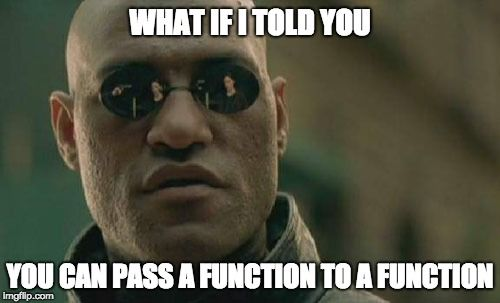

Contoh fungsi yang dijadikan nilai kembalian untuk fungsi lainnya:

```php
function getPizzaFunction()
{
    return function () {
        return '🍕🍕🍕';
    };
}

// Output: "🍕🍕🍕"
echo getPizzaFunction()();
```

Bila mengacu pada terminologinya, ekspresi lambda tidak harus selalu menggunakan *anonymous function*. Dalam *JavaScript* misalnya, kita dapat menjadikan *named function* (fungsi dengan nama) sebagai argumen untuk fungsi lain:

```js
const numbers = [1, 2, 3];

const doubles = numbers.map(function timesTwo (number) {
    return number * 2;
});

console.log(doubles); // [2, 4, 6]
```

Pun begitu, dalam PHP ekspresi lambda hanya bisa dituliskan dengan *anonymous function*. Untuk memberikan *named function* sebagai argumen, kita dapat merujuknya dengan `string` berisi nama fungsi tersebut:

```php
$numbers = [1, 2, 3];

function timesTwo($number)
{
    return $number * 2;
}

$doubled = array_map('timesTwo', $numbers);

print_r($doubled);
```

### Closure

*Closure* adalah fungsi yang memiliki akses pada data-data yang ada di luar *scope*-nya. *Closure* dapat mengakses data yang ada di *scope* induk dimana ia dideklarasikan. Selain itu *closure* juga dapat menjaga nilai dari data-data yang ada di *scope* induknya; meski kemudian data-data tersebut diubah atau bahkan *scope* induknya tuntas dieksekusi.

Dalam PHP *closure* dapat diimplementasikan dengan menggunakan *anonymous function*. Bahkan setiap *anonymous function* sebetulnya akan otomatis menjadi *instance* dari kelas `Closure`!

```php
$getPizzas = function () {
    return '🍕🍕🍕';
};

var_dump($getPizzas instanceof Closure); // bool(true)
```

Kita dapat menggunakan *keyword* `use` untuk mengakes data yang ada di *scope* induk:

```php
$message = 'Help me Obi-Wan Kenobi.';

$printMessage = function () use ($message) {
    echo $message . "\n";
};

$printMessage();
```

Perhatikan bagaimana *anonymous function* di atas mengakses *variable* `$message` yang berada di luar *scope*-nya. Apabila kode dia atas dijalankan, kita akan mendapatkan keluaran seperti berikut:

```shell
Help me Obi-Wan Kenobi
```

> 🎨 **Panduan Penulisan Closure**
>
> Contoh penulisan *closure* di atas mengikuti panduan yang ada di [PSR-2](https://www.php-fig.org/psr/psr-2/#6-closures). Perhatikan peletakan tanda kurung (`()`), *keyword* `use`, kurung kurawal (`{...}`), dan indentasi pada blok *closure*.

Fungsi anonim di atas juga akan menjaga nilai dari `$message` meski kemudian kita ubah nilainya.

```php
$message = 'Help me Obi-Wan Kenobi.';

$printMessage = function () use ($message) {
    echo $message . "\n";
};

$printMessage();

// Mengganti nilai $message
$message = 'Live long and prosper 🖖';
$printMessage();

// Menghapus nilai $message
unset($message);
$printMessage();
```

Apabila kode di atas dijalankan, kita akan mendapatkan nilai `$message` yang sama dari dalam *anonymous function*:

```shell
Help me Obi-Wan Kenobi.
Help me Obi-Wan Kenobi.
Help me Obi-Wan Kenobi.
```

*Closure* juga dapat menjaga data yang ada di *scope* induk meski *scope* induk tersebut selesai dieksekusi. Perhatikan contoh berikut:

```php
function getEatFunction($food)
{
    return function () use ($food) {
        echo "I eat $food\n";
    };
}

$eat = getEatFunction('🍕🍕🍕');

$eat(); // I eat 🍕🍕🍕
```

Pada contoh kode di atas, *anonymous function* mengakses `$food` yang merupakan parameter dari *scope* induknya. Saat fungsi `getEatFunction` selesai dieksekusi, *anonymous function* yang dikembalikan tetap memiliki akses pada nilai `$food` tersebut.

### Latihan Closure

Untuk latihan buat file *php* baru dengan nama `18_closure.php`. Lalu coba tikkan dan pahami penggunaan *closure* di bawah ini:

```php
<?php

declare(strict_types=1);

$drink = '🥤';

$prepareFastFoodMealFor = function (string $customer) use ($drink) {
    echo "Prepare fast food meal for $customer.\n";
    echo "Food: 🍔🍟🍗\n";
    echo "Drink: $drink\n\n";
};

function prepareMealForGroups(Closure $prepareMealFor, array $customers)
{
    echo "GROUP ORDER\n";
    echo "===========\n";

    foreach ($customers as $customer) {
        $prepareMealFor($customer);
    }
}

$prepareFastFoodMealFor('Tiberius Kirk');

// Change the $drink variable won't affect the $drink value within the
// anonymous function ($prepareFastFoodMealFor).
$drink = '🍺';
$prepareFastFoodMealFor('Han Solo');

prepareMealForGroups($prepareFastFoodMealFor, ['Yoda', 'Mace Windu']);

// Pass the anonymous function inline.
prepareMealForGroups(function (string $customer) {
    echo "Prepare healthy meal for $customer.\n";
    echo "Food: 🥗🥦🥑\n";
    echo "Drink: 🍵\n\n";
}, ['Saru', 'Data']);
```

Apabila kode dia atas dijalankan, kita akan mendapatkan keluaran seperti berikut:

```shell
Prepare fast food meal for Tiberius Kirk.
Food: 🍔🍟🍗
Drink: 🥤

Prepare fast food meal for Han Solo.
Food: 🍔🍟🍗
Drink: 🥤

GROUP ORDER
===========
Prepare fast food meal for Yoda.
Food: 🍔🍟🍗
Drink: 🥤

Prepare fast food meal for Mace Windu.
Food: 🍔🍟🍗
Drink: 🥤

GROUP ORDER
===========
Prepare healthy meal for Saru.
Food: 🥗🥦🥑
Drink: 🍵

Prepare healthy meal for Data.
Food: 🥗🥦🥑
Drink: 🍵
```

### Rangkuman Closure

Dari subbab ini, kita dapat rangkum poin-poin berikut:

* *Anonymous function*, lambda, dan *closure* merupakan istilah yang saling berkaitan, pun begitu ketiganya merujuk pada tiga konsep yang berbeda.
* *Anonymous function* adalah fungsi yang tidak memiliki nama, ia bisa di-*assign* kepada sebuah *variable* atau dijadikan argumen untuk sebuah fungsi.
* Layaknya *nammed function*, *anonymous function* bisa juga menerima argumen.
* Lambda atau ekspresi lambda adalah saat fungsi digunakan sebagai data: disimpan dalam *variable*, dijadikan argumen untuk fungsi lain, atau dijadikan nilai kembalian suatu fungsi.
* Secara konsep, lambda belum tentu *anonymous function*. Pun begitu dalam PHP ekspresi lambda hanya dapat diimplementasikan dengan *anonymous function*.
* *Closure* adalah fungsi yang dapat mengakses data-data pada *scope* induk dimana ia dideklarasikan.
* *Closure* dapat menjaga nilai data dari *scope* induknya meski kemudian data tersebut diubah atau bahkan *scope* induknya telah tuntas dieksekusi.
* Dalam PHP, *closure* dapat diimplementasikan dengan *anonymous function*. Bahkan setiap *anonymous function* akan dikonversi secara otomatis menjadi *instance* dari kelas `Closure`.

## Menyertakan Kode dari File Lain

Kita dimungkinkan untuk menyertakan kode PHP dari *file* lain dengan menggunakan *keyword* [`include`](https://secure.php.net/manual/en/function.include.php). Misal kita memiliki *file* PHP bernama `math.php` berisi *variable*, konstanta dan fungsi seperti di bawah ini:

```php
// math.php
$mathQuote = 'Pure mathematics is, in its way, the poetry of logical ideas.';

const PI = 3.14;

function add(float $number1, float $number2): float
{
    return $number1 + $number2;
}

function subtract(float $number1, float $number2): float
{
    return $number1 - $number2;
}
```

Kemudian kita memiliki *file* lainnya yang bernama `calculation.php`. *File* ini berada pada direktori yang sama dengan *file* `math.php`. Dengan *keyword* `include`, kita dapat menyertakan kode `math.php` ke dalam *file* `calculation.php`. Sehingga *variable*, konstanta, hingga fungsi pada `math.php` bisa kita akses dari `calculation.php`.

```php
// calculation.php
include 'math.php';

var_dump($mathQuote); // Pure mathematics is, in its way, the poetry of logical ideas.

var_dump(PI); // 3.14

var_dump(add(10, 5)); // 15

var_dump(subtract(15.0, 7.5)); // 7.5
```

Misal *file* `math.php` berada pada direktori induk dari `calculation.php`, kita bisa menggunakan *relative path* untuk merujuk pada *file* `math.php`:

```php
// calculation.php
include '../math.php';
```

Perlu diingat bahwa *variable*, konstanta, atau fungsi yang ada pada `math.php` baru bisa diakses setelah *statement* `include`:

```php
// calculation.php

// Tidak bisa mengakses sebelum statement "include".
var_dump($mathQuote); // Notice: Undefined variable: mathQuote
var_dump(PI); // Warning: Use of undefined constant PI
var_dump(add(10, 5)); // Uncaught Error: Call to undefined function add()

include 'math.php';

// Baru bisa diakses setelah statement "include".
var_dump(PI); // 3.14
```

Dengan menggunakan `include`, apabila *file* yang ingin disertakan tidak ditemukan, PHP akan menghasilkan *warning* (`E_WARNING`). Baris-baris kode setelahnya pun akan tetap dieksekusi.

```php
// Warning: include(): Failed opening 'unknown.php' for inclusion...
include 'unknown.php';

// Akan tetap dieksekusi meski unknown.php tidak ditemukan.
echo 'This line will be executed.';
```

### Menggunakan include_once

Selain `include`, ada juga *keyword* [`include_once`](https://secure.php.net/manual/en/function.include-once.php). Bedanya, `include_once` akan memastikan bahwa tidak ada *file* yang sama diikutkan lebih dari satu kali.

Misal kita tidak sengaja menyertakan file `math.php` sebanyak dua kali.

```php
// calculation.php
include 'math.php';
include 'math.php'; // PHP Fatal error: Cannot redeclare add()

var_dump(PI);
```

Dengan *keyword* `include` seperti di atas, kita akan mendapatkan pesan kesalahan karena fungsi `add` dideklarasikan dua kali. Lain halnya dengan `include_once` yang akan memastikan bahwa tidak ada *file* yang disertakan lebih dari satu kali. Meski `math.php` disertakan dua kali, kita tidak akan mendapatkan pesan kesalahan.

```php
// calculation.php
include_once 'math.php';
include_once 'math.php';

var_dump(PI); // 3.14
```

Seperti dalam `include`, apabila *file* yang ingin disertakan tidak ditemukan, `include_once` hanya akan menghasilkan *warning* (`E_WARNING`) dan eksekusi kode tetap dilanjutkan.

```php
// Warning: include_once(): Failed opening 'unknown.php' for inclusion...
include_once 'unknown.php';

// Akan tetap dieksekusi meski unknown.php tidak ditemukan.
echo 'This line will be executed.';
```

### Menggunakan require

Ada juga *keyword* [`require`](https://secure.php.net/manual/en/function.require.php). Fungsinya hampir sama dengan `include`. Namun apabila *file* yang ingin disertakan tidak ditemukan, `require` akan menghasilkan *fatal error* dengan level `E_COMPILE_ERROR` sehingga kode akan berhenti dieksekusi.

```php
// Fatal error: require(): Failed opening required 'unknown.php'
require 'unknown.php';

// Baris ini tidak akan dieksekusi.
echo "This line won't be executed.";
```

### Menggunakan require_once

*Keyword* [`require_once`](https://secure.php.net/manual/en/function.require-once.php) memiliki fungsi yang hampir sama dengan `include_once`. `require_once` akan memastikan bahwa tidak ada *file* yang sama disertakan lebih dari satu kali.

Jika menggunakan `require`, kita akan mendapatkan pesan kesalahan karena menyertakan *file* `math.php` dua kali:

```php
// calculation.php
require 'math.php';
require 'math.php'; // Fatal error: Cannot redeclare add()

var_dump(PI);
```

Namun dengan `require_once`, kode akan tetap berjalan dengan normal meski kita mencoba untuk menyertakan `math.php` dua kali:

```php
// calculation.php
require_once 'math.php';
require_once 'math.php';

var_dump(PI); // 3.14
```

Seperti `require`, `require_once` juga akan menghasilkan *fatal error* (`E_COMPILE_ERROR`) apabila *file* yang ingin disertakan tidak ditemukan.

```php
// Fatal error: require_once(): Failed opening required 'unknown.php'
require_once 'unknown.php';

// Baris ini tidak akan dieksekusi.
echo "This line won't be executed.";
```

### Rangkuman Menyertakan Kode dari File Lain

Dari subbab ini kita bisa simpulkan beberapa poin berikut:

* Untuk menyertakan kode PHP dari *file* lain, kita bisa menggunakan *keyword*: `include`, `include_once`, `require`, atau `require_once`.
* `include_once` dan `require_once` akan memastikan bahwa *file* yang sama tidak disertakan lebih dari satu kali.
* `include` dan `include_once` akan menghasilkan *warning* (`E_WARNING`) apabila *file* yang disertakan tidak ditemukan. Eksekusi kode pun akan dilanjutkan meski *file* yang ingin disertakan tidak ditemukan.
* `require` dan `require_once` akan menghasilkan *fatal error* (`E_COMPILE_ERROR`) apabila *file* yang disertakan tidak ditemukan. Eksekusi kode pun akan dihentikan.

## Bekerja dengan String

Berikut adalah sejumlah fungsi-fungsi bawaan PHP yang dapat kita gunakan untuk bekerja dengan *string*. Tidak semua fungsi *string* disajikan di sini, cek dokumentasi resmi PHP untuk melihat daftar lengkapnya: [String Functions](https://secure.php.net/manual/en/ref.strings.php).

### Menghitung Jumlah Karakter dalam String

Untuk menghitung jumlah karakter dalam sebuah *string*, gunakan fungsi [`strlen`](https://secure.php.net/manual/en/function.strlen.php):

```php
int strlen(string $string)
```

Perhatikan contoh-contoh berikut:

```php
var_dump(strlen('Hello World!')); // 12

// String kosong.
var_dump(strlen('')); // 0

// String berisi 1 spasi.
var_dump(strlen(' ')); // 1

// String dengan karakter emoji.
var_dump(strlen('😅')); // 4
```

### Mengubah String ke Huruf Kecil atau Besar

Untuk mengubah *string* ke huruf kecil, gunakan fungsi [`strtolower`](https://secure.php.net/manual/en/function.strtolower.php). Sementara untuk mengubahnya ke dalam huruf besar, gunakan fungsi [`strtoupper`](https://secure.php.net/manual/en/function.strtoupper.php).

```php
string strtolower(string $string)

string strtoupper(string $string)
```

Perhatikan contoh-contoh penggunaanya:

```php
echo strtolower('FOO bar Baz'); // foo bar baz

echo strtoupper('FOO bar Baz'); // FOO BAR BAZ
```

Untuk membuat karakter pertama saja yang menjadi huruf besar, gunakan fungsi [`ucfirst`](https://secure.php.net/manual/en/function.ucfirst.php):

```php
echo ucfirst('foo bar baz'); // Foo bar baz
```

Kita bisa juga menggunakan fungsi [`ucwords`](https://secure.php.net/manual/en/function.ucwords.php) untuk mengubah karakter pertama pada setiap kata menjadi huruf besar.

```php
echo ucwords('foo bar baz'); // Foo Bar Baz
```

Perlu diperhatikan bahwa `strtolower` dan `strtoupper` bergantung pada konfigurasi [`LC_CTYPE`](https://secure.php.net/manual/en/function.setlocale.php) (klasifikasi dan konversi karakter). Pun begitu, konfigurasi `LC_TYPE` yang sudah tepat belum tentu dapat menghasilkan keluaran yang diinginkan; contohnya untuk karakter dengan umlaut (`äöü`):

```php
setlocale(LC_CTYPE, 'de_DE.UTF8');

echo strtoupper('äöü'); // äöü
```

Solusinya, kita dapat menggunakan fungsi [`mb_strtolower`](https://secure.php.net/manual/en/function.mb-strtolower.php) atau [`mb_strtoupper`](https://secure.php.net/manual/en/function.mb-strtoupper.php). Argumen kedua adalah tipe *encoding* yang digunakan.

```php
echo mb_strtolower('ÄÖÜ', 'UTF-8'); // äöü

echo mb_strtoupper('äöü', 'UTF-8'); // ÄÖÜ
```

### Menghapus Spasi dari Awal dan Akhir String

Untuk menghapus spasi (atau karakter lainnya) dari awal dan akhir sebuah *string*, gunakan fungsi [`trim`](https://secure.php.net/manual/en/function.trim.php):

```php
string trim(string $str [, string $character_mask = " \t\n\r\0\x0B"])
```

* `$str`: *String* yang akan diproses.
* `$character_mask`: Daftar karakter yang akan dihapus dari awal dan akhir sebuah *string*.

```php
// string(12) "Hello World!"
var_dump(trim(' Hello World! '));

// string(12) "Hello World!"
var_dump(trim(" \tHello World!\n\n  "));

// Bisa juga digunakan untuk menghapus karakter lainnya.
// string(7) "foo/bar"
var_dump(trim('/foo/bar/', '/'));
```

Untuk menghapus dari sisi kiri saja, kita bisa menggunakan fungsi [`ltrim`](https://secure.php.net/manual/en/function.ltrim.php):

```php
// string(13) "Hello World! "
var_dump(ltrim(' Hello World! '));

// string(8) "foo/bar/"
var_dump(ltrim('/foo/bar/', '/'));
```

Sementara untuk menghapus sisi kanan saja, kita bisa gunakan [`rtrim`](https://secure.php.net/manual/en/function.rtrim.php):

```php
// string(13) " Hello World!"
var_dump(rtrim(' Hello World! '));

// string(8) "/foo/bar"
var_dump(rtrim('/foo/bar/', '/'));
```

### Mengulang String

Kita dapat mengulang sebuah *string* dengan jumlah tertentu menggunakan fungsi [`str_repeat`](https://secure.php.net/manual/en/function.str-repeat.php):

```php
string str_repeat(string $input , int $multiplier);
```

* `$input`: *String* yang ingin kita ulang.
* `$multiplier`: Jumlah perulangan.

```php
echo str_repeat('🥝', 5); // 🥝🥝🥝🥝🥝

echo str_repeat('burger 🍔 ', 3); // burger 🍔 burger 🍔 burger 🍔
```

### Mengambil Bagian dari String

Kita dapat mengambil bagian dari sebuah *string* dengan menggunakan fungsi [`substr`](https://secure.php.net/manual/en/function.substr.php):

```php
string substr(string $string ,int $start [, int $length])
```

* `$string`: Data *string* yang digunakan.
* `$start`: Posisi karakter awal yang akan diambil. Posisi awal dimulai dari `0`.
* `$length`: Jumlah karakter yang akan diambil. Bila tidak diberikan, *string* akan diambil dari posisi `$start` sampai akhir.

```php
echo substr('Hello World!', 6); // World!

echo substr('Hello World!', 6, 3); // Wor

// Dapat menggunakan $start negatif.
echo substr('Hello World!', -5, 4); // orld
```

### Mencari String

Untuk melakukan pencarian dalam sebuah *string*, kita dapat menggunakan fungsi [`strpos`](https://secure.php.net/manual/en/function.strpos.php):

```php
int strpos(string $haystack , mixed $needle [, int $offset = 0])
```

* `$haystack`: *String* yang menjadi sumber pencarian.
* `$needle`: *String* yang dicari pada `$haystack`. Apabila argumen yang diberikan bukan bertipe *string*, datanya akan dikonversi menjadi *integer* (*integer* dapat merepresentasikan karakter).
* `$offset`: Posisi awal pencarian. Secara *default* bernilai `0` yang artinya pencarian dimulai dari karakter pertama.

Fungsi `strpos` ini akan mengembalikan posisi dari *string* yang dicari. Apabila *string* yang dicari ditemukan lebih dari satu kali, fungsi ini hanya akan mengembalikan posisi temuan yang pertama.

> ⚠️ Perlu diingat bahwa posisi karakter dimulai dari `0`. Apabila *string* yang dicari tidak ditemukan, fungsi ini akan mengembalikan *boolean* `false`.

```php
var_dump(strpos('foo bar', 'bar')); // int(4)

// 0 berarti di awal string.
var_dump(strpos('foo bar', 'foo')); // int(0)

// false berarti tidak pencarian tidak ditemukan.
var_dump(strpos('foo bar', 'baz')); // bool(false)

// Akan mengembalikan temuan yang pertama.
var_dump(strpos('foo bar bar', 'bar')); // int(4)

// Pencarian "bar" dimulai dari posisi ke-5 (huruf ke-6).
var_dump(strpos('foo bar bar', 'bar', 5)); // int(8)
```

Fungsi `strpos` bersifat *case sensitive*. Untuk melakukan pencarian *string* tanpa memedulikan besar-kecilnya huruf, gunakan fungsi [`stripos`](https://secure.php.net/manual/en/function.stripos.php):

```php
var_dump(strpos('foo bar', 'BAR')); // bool(false)

var_dump(stripos('foo bar', 'BAR')); // int(4)
```

### Mengganti Bagian dari String

Untuk mencari dan mengganti bagian tertentu dari sebuah *string*, kita dapat menggunakan fungsi [`str_replace`](https://secure.php.net/manual/en/function.str-replace.php):

```php
mixed str_replace (mixed $search, mixed $replace, mixed $subject [, int &$count])
```

* `$search`: Bagian dari *string* yang dicari. Bisa berupa *array* jika kita ingin mencari lebih dari satu bagian.
* `$replace`: *String* atau *array* yang digunakan untuk mengganti bagian yang ditentukan oleh parameter `$search`.
* `$subject`: *String* atau *array* dari *string* yang akan dicari dan digantikan bagiannya.
* `$count`: Parameter opsional yang bila diberikan akan berisi jumlah penggantian yang dilakukan.

```php
echo str_replace('foo', 'fuuu', 'foo bar foo bar'); // fu bar fu bar

// Mencari dan mengganti dua nilai sekaligus.
// Output: I eat 🥗 and 🥦
echo str_replace(['🍟', '🍔'], ['🥦', '🥗'], 'I eat 🍔 and 🍟');

// Output:I eat 🍉 and 🍉
echo str_replace(['🍟', '🍔'], '🍉', 'I eat 🍔 and 🍟');

// Bila array $replace lebih sedikit dari $search
// Output: I eat  and 🍉
echo str_replace(['🍟', '🍔'], ['🍉'], 'I eat 🍔 and 🍟');

// Mencari dan mengganti dari array string.
$orders = [
    "I'll have 🍔 and 🍌",
    "I'll have 🍔 and 🍟",
];

$healthyOrders = str_replace(['🍟', '🍔'], ['🥦', '🥗'], $orders);

print_r($healthyOrders);

// Array
// (
//     [0] => I'll have 🥗 and 🍌
//     [1] => I'll have 🥗 and 🥦
// )
```

Berikan argumen opsional `$count` untuk mencari tahu jumlah penggantian yang dilakukan. Perhatikan bahwa `$count` diberikan dengan *pass by reference*.

```php
$totalReplacements = 0;

str_replace('foo', 'fuuu', 'foo bar foo bar', $totalReplacements);

var_dump($totalReplacements); // int(2)
```

Fungsi `str_replace` bersifat *case-sensitive*, untuk melakukan operasi tanpa memedulikan besar-kecilnya huruf, gunakan `str_ireplace`:

```php
echo str_replace('foo', 'fuuu', 'foo bar FOO bar'); // fuuu bar FOO bar

echo str_ireplace('foo', 'fuuu', 'foo bar FOO bar'); // fuuu bar fuuu bar
```

### Membuat String dengan Format Tertentu

Kita dapat membuat *string* yang mengikuti format tertentu dengan menggunakan fungsi [`sprintf`](https://secure.php.net/manual/en/function.sprintf.php):

```php
string sprintf(string $format [, mixed $args [, mixed $... ]])
```

* `$format`: Format *string* yang akan dihasilkan. Kita dapat menentukan format yang digunakan untuk mencetak nilai-nilai yang diberikan pada `$args`. Setiap format data didahului dengan tanda persen (`%`) dan diikuti oleh satu atau beberapa elemen dengan urutan seperti berikut:
    1. **Sign specifier** (`+`): Jika ingin menampilkan tanda positif atau negatif pada sebuah angka (opsional).
    2. **Padding specifier**: Karakter yang ingin digunakan untuk mengisi kekurangan karakter pada data. Karakter harus didahului oleh kutip tunggal (opsional dengan nilai *default* berupa spasi).
    3. **Alignment specifier**: Untuk menentukan apakah data ditampilkan rata-kiri atau rata kanan. Secara *default* rata-kanan akan digunakan, untuk rata-kiri gunakan tanda `-` (opsional).
    4. **Width specifier**: Jumlah karakter minimum yang digunakan untuk menampilkan data. Kekurangan karakter akan diisi oleh **padding specifier** (opsional).
    5. **Precision specifier**: Berupa titik (`.`) yang kemudian diikuti oleh bilangan cacah. Nilai bilangan ini menentukan jumlah digit presisi yang digunakan untuk menampilkan data *float*. Bila data berupa *string*, ia akan menjadi jumlah karakter maksimum (opsional).
    6. **Type spesifier**: Menentukan tipe untuk data `$args` yang diberikan. Cek tabel di bawah untuk melihat daftar lengkapnya.
* `$args`: Argumen yang akan diberikan pada format *string*.

| Type | Dikonversi menjadi | Ditampilkan sebagai                            |
| ---- | ------------------ | ---------------------------------------------- |
| `%`  |           | Karakter persen                                         |
| `b`  | *integer* | Angka biner                                             |
| `c`  | *integer* | Karakter ASCII dengan nilai yang setara                 |
| `d`  | *integer* | Bilangan desimal (*signed*)                             |
| `e`  | *float*   | Notasi eksponensial                                     |
| `E`  | *float*   | Notasi eksponensial dengan huruf besar                  |
| `f`  | *float*   | Bilangan pecahan (mengikuti konfigurasi *locale*)       |
| `F`  | *float*   | Bilangan pecahan (tidak mengikuti konfigurasi *locale*) |
| `g`  | *float*   | Menggunakan `%e` atau `%f` tergantung besar nilainya    |
| `G`  | *float*   | Menggunakan `%E` atau `%F` tergantung besar nilainya    |
| `o`  | *integer* | Angka oktal                                             |
| `s`  | *string*  | *String*                                                |
| `u`  | *integer* | Bilangan desimal (*unsigned*)                           |
| `x`  | *integer* | Bilangan heksadesimal dengan huruf kecil                |
| `X`  | *integer* | Bilangan heksadesimal dengan huruf besar                |

```php
$quantity = 2;
$item = 'Milenium Falcon';
$total = 1500750.5;

// Output: Total for 2 Milenium Falcon: 1500750.50
echo sprintf("Total for %d %s: %.2f\n", $quantity, $item, $total);

// Data dikonversi sesuai tabel di atas.
// Output: Price: 150
echo sprintf("Price: %d\n", '150 ewok');

// Menggunakan type "g".
echo sprintf("%g\n", 150000); // 150000
echo sprintf("%g\n", 1500000); // 1.5e+6
```

Contoh penggunaan *precision specifier*:

```php
echo sprintf("Price: %.2f\n", 150.76); // Price: 150.76

// Untuk string precision spesifier menjadi batas maksimum karakter
echo sprintf("Item: %.10s\n", 'Milenium Falcon'); // Item: Milenium F
```

Contoh penggunaan *sign specifier*:

```php
echo sprintf("Temperature: %+.1f °C\n", 30.56); // Temperature: +30.6 °C

echo sprintf("Temperature: %+.1f °C\n", -11.72); // Temperature: -11.7 °C
```

Contoh penggunaan *width specifier*:

```php
echo sprintf("Temperature: %+10.1f °C\n", 30.56);
echo sprintf("Temperature: %+10.1f °C\n", -11.72);

// Temperature:      +30.6 °C
// Temperature:      -11.7 °C
```

Contoh penggunaan *padding spesifier*:

```php
echo sprintf("Price: %'.10.2f\n", 100);
echo sprintf("Price: %'_10.2f\n", 200);

// Price: ....100.00
// Price: ____200.00
```

Contoh penggunaan *alignment specifier*:

```php
echo sprintf("Price: %'.10.2f\n", 100); // Rata kanan tak perlu alignment specifier
echo sprintf("Price: %'.-10.2f\n", 200); // Rata kiri gunakan tanda minus

// Price: ....100.00
// Price: 200.00....
```

Fungsi `sprintf` hanya akan mengembalikan format *string*. Untuk mencetaknya langsung, kita bisa gunakan fungsi [`printf`](https://secure.php.net/manual/en/function.printf.php):

```php
printf("Temperature: %+10.1f °C\n", 30.56);
printf("Temperature: %+10.1f °C\n", -11.72);

// Temperature:      +30.6 °C
// Temperature:      -11.7 °C
```

### Memecah String ke Dalam Array

Kita dapat menggunakan fungsi [`explode`](https://secure.php.net/manual/en/function.explode.php) untuk memecah sebuah *string* ke dalam *array*.

```php
array explode(string $delimiter ,string $string [, int $limit = PHP_INT_MAX])
```

* `$delimiter`: Satu atau beberapa karakter yang ingin kita gunakan untuk memecah *string*.
* `$string`: *String* yang ingin kita pecah ke dalam *array*.
* `$limit`: Parameter opsional untuk membatasi jumlah *array* yang dihasilkan.

Misalnya kita ingin memecah sebuah kalimat ke dalam *array* dari kata-kata:

```php
$words = explode(' ', 'I am your Father.');

print_r($words);

// Array
// (
//     [0] => I
//     [1] => am
//     [2] => your
//     [3] => Father.
// )
```

Contoh lainnya adalah untuk mengubah sebuah *string* yang berisi *comma separated list*:

```php
$characters = explode(',', 'Yoda,Mance Windu,Kenobi');

print_r($characters);

// Array
// (
//     [0] => Yoda
//     [1] => Mance Windu
//     [2] => Kenobi
// )
```

### Menggabungkan Array Menjadi String

Fungsi [`implode`](https://secure.php.net/manual/en/function.implode.php) merupakan kebalikan dari fungsi `explode`. Fungsi ini digunakan untuk menggabungkan sebuah *array* menjadi *string*:

```php
string implode(string $glue , array $pieces)
```

* `$glue`: *String* yang digunakan untuk menyatukan *array*.
* `$pieces`: *Array* yang ingin dijadikan *string*.

```php
$characters = [
    'Yoda',
    'Mance Windu',
    'Kenobi',
];

echo implode(',', $characters); // Yoda,Mance Windu,Kenobi
```

### Mengubah Baris Baru menjadi Tag br

Baris baru dalam dokumen HTML direpresentasikan oleh tag `<br>`. Untuk mengubah baris baru dalam sebuah *string* (`\n`) menjadi tag `<br>`, kita dapat menggunakan fungsi [`nl2br`](https://secure.php.net/manual/en/function.nl2br.php):

```php
string nl2br(string $string [, bool $is_xhtml = true])
```

* `$string`: *String* yang akan diubah baris barunya.
* `$is_xhtml`: Parameter opsional untuk menentukan apakah harus menggunakan tag yang cocok dengan standard XHTML atau tidak.

```php
echo nl2br("Do or do not\nThere is no try");
// Do or do not<br />
// There is no try

// Tidak menggunakan standard XHTML.
echo nl2br("Do or do not\nThere is no try", false);
// Do or do not<br>
// There is no try
```

### Membalikan Sebuah String

Untuk membalikan sebuah *string*, kita dapat menggunakan fungsi [`strrev`](https://secure.php.net/manual/en/function.strrev.php):

```php
echo strrev('Hello World!'); // !dlroW olleH
```

Hati-hati menggunakan fungsi ini, karena ia tidak bisa menangani karakter *multibyte* seperti emoji.

```php
echo strrev('Hello 😅'); // ���� olleH
```

## Bekerja dengan Array

Seperti yang telah kita bahas di [bab tipe data](#array), *array* atau larik dapat menampung deretan data:

```php
// Dengan perintah array.
$siths = array('Darth Vader', 'Darth Maul', 'Kylo Ren');

// Short syntax.
$jedis = ['Yoda', 'Mance Windu', 'Kenobi'];
```

### Key dan Value dalam Array

Setiap elemen *array* terdiri dari pasangan *key* (kunci) dan *value* (nilai). *Key* dalam *array* hanya boleh bertipe *integer* ataupun *string*. Sementara *value* boleh bertipe apa saja, bahkan bertipe *array* sekalipun (dinamakan *array* multidimensi).

```php
array(
    key1 => value1,
    key2 => value2,
    key3 => value3,
    ...
)
```

Namun pada kedua contoh sebelumnya, kita hanya memberikan porsi *value*-nya saja. *Key* dari kedua *array* sebelumnya secara implisit akan berupa *integer* yang dimulai dari `0`. Gunakan fungsi `print_r` untuk melihat pasangan `key` dan `value` dari kedua *array* di atas:

```php
$siths = array('Darth Vader', 'Darth Maul', 'Kylo Ren');
print_r($siths);

// Array
// (
//     [0] => Darth Vader
//     [1] => Darth Maul
//     [2] => Kylo Ren
// )

$jedis = ['Yoda', 'Mance Windu', 'Kenobi'];
print_r($jedis);

// Array
// (
//     [0] => Yoda
//     [1] => Mance Windu
//     [2] => Kenobi
// )
```

Nilai `0`, `1`, dan `2` adalah *key* dari *array*. Perhatikan bagaimana nilai *key* bertambah sesuai dengan posisi elemen tersebut di dalam *array*. *Array* dengan *key* berupa *integer* berurut seperti ini biasa disebut dengan *indexed array*.

Kita dapat menyertakan nilai dari *key* untuk mendeklarasikan sebuah *associative array* (larik asosiatif):

```php
$vader = array(
    'name' => 'Darth Vader',
    'age' => 45,
);

$yoda = [
    'name' => 'Yoda',
    'age' => 900,
];
```

> 🎨 **Koma pada item terakhir array**
>
> Koma pada item terakhir *array* tidaklah diperlukan. Gaya penulisan seperti ini diterapkan oleh *framework* Laravel dan Symfony untuk deklarasi *array* yang lebih dari satu baris.

Dalam PHP kita bahkan bisa mencampurkan *key* bertipe *string* dengan *key* bertipe *integer*:

```php
$yoda = [
    'name' => 'Yoda',
    'age' => 900,
    23 => 'foo',
];
```


### Mengecek Apakah Key Tersedia dalam Array

Untuk mengecek apakah sebuah *key* tersedia dalam *array*, kita bisa menggunakan fungsi [`array_key_exists`](https://secure.php.net/manual/en/function.array-key-exists.php):

```php
bool array_key_exists(mixed $key , array $array)
```

Berikut contoh penggunaanya:

```php
$jedis = ['Yoda', 'Mance Windu', 'Kenobi'];

var_dump(array_key_exists(2, $jedis)); // true
var_dump(array_key_exists(3, $jedis)); // false

$yoda = ['name' => 'Yoda', 'age' => 900];

var_dump(array_key_exists('age', $yoda)); // true
var_dump(array_key_exists('dark_side', $yoda)); // false
```

Fungsi `array_key_exists` akan mengembalikan nilai `true` selama *key* tersedia dalam *array*—meski nilainya `null` sekalipun. Berbeda dengan fungsi [`isset`](https://secure.php.net/manual/en/function.isset.php), meski *key* tersedia dalam *array* ia akan mengembalikan nilai `false` apabila *value*-nya `null`:

```php
$yoda = ['name' => 'Yoda', 'dark_side' => null];

var_dump(array_key_exists('dark_side', $yoda)); // true
var_dump(isset($yoda['dark_side'])); // false
```

### Mengakses Elemen Array

Untuk mengakses elemen di dalam *array*, kita gunakan *key* dari elemen tersebut.

```php
$jedis = ['Yoda', 'Mance Windu', 'Kenobi'];

var_dump($jedis[0]); // Yoda
var_dump($jedis[1]); // Mance Windu
var_dump($jedis[2]); // Kenobi

$yoda = ['name' => 'Yoda', 'age' => 900];

var_dump($yoda['name']); // Yoda
var_dump($yoda['age']); // 900
```

Apabila kita mencoba untuk mengakses elemen *array* yang *key*-nya tidak tersedia, kita akan mendapatkan pesan kesalahan:

```php
$jedis = ['Yoda', 'Mance Windu', 'Kenobi'];

$jedis[5]; // Undefined offset: 5

$yoda = ['name' => 'Yoda', 'age' => 900];

$yoda['dark_side']; // Undefined index: dark_side
```

Kita dapat menggunakan fungsi [`array_key_exists`](#mengecek-apakah-key-tersedia-dalam-array) atau [`isset`](https://secure.php.net/manual/en/function.isset.php) untuk mengecek terlebih dahulu apakah elemen *array* yang ingin kita akses tersedia atau tidak.

```php
$jedis = ['Yoda', 'Mance Windu', 'Kenobi'];

if (array_key_exists(5, $jedis)) {
    echo "Jedi number 6: $jedis[5]\n";
} else {
    echo "Jedi number 6 is not exsits.\n";
}

$yoda = ['name' => 'Yoda', 'age' => 900];

if (isset($yoda['dark_side'])) {
    echo "Yoda's dark side: $yoda[dark_side]\n";
} else {
    echo "Yoda's dark side is not exsits.\n";
}
```

Apabila dijalankan, kita akan mendapatkan keluaran:

```text
Jedi number 6 is not exsits.
Yoda's dark side is not exsits.
```

### Array Multidimensi

*Array* multidimensi adalah *array* yang berisi *array* lainnya:

```php
$matrix = [
    [23, 27, 29],
    [10, 20, 30],
    [-2, -4, -6],
];

var_dump($matrix[1][2]); // 30

$animals = [
    'mamals' => ['panda', 'whale', 'cat'],
    'birds' => ['eagle', 'owl', 'penguins'],
];

var_dump($animals['birds'][2]); // penguins

$meals = [
    'not_healthy' => [
        'foods' => ['🍔', '🍕'],
        'drinks' => ['🥤'],
    ],
    'healthy' => [
        'foods' => ['🥦', '🍆'],
        'drinks' => ['🍵', '🥛'],
    ],
];

var_dump($meals['healthy']['foods'][1]); // 🍆
```

### Menghitung Jumlah Elemen dalam Array

Kita dapat menghitung jumlah elemen dalam sebuah *array* dengan menggunakan fungsi [`count`](https://secure.php.net/manual/en/function.count.php):

```php
int count(mixed $array_or_countable [, int $mode = COUNT_NORMAL])
```

* `$array_or_countable`: *Array* atau objek dari kelas yang mengimplementasikan *interface* [`Countable`](https://secure.php.net/manual/en/class.countable.php).
* `$mode`: Parameter opsional yang menentukan mode yang digunakan. Berikan nilai `COUNT_RECURSIVE` atau `1` untuk menghitung jumlah elemen secara rekursif dalam sebuah *array* multidimensi.

```php
$jedis = ['Yoda', 'Mance Windu', 'Kenobi'];
var_dump(count($jedis)); // 3

$yoda = ['name' => 'Yoda', 'age' => 900];
var_dump(count($yoda)); // 2

$matrix = [
    [23, 27, 29],
    [10, 20, 30],
    [-2, -4, -6],
];

var_dump(count($matrix)); // 3
var_dump(count($matrix, COUNT_RECURSIVE)); // 12

$animals = [
    'mamals' => ['panda', 'whale', 'cat'],
    'birds' => ['eagle', 'owl', 'penguins'],
];

var_dump(count($animals)); // 2
var_dump(count($animals, COUNT_RECURSIVE)); // 8
```

### Perulangan dengan Array

Untuk *indexed array*, tentu kita bisa menggunakan perulangan `for`:

```php
$mamals = ['panda', 'whale', 'cat'];

$totalMamals = count($mamals);

for ($i = 0; $i < $totalMamals; $i++) {
    echo "$i - $mamals[$i]\n";
}
```

Apabila kode di atas dijalankan, kita akan mendapatkan seluruh elemen dalam *array* `$mamals`:

```shell
0 - panda
1 - whale
2 - cat
```

Namun bagaimana dengan *array* asosiatif yang *key*-nya bukan merupakan *integer* berurut? Kita bisa menggunakan perintah `foreach` untuk itu:

```php
$yoda = ['name' => 'Yoda', 'age' => 900];

foreach ($yoda as $key => $value) {
    echo "$key: $value\n";
}
```

Apabila kode di atas dijalankan, kita akan mendapatkan keluaran seperti berikut:

```php
name: Yoda
age: 900
```

Apabila kita hanya mebutuhkan porsi `$value`, kita tidak perlu menuliskan `$key`:

```php
$mamals = ['panda', 'whale', 'cat'];

foreach ($mamals as $value) {
    echo $value . "\n";
}
```

Nama *variable* yang digunakan pun tidak harus selalu `$key` dan `$value`. Kita bisa menggunakan nama apa saja:

```php
$mamals = ['panda', 'whale', 'cat'];

foreach ($mamals as $index => $mamal) {
    echo "$index - $mamal\n";
}
```

Apabila kode di atas dijalankan, kita akan mendapatkan keluaran yang serupa:

```shell
0 - panda
1 - whale
2 - cat
```

Untuk *array* multidimensi, kita bisa menggunakan `foreach` di dalam `foreach`:

```php
$animals = [
    'mamals' => ['panda', 'whale', 'cat'],
    'birds' => ['eagle', 'owl', 'penguins'],
];

foreach ($animals as $type => $animalArr) {
    echo "Animal Type: $type\n";

    foreach ($animalArr as $animal) {
        echo "- $animal\n";
    }

    echo "\n";
}
```

Apabila kode di atas dijalankan, kita akan mendapatkan keluaran seperti berikut:

```shell
Animal Type: mamals
- panda
- whale
- cat

Animal Type: birds
- eagle
- owl
- penguins
```

### Menambahkan Elemen pada Array

Ada beberapa cara untuk menambahkan elemen baru pada sebuah *array*.

#### Menggunakan Kurung Siku []

Untuk *indexed array*, salah satu cara yang paling umum adalah dengan menggunakan kurung siku kosong `[]`. Dengan cara seperti ini, elemen baru tersebut akan ditempatkan pada akhir *array*.

```php
$jedis = ['Yoda', 'Mance Windu', 'Kenobi'];

$jedis[] = 'Mundi';
$jedis[] = 'Plo Koon';

print_r($jedis);
// Array(
//     [0] => Yoda
//     [1] => Mance Windu
//     [2] => Kenobi
//     [3] => Mundi
//     [4] => Plo Koon
// )
```

Untuk *array* asosiatif, kita dapat meng-*assign* pasangan *key* dan *value*-nya langsung. Cara ini juga berlaku untuk *indexed array*.

```php
$yoda = ['name' => 'Yoda', 'age' => 900];

$yoda['height_in_cm'] = 70;
$yoda['power_percentage'] = 93.5;

print_r($yoda);
// Array(
//     [name] => Yoda
//     [age] => 900
//     [height_in_cm] => 70
//     [power_percentage] => 93.5
// )

$jedis = ['Yoda', 'Mance Windu', 'Kenobi'];

$jedis[3] = 'Mundi';
$jedis[4] = 'Plo Koon';

print_r($jedis);
// Array(
//     [0] => Yoda
//     [1] => Mance Windu
//     [2] => Kenobi
//     [3] => Mundi
//     [4] => Plo Koon
// )
```

#### Menambahkan Elemen Baru di Akhir dengan array_push

Fungsi [`array_push`](https://secure.php.net/manual/en/function.array-push.php) dapat kita gunakan untuk menambahkan satu atau beberapa elemen pada akhir suatu *array*.

```php
int array_push(array &$array [, mixed $...]);
```

Perhatikan contoh berikut:

```php
$mamals = ['panda', 'whale', 'cat'];

array_push($mamals, 'bear', 'lion');

print_r($mamals);
// Array(
//     [0] => panda
//     [1] => whale
//     [2] => cat
//     [3] => bear
//     [4] => lion
// )
```

Dengan fungsi `array_push`, kita tidak bisa secara eksplisit menentukan *key* dari elemen baru. Meski tetap bisa digunakan pada *array* asosiatif, fungsi ini hanya cocok untuk *indexed array*.

```php
$yoda = ['name' => 'Yoda', 'age' => 900];

array_push($yoda, 'foo', 'bar');

print_r($yoda);
// Array(
//     [name] => Yoda
//     [age] => 900
//     [0] => foo
//     [1] => bar
// )
```

#### Menambahkan Elemen Baru di Awal dengan array_unshift

Fungsi [`array_unshift`](https://secure.php.net/manual/en/function.array-unshift.php) hampir sama dengan [`array_push`](#menggunakan-fungsi-array_push). Hanya saja dengan `array_unshift`, elemen akan ditambahkan pada bagian awal dari *array*.

```php
int array_unshift( array &$array [, mixed $...])
```

Berikut contoh penggunaanya:

```php
$mamals = ['panda', 'whale', 'cat'];

array_unshift($mamals, 'bear', 'lion');

print_r($mamals);
// Array(
//     [0] => bear
//     [1] => lion
//     [2] => panda
//     [3] => whale
//     [4] => cat
// )
```

### Mengubah Elemen Array

#### Mengubah Elemen Array dengan Menggunakan Key-nya

Cara paling mudah untuk mengubah elemen dari sebuah *array* adalah dengan menggunakan *key* dari elemen tersebut dan memberinya nilai yang baru.

```php
$mamals = ['panda', 'whale', 'cat'];

$mamals[1] = 'bear';

print_r($mamals);
// Array(
//     [0] => panda
//     [1] => bear
//     [2] => cat
// )

$yoda = ['name' => 'Yoda', 'age' => 900];

$yoda['age'] = 923;

print_r($yoda);
// Array(
//     [name] => Yoda
//     [age] => 923
// )
```

#### Mengganti Elemen Array dengan array_replace

Kita bisa juga menggunakan fungsi [`array_replace`](https://secure.php.net/manual/en/function.array-replace.php) untuk mengganti elemen *array*:

```php
array array_replace(array $array1 , array $array2 [, array $...])
```

* `$array1`: *Array* yang ingin kita ganti elemennya.
* `$array2`: *Array* lain yang berisi elemen pengganti. Elemen pada *array* ini akan mengganti elemen pada `$array1` dengan *key* yang sama.
* `$...`: *Array* lainnya yang berisi elemen pengganti. *Array* paling akhir akan mengganti elemen-elemen lain sebelumnya yang memiliki *key* yang sama.

```php
$mamals = ['panda', 'whale', 'cat'];

$mamals = array_replace($mamals, [1 => 'bear', 2 => 'penguin']);

print_r($mamals);
// Array(
//     [0] => panda
//     [1] => bear
//     [2] => penguin
// )

$yoda = ['name' => 'Yoda', 'age' => 900];

$yoda = array_replace($yoda, ['age' => 923]);

print_r($yoda);
// Array(
//     [name] => Yoda
//     [age] => 923
// )
```

Apabila parameter `$array2` atau *array*-*array* setelahnya memiliki *key* yang tidak tersedia pada `$array1`, elemen tersebut akan ditambahkan pada *array* hasil kembalian:

```php
$yoda = ['name' => 'Yoda', 'age' => 900];

$yoda = array_replace($yoda, [
    'age' => 923,
    'height_in_cm' => 70,
    'power_percentage' => 93.5,
]);

print_r($yoda);
// Array(
//     [name] => Yoda
//     [age] => 923
//     [height_in_cm] => 70
//     [power_percentage] => 93.5
// )
```

#### Mengubah Elemen Array dengan array_splice

Untuk mengubah satu atau beberapa elemen pada *indexed array*, kita juga bisa menggunakan fungsi [`array_splice`](https://secure.php.net/manual/en/function.array-splice.php):

```php
array array_splice(array &$input , int $offset [, int $length = count($input) [, mixed $replacement = array()]])
```

* `$input`: *Array* yang akan kita ubah.
* `$offset`: Posisi awal dari elemen yang ingin kita ganti.
* `$length`: Parameter opsional untuk jumlah elemen *array* yang ingin kita ganti. Secara *default* akan sampai akhir dari *array*.
* `$replacement`: *Array* yang berisi elemen pengganti.

```php
$mamals = ['panda', 'whale', 'cat'];

$removedMamals = array_splice($mamals, 1, 2, ['bear', 'penguin']);

print_r($removedMamals);
// Array(
//     [0] => whale
//     [1] => cat
// )

print_r($mamals);
// Array(
//     [0] => panda
//     [1] => bear
//     [2] => penguin
// )
```

Apabila `$replacement` tidak diberikan, elemen-elemen *array* tersebut akan dihapus:

```php
$mamals = ['panda', 'whale', 'cat'];

array_splice($mamals, 1, 2);

print_r($mamals);
// Array(
//     [0] => panda
// )
```

Apabila jumlah elemen pada *array* `$replacement` lebih banyak, kelebihan elemen tersebut akan ditambahkan pada `$input` (`$mamals` dalam kasus kita).

```php
$mamals = ['panda', 'whale', 'cat'];

array_splice($mamals, 1, 2, ['bear', 'penguin', 'lion']);

print_r($mamals);
// Array(
//     [0] => panda
//     [1] => bear
//     [2] => penguin
//     [3] => lion
// )
```

### Menghapus Elemen Array

#### Menggunakan Fungsi unset

Cara paling mudah untuk mengapus elemen dari sebuah *array* adalah dengan fungsi [`unset`](https://secure.php.net/manual/en/function.unset.php):

```php
$mamals = ['panda', 'whale', 'cat'];

unset($mamals[1]);

print_r($mamals);
// Array(
//     [0] => panda
//     [2] => cat
// )

$yoda = ['name' => 'Yoda', 'age' => 900];

unset($yoda['age']);

print_r($yoda);
// Array(
//     [name] => Yoda
// )
```

#### Menghapus Elemen Terakhir dari Array dengan array_pop

Untuk menghapus elemen paling akhir dari sebuah *array* kita dapat menggunakan fungsi [`array_pop`](https://secure.php.net/manual/en/function.array-pop.php). Fungsi ini juga memiliki nilai kembalian berupa elemen terakhir yang dikeluarkan dari *array* tersebut.

```php
$mamals = ['panda', 'whale', 'cat'];

$lastMamal = array_pop($mamals);
var_dump($lastMamal); // cat

print_r($mamals);
// Array(
//     [0] => panda
//     [1] => whale
// )
```

#### Menghapus Elemen Pertama dari Array dengan array_shift

Fungsi [`array_shift`](https://secure.php.net/manual/en/function.array-shift.php) hampir sama dengan [`array_pop`](#menghapus-elemen-terakhir-dari-array-dengan-array_pop), hanya saja yang dihapus adalah elemen pertama dari sebuah *array*.

```php
$mamals = ['panda', 'whale', 'cat'];

$firstMamal = array_shift($mamals);
var_dump($firstMamal); // panda

print_r($mamals);
// Array(
//     [0] => whale
//     [1] => cat
// )
```

#### Menghapus dengan array_splice

Seperti yang telah kita bahas sebelumnya, kita juga bisa menggunakan fungsi [`array_splice`](#mengubah-elemen-array-dengan-array_splice) untuk menghapus satu atau beberapa elemen pada sebuah *array*.

```php
$mamals = ['panda', 'whale', 'cat'];

array_splice($mamals, 1, 2);

print_r($mamals);
// Array(
//     [0] => panda
// )
```

### Menggabungkan Array

#### Menggunakan Operator Union

Salah satu cara untuk menggabungkan *array* adalah dengan operator *union* (`+`). Ingat bahwa apabila ada *key* yang sama, nilai dari sisi kiri operator yang akan digunakan.

```php
$kowalski = ['type' => 'penguin', 'name' => 'kowalski', 'can_fly' => 'no'];

$birdFeatures = [
    'feathers' => true,
    'wings' => true,
    'can_fly' => 'not always',
];

print_r($kowalski + $birdFeatures);
// Array(
//     [type] => penguin
//     [name] => kowalski
//     [can_fly] => no
//     [feathers] => 1
//     [wings] => 1
// )
```

Dari contoh kode di atas, baik *array* `$kowalski` maupun `$birdFeatures` sama-sama memiliki elemen dengan *key* `can_fly`. Karena `$kowalski` berada di sisi-kiri operator `+`, maka nilai `can_fly` dari `$kowalski`-lah yang digunakan.

Hal ini berlaku juga untuk *indexed array*:

```php
$jedis1 = ['Yoda', 'Mance Windu'];

$jedis2 = ['Kit Fisto', 'Mundi', 'Plo Koon'];

print_r($jedis1 + $jedis2);
// Array(
//     [0] => Yoda
//     [1] => Mance Windu
//     [2] => Plo Koon
// )
```

Hanya `Plo Koon` yang akan muncul pada hasil *union*. Hal ini terjadi karena *key* untuk `Kit Fisto (0)` dan `Mundi (1)` sudah ada pada *variable* `$jedis`. Untuk mengatasi hal ini kita bisa secara eksplisit menentukan *key* dari `$jedis2`:

```php
$jedis1 = ['Yoda', 'Mance Windu'];

$jedis2 = [2 => 'Kit Fisto', 3 => 'Mundi', 4 => 'Plo Koon'];

print_r($jedis1 + $jedis2);
// Array(
//     [0] => Yoda
//     [1] => Mance Windu
//     [2] => Kit Fisto
//     [3] => Mundi
//     [4] => Plo Koon
// )
```

#### Menggabungkan Array dengan array_merge

Cara lain untuk menggabungkan dua *array* atau lebih adalah dengan menggunakan fungsi [`array_merge`](https://secure.php.net/manual/en/function.array-merge.php). Untuk *array* assosiatif, apabila dua *array* memiliki *key* yang sama, nilai dari *array* yang kedua lah yang akan digunakan.

```php
$kowalski = ['type' => 'penguin', 'name' => 'kowalski', 'can_fly' => 'no'];

$birdFeatures = [
    'feathers' => true,
    'wings' => true,
    'can_fly' => 'not always',
];

print_r(array_merge($birdFeatures, $kowalski));
// Array(
//     [feathers] => 1
//     [wings] => 1
//     [can_fly] => no
//     [type] => penguin
//     [name] => kowalski
// )
```

Sementara untuk *indexed array*, kita tidak perlu khawatir dengan nilai *key* yang sama. *Array* yang kedua akan ditempatkan pada akhir *array* yang pertama. *Key* dari hasil gabungannya akan direset.

```php
$jedis1 = ['Yoda', 'Mance Windu'];

$jedis2 = ['Kit Fisto', 'Mundi', 'Plo Koon'];

print_r(array_merge($jedis1, $jedis2));
// Array(
//     [0] => Yoda
//     [1] => Mance Windu
//     [2] => Kit Fisto
//     [3] => Mundi
//     [4] => Plo Koon
// )
```

### Menggunakan array_map

Fungsi [`array_map`](https://secure.php.net/manual/en/function.array-map.php) digunakan untuk menciptakan *array* baru berdasarkan argumen *callback* dan *array* yang diberikan:

```php
array array_map(callable $callback , array $array1 [, array $...]);
```

* `$callback`: Fungsi *callback* yang akan dijalankan untuk setiap elemen *array*.
* `$array1`: *Array* yang akan dijalankan pada fungsi `$callback`.
* `$...`: *Array* lainnya yang akan dijalankan pada fungsi `$callback`.

Setiap elemen *array* yang diberikan pada fungsi [`array_map`](https://secure.php.net/manual/en/function.array-map.php) akan dijadikan argumen untuk menjalankan fungsi *callback*. Nilai kembalian fungsi *callback* inilah yang akan menjadi *array* baru.

Misalnya, kita mempunyai *array* `$numbers` yang berisi deretan angka. Apabila kita ingin mengkuadratkan setiap angka pada `$numbers`, tentu kita bisa melakukannya dengan bantuan `foreach` biasa:

```php
$numbers = [1, 2, 3, 4];
$squared = [];

foreach ($numbers as $number) {
    $squared[] = $number ** 2;
}

print_r($squared); // [1, 4, 9, 16]
```

Kita bisa juga menggunakan fungsi `array_map`:

```php
$numbers = [1, 2, 3, 4];

$squared = array_map(function ($number) {
    return $number ** 2;
}, $numbers);

print_r($squared); // [1, 4, 9, 16]
```

*Array* yang diberikan sebagai argumen pada `array_map` bisa lebih dari satu. Perhatikan contoh berikut, dimana kita menjumlahkan pasangan angka dengan indeks yang sama pada *array* `$number1` dan `$numbers2`:

```php
$numbers1 = [1, 2, 3, 4];
$numbers2 = [3, 5, 7, 9];

$additions = array_map(function ($number1, $numbers2) {
    return $number1 + $numbers2;
}, $numbers1, $numbers2);

print_r($additions); // [4, 7, 10, 13]
```

### Menggunakan array_filter

Fungsi [`array_filter`](https://secure.php.net/manual/en/function.array-filter.php) digunakan untuk menyaring elemen *array*:

```php
array array_filter(array $array [, callable $callback [, int $flag = 0]])
```

* `$array`: *Array* yang ingin kita saring.
* `$callback`: Fungsi *callback* yang digunakan untuk menyaring. Kembalikan nilai `false` untuk membuang elemen *array* dan `true` untuk menjaganya. Apabila `$callback` tidak diberikan, elemen yang bernilai `false` setelah di-*casting* ke `boolean` akan dibuang.
* `$flag`: Menentukan argumen apa yang akan diberikan pada fungsi `$callback`:
    * `ARRAY_FILTER_USE_KEY`: Berikan *key* saja pada fungsi `$callback`.
    * `ARRAY_FILTER_USE_BOTH`: Berikan *key* dan *value* pada fungsi `$callback`.

Misalnya kita ingin menyaring *array* `$numbers` untuk mendapatkan angka-angka ganjilnya saja:

```php
$numbers = [1, 2, 3, 4, 5, 6, 7, 8, 9];

$oddNumbers = array_filter($numbers, function ($number) {
    return $number % 2 !== 0;
});

print_r($oddNumbers);
// Array(
//     [0] => 1
//     [2] => 3
//     [4] => 5
//     [6] => 7
//     [8] => 9
// )
```

Perhatikan bagaimana *key* dari *array* kembalian fungsi `array_filter` sama seperti sumbernya (`$numbers`). Apabila kita ingin mereset *key*-nya, kita bisa gunakan fungsi [`array_values`](https://secure.php.net/manual/en/function.array-values.php):

```php
$numbers = [1, 2, 3, 4, 5, 6, 7, 8, 9];

$oddNumbers = array_filter($numbers, function ($number) {
    return $number % 2 !== 0;
});

$oddNumbers = array_values($oddNumbers);

print_r($oddNumbers);
// Array(
//     [0] => 1
//     [1] => 3
//     [2] => 5
//     [3] => 7
//     [4] => 9
// )
```

Apabila kita tidak memberikan argumen `$callback`, elemen *array* yang bernilai `false` jika di-*casting* kedalam *boolean* akan dibuang. Perhatikan contoh berikut:

```php
$items = [
    null,       // ❌
    false,      // ❌
    true,       // ✅
    0,          // ❌
    -7,         // ✅
    0.0,        // ❌
    0.12,       // ✅
    '0',        // ❌
    '99',       // ✅
    '',         // ❌
    'hello',    // ✅
    ' ',        // ✅
    [],         // ❌
    [false],    // ✅
];

$truthyItems = array_filter($items);

print_r($truthyItems);
// Array(
//     [2] => 1
//     [4] => -7
//     [6] => 0.12
//     [8] => 99
//     [10] => hello
//     [11] =>
//     [13] => Array(
//         [0] =>
//     )
// )
```

### Menggunakan array_reduce

Fungsi [`array_reduce`](https://secure.php.net/manual/en/function.array-reduce.php) digunakan untuk menjalankan fungsi *callback* secara berulang pada setiap elemen *array* hingga menghasilkan satu nilai.

```php
mixed array_reduce(array $array , callable $callback [, mixed $initial = null])
```

* `$array`: *Array* yang akan direduksi menjadi satu nilai.
* `$callback`: Fungsi *callback* yang akan dijalankan untuk setiap elemen `$array`. Fungsi *callback* akan menerima dua argumen:
    * `$carry`: Nilai kembalian dari iterasi sebelumnya.
    * `$item`: Elemen *array* yang tengah diproses.
* `$initial`: Nilai awal yang akan diberikan pada iterasi pertama sebagai parameter `$carry`.

Misal kita ingin menjumlahkan semua nilai pada *array* `$prices`:

```php
$prices = [100, 200, 250, 50];

$total = array_reduce($prices, function ($carry, $price) {
    return $carry + $price;
}, 0);

var_dump($total); // 600
```

Tentu untuk masalah di atas, kita bisa dengan mudah menyelesaikannya dengan fungsi [`array_sum`](https://secure.php.net/manual/en/function.array-sum.php):

```php
$prices = [100, 200, 250, 50];

$total = array_sum($prices);

var_dump($total); // 600
```

Namun bayangkan apabila *array* yang kita hadapi memiliki struktur yang kompleks. Misal kita ingin menghitung total pesanan seorang pelanggan, dimana data pesananya disimpan dalam *array* multidimensi `$order`:

```php
$order = [
    [
        'product' => 'Burger',
        'quantity' => 2,
        'price' => 100,
    ],
    [
        'product' => 'Chiken Wings',
        'quantity' => 4,
        'price' => 25,
    ],
    [
        'product' => 'Apple Juice',
        'quantity' => 2,
        'price' => 10,
    ]
];

$total = array_reduce($order, function ($carry, $item) {
    $itemTotal = $item['quantity'] * $item['price'];

    return $carry + $itemTotal;
}, 0);

var_dump($total); // 320
```

## Penutup

Sampai juga pada akhir tutorial. Kita telah banyak membahas topik seputar dasar-dasar pemrograman dalam PHP:

* Instalasi PHP.
* Cara menjalankan *file* PHP lewat *command line* juga melalui *web server*.
* Sintaksis dasar dalam PHP.
* Komentar, *variable*, serta konstanta dalam PHP.
* Ragam tipe-tipe data yang tersedia dalam PHP.
* Puluhan operator dalam PHP.
* Percabangan dengan `if...else` dan `switch`.
* Perulangan dengan `while`, `do...while`, dan `for`.
* Hingga fungsi dan *closure*.

Jika kamu berhasil merampungkan materi sampai sejauh ini: kamu memang luar biasa! Pun begitu, masih banyak topik-topik penting lainnya yang tidak sempat dibahas di sini:

* [Pemrograman berbasis objek](https://secure.php.net/manual/en/language.oop5.php) dalam PHP.
* Bekerja dengan *form* dan *database*.
* HTTP *request*, *cookies*, dan *session* dalam PHP.
* [*Composer*](https://getcomposer.org/) sebagai *dependency manager* untuk PHP.

Apakah untuk menjadi seorang *programmer* PHP kita harus menghapalkan semua *keyword*, kode, dan fungsi-fungsi yang ada pada materi di atas? **TIDAK!** *Keyword*, fungsi, dan kelas bawaan PHP sangatlah banyak. Hampir mustahil untuk menghapal semuanya.

Kita cukup pahami dan coba hapalkan dasar-dasarnya saja seperti: penulisan komentar, penulisan *variable*, jenis tipe data, operator yang tersedia, *syntax* percabangan, perulangan, dan fungsi. Sisanya? Kita bisa [*googling*](https://duckduckgo.com/), cari di [dokumentasi resmi](https://secure.php.net/manual/en/), atau di [StackOverflow](https://stackoverflow.com/). Dengan seringnya menulis kode, *keyword* atau fungsi-fungsi tersebut akan kita hafal dengan sendirinya.

Yang paling penting dalam pemrograman adalah kerunutan logika—pola pikir kita dalam merumuskan dan menyelesaikan suatu masalah. Keterampilan untuk memecahkan suatu masalah menjadi langkah-langkah penyelesaian yang runut dan konkret, sangatlah krusial.

Hal yang tidak kalah penting lainnya adalah: Bahasa Inggris. Mayoritas artikel pemrograman atau bahkan dokumentasi PHP sendiri ditulis dalam Bahasa Inggris. Belum mahir berbahasa Inggris? Manfaatkan teknologi! Gunakan [Google Translate](https://translate.google.com/), belajar lewat YouTube atau aplikasi seperti [DuoLingo](https://www.duolingo.com/).

Terakhir, perbanyaklah menulis kode! Karena ini merupakan cara yang paling efektif untuk mahir dalam suatu bahasa pemrograman.

\*\*\*

Seluruh isi artikel ini dapat diakses secara bebas di [Github](https://github.com/risan/koding). Silakan buka [*issue* di Github](https://github.com/risan/koding/issues/new) atau komentar di bawah jika Anda menemukan kesalahan dalam artikel ini. Bila ada kritik atau saran, jangan ragu tuliskan pada kolom komentar di bawah.

Kunjungi juga blog pribadi saya: [bagja.net](https://bagja.net) dan [Medium](https://medium.com/risan)—yang juga membahas topik-topik seputar pemrograman.

Credits:

- I'm Ready by Spongebob Squarepants dari [Giphy](https://giphy.com/gifs/spongebob-season-4-spongebob-squarepants-l1Aswx03WbLDf9kYw).
- Using VIM for Two Years dari [I Am Developer](https://twitter.com/iamdevloper)
- Forget Men in Black dari [Giphy](https://giphy.com/gifs/men-in-black-memory-no-worries-374pcIBVEGb6g)
- Adventure Time Congratulations dari [Giphy](https://giphy.com/gifs/adventure-time-cartoons-confetti-9sVS967nejlqU)
- Comment is Not Necessary dari [Giphy](https://giphy.com/gifs/comment-necessary-3YKNXZynJMGg8)
- Descriptive Variable name dari [me.me](https://me.me/i/descriptive-variable-name-ariable-name-short-none-19513219)
- Rick Astley Dancing dari [Giphy](https://giphy.com/gifs/life-gets-down-olAik8MhYOB9K)
- Why Do You Use Strict Comparison? dari [Geek and Poke](http://geek-and-poke.com/geekandpoke/2014/6/21/e0mcwcv374xge3ogtv5wr1yzdfs5zp) dengan sedikit perubahan.
- AI Inside dari [CommitStrip](http://www.commitstrip.com/en/2017/06/07/ai-inside/)
- Do Or Do Not, There is No Try dari [Giphy](https://giphy.com/gifs/star-wars-yoda-the-empire-strikes-back-pvDp7Ewpzt0o8).
- While Loop Comic dari [SMBC](https://www.smbc-comics.com/?id=2656)
- Arrays Start at One dari [r/ProgrammerHumor](https://www.reddit.com/r/ProgrammerHumor/comments/6r60pl/array_jokes_exceeded_supported_range/)
