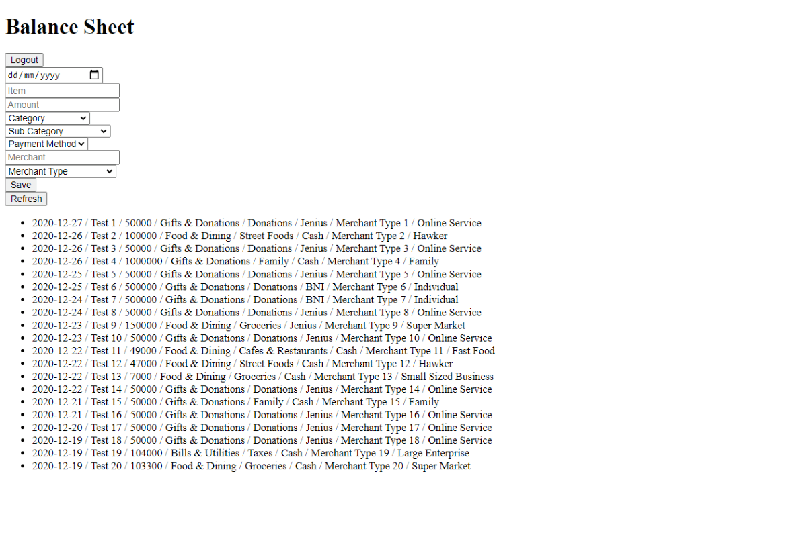
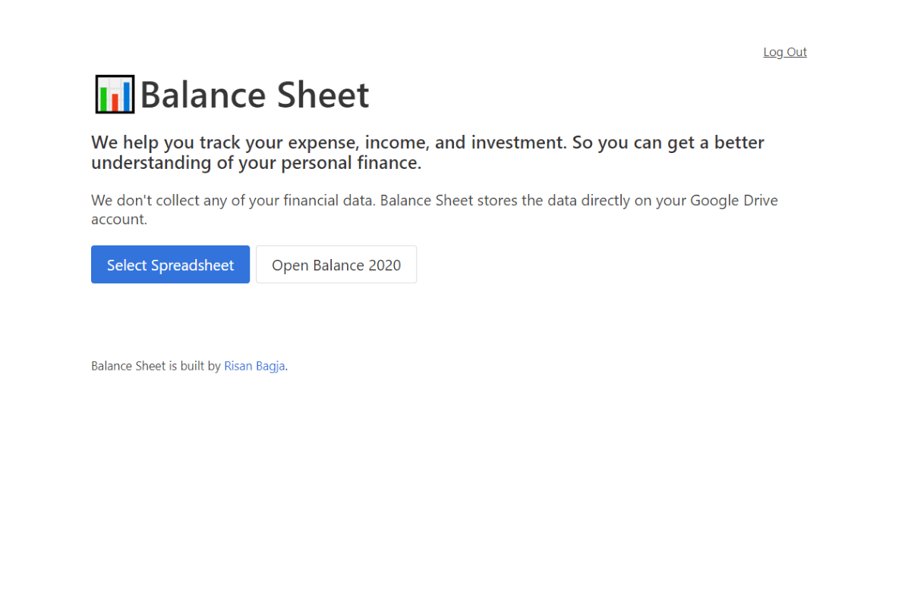
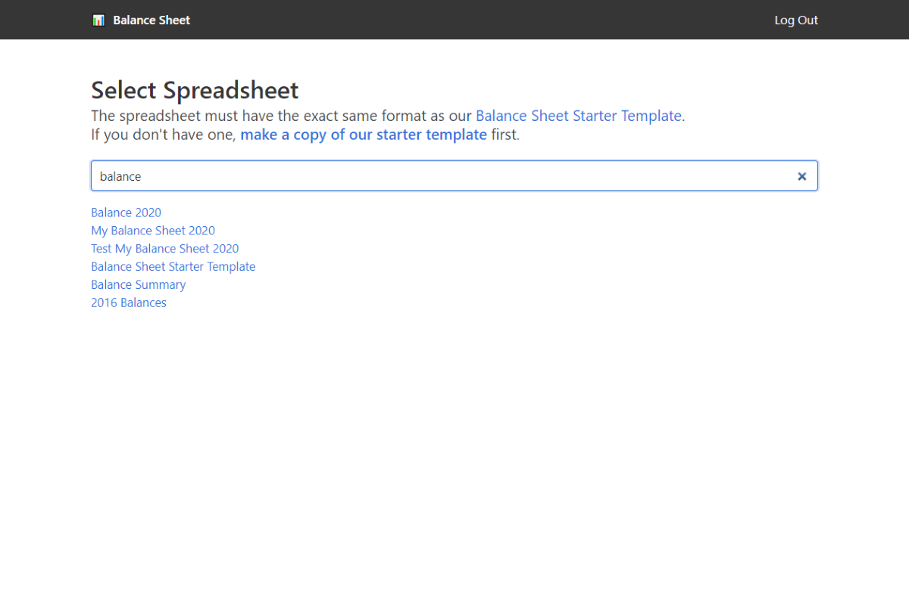
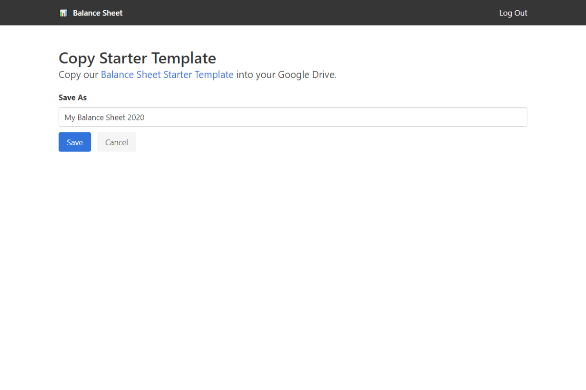
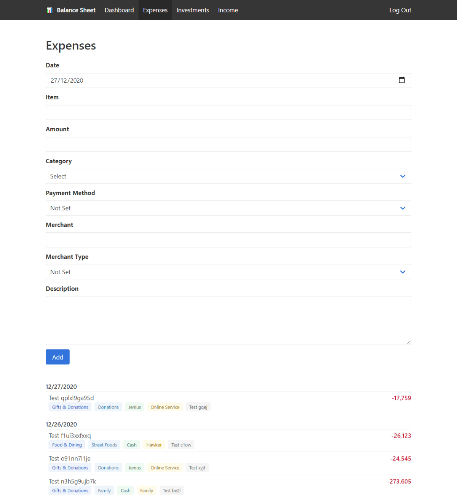
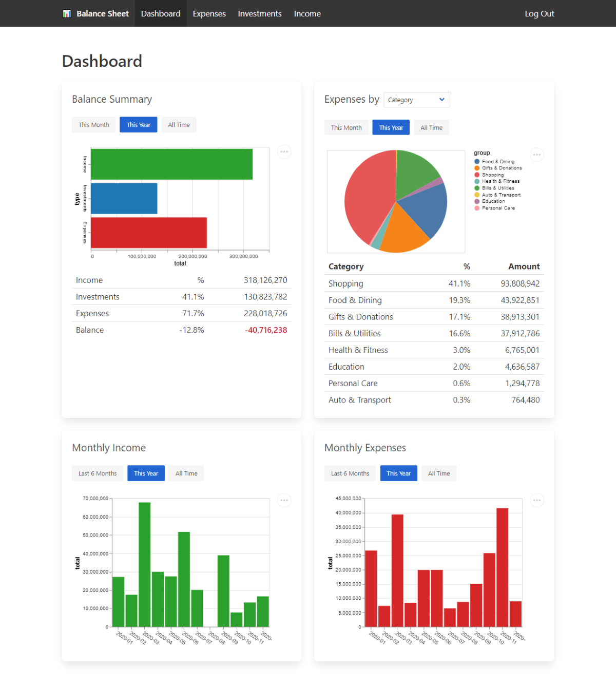

I've tried so many applications to track my spending in the past. None of them stick with me for six months, at least. I always found myself fighting back against those applications. It could be the spending categories that didn't fit my use case. Or some expense related fields that were missing, but I need those details. Or as simple as it didn't have a web version, so I couldn't log my spending while I was on my laptop.

Since December last year, I've been using Google Sheets to track my daily expenses, income, and investments. And it just works! I can have flexible spending categories.  Or put as much or as little spending detail to record. And I can access it through my phone or my PC.

However, the problem started to arise just a month ago. As my spreadsheet started to grow more than 1,000 rows, it takes some time for me to input a new record on my phone. I have to scroll to the bottom of the spreadsheet to add a new one. It's not the best experience to work with a spreadsheet with many columns on the phone. Though it still works great on a PC.

So I built a simple web-app that will programmatically append a new record to my Google Sheets. It was a bare-bones HTML+JS application. Just look at that ugly form. Even the spreadsheet ID was hardcoded, so I was the only one that can use the app. It worked great! I no longer need to open my Google Spreadsheet and scroll down to the bottom to add a new record.

Last week I decided to start [building more stuff again](/blog/lets-build-stuff-again/). So why not start with ramping up this expense tracking app? I named this app "Balance Sheet" simply because it's the name I use for my spreadsheet. Besides expenses, I also track my income and investments on Google Sheets. I built the form only for spending because that was the one that I use more often.

You can check out the web-app at [balancesheet.netlify.app](https://balancesheet.netlify.app/). Note that you will get a warning from Google because this app is not verified yet. I do not use any database. This app works directly with the Google Sheets and Google Drive APIs. I can guarantee you that this app won't collect any of your data. You can always check your Network tab and see that it will only send XHR to the Google API endpoint. To proceed, you can click on the "Advanced" button, then continue to open this website.

Here are some screenshots of this app. Note that these are coming from some randomly generated data, not my actual finance data.

\

I used vanilla JavaScript to build the first version. Now the Balance Sheet is much more sophisticated in terms of its tech stacks:

- [Vue.js](https://v3.vuejs.org/) version 3 for the framework.
- [Vue Router](https://router.vuejs.org/) for routing.
- [Vuex](https://vuex.vuejs.org/) mainly for managing authentication state and interfacing with Google Sheets API.
- [Vue CLI](https://cli.vuejs.org/) for tooling.
- [VeeValidate](https://vee-validate.logaretm.com/v4/) and [Yup](https://github.com/jquense/yup) for easy form validation.
- [Vega-Lite](https://vega.github.io/vega-lite/) for visualizing the financial data.
- [Bulma](https://bulma.io/) to make this app more pleasant to look at.
- [Netlify](https://www.netlify.com/) to host the web app for free.
