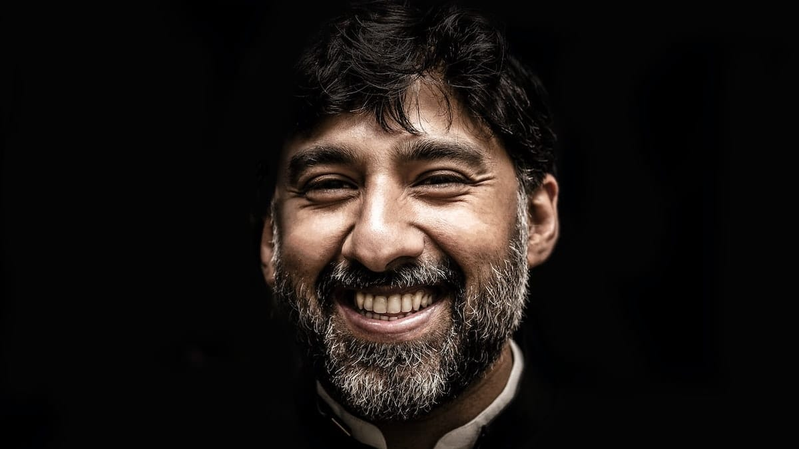

Siapa yang tidak pernah berurusan dengan ruwetnya birokrasi di negeri yang tercinta ini? Mungkin rekan-rekan sering menghadapi situasi seperti ini saat akan membuat KTP, memperpanjang SIM, mengajukan usulan acara atau peminjaman fasilitas-fasilitas umum.

Saya sendiri akhir-akhir ini sering berurusan dengan bertele-telenya proses birokrasi. Harus izin ke Pak A dulu lah, harus membuat surat ke Ibu B dulu lah, harus ada persetujuan dari bagian C dulu lah; intinya: repot dan memakan waktu.

Bayangkan, baru-baru ini saya meminta izin untuk penggunaan laboratorium untuk mengerjakan proyek Korindo (Kontes Roket Indonesia), namun sampai saat ini tim kami terpaksa nebeng dengan tim robot.

Belum lagi masalah dana. Dana untuk pengerjaan proyek tersebut baru akan dikucurkan pada bulan Maret, padahal tahap evaluasi kedua jatuh pada tanggal 12 Maret! Mungkin tidak akan menjadi masalah apabila komponen-komponen yang dibutuhkan harganya terjangkau, namun masalahnya harga perkomponennya ratusan ribu bahkan ada yang mencapai 1 juta. Padahal itu untuk kepentingan pendidikan.

Lain ceritanya ketika beberapa hari yang lalu. Saya, kang Arif, kang Lea dan kang Iki menyambangi kembali SMA Negeri 11 Bandung di bilangan Tegalega. Maksud kami ke sana adalah untuk mempresentasikan mikroskop cahaya milik SMA Negeri 11 yang telah kami (ditambah Pak Jon, terimakasih bapak!) ubah menjadi mikroskop digital.

Dikarenakan semua guru-guru di sekolah tersebut sedang mengadakan rapat selama tiga hari, maka jadwal presentasi kami terpaksa diundur. Kamipun memutuskan untuk meminjam kembali mikroskop tersebut dan hal yang jarang terjadi akhirnya terjadi, berikut kira-kira cuplikan percakapannya:

Kang Arif: "Pak, kalau gitu mikroskopnya boleh kita bawa lagi?"\
Pak Guru yang Budiman: "O, silakan."\
Kang Arif: "Suratnya gimana Pak? Kita kan minjemnya cuma 1 minggu."\
Pak Guru yang Budiman: "Arif percaya sama bapak?"\
Kang Arif: "Percaya Pak."\
Pak Guru yang Budiman: "Bapak juga percaya sama Arif, bawa aja mikroskopnya."

Saat itu saya hanya bisa tercengang, sungguh bapak Guru yang budiman! Padahal seminggu sebelumnya kita diharuskan untuk membuat surat peminjaman mikroskop tersebut.

Sayang saya tidak tahu nama bapak guru itu, mungkin akan seperti itulah keadaan di negeri ini ketika semua orangnya sudah jujur dan saling percaya, tidak ada curiga-mencurigai, tidak ada prosedur abal-abal yang hanya akan memakan waktu.

Foto dari [Unsplash](https://unsplash.com/photos/7omHUGhhmZ0) oleh [Aatik Tasneem](https://unsplash.com/@aatiktasneem).
