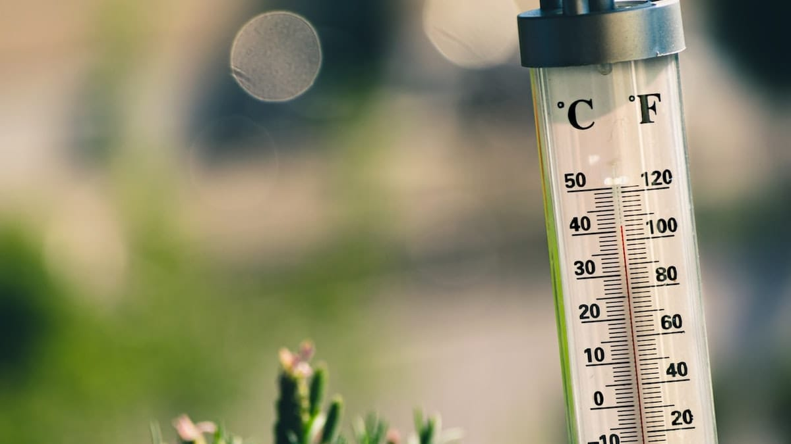

Bentuknya seperti tabung yang memanjang\
Di salah satu ujungnya terdapat tonjolan berbentuk bola

Kebanyakan panjangnya seperti pena, hanya lebih panjang sedikit\
Diameternya pun seperti pena, hanya lebih kecil sedikit\
Beratnya cukup ringan

Bahannya terbuat dari kaca bening, jadi jangan sampai jatuh\
Di dalamnya terdapat saluran yang memanjang dari satu sisi ke sisi yang lain\
Di dalam saluran tersebut terdapat cairan raksa berwarna merah\
Raksa tersebut mengendap dari dalam tonjolan bola, kemudian merambat mengisi sebagian saluran

Sepanjang saluran itu terdapat garis-garis hitam yang mengapit\
Di salah satu ujung garis-garis tersebut tertuliskan angka-angka\
Dari mulai pangkal tonjolan bola angka yang tertuliskan: 0\
Naik terus sepanjang saluran angka yang dituliskan menaik pula: 5, 10, 15, 20, 25(1)\
Terus hingga ujung saluran dituliskan: 100

Apabila suhu disekitarnya naik, maka cairan raksa akan ikut merambat naik sepanjang saluran\
Apabila suhu disekirnya turun, maka cairan raksa akan ikut menyusut turun

Angka tempat batas atas yang dirambati thermometer ini menunjukan suhu disekitarnya\
Alat ini biasa ditemukan di dalam laboratorium, klinik kesehatan, kotak P3K atau lemari milik dokter

Alat ini juga berguna untuk mengukur suhu tubuh\
Sisipkan saja dia di ketiak, mulut atau [maaf] dubur

Sekarang alat ini ada yang lebih modern\
Bukan lagi tinggi raksa sebagai pengukurnya,\
tetapi beda potensial listrik yang dihasilkan sensor(2)\
Bukan lagi angka dan garis-garis hitam sebagai penandanya,\
tetapi layar LCD yang mampu menampilkan sederet angka\

(1) Angka-angka tersebut dalam skala Celcius\
(2) Sensor yang umum digunakan adalah LM35 dengan kenaikan linier sebesar 10mV/°C, jangkuan suhu -55°C sampai 150°C serta tingkat ketelitian 0,5°C pada suhu 25°C

—Terinspirasi dari pertanyaan seorang dosen

Foto dari [Unsplash](https://unsplash.com/photos/ynwGXMkpYcY) oleh [
Jarosław Kwoczała](https://unsplash.com/@sumekler).
