The basics of machine learning. There is no code here, only the concepts worth remembering. It comes in two parts: the general ideas, and a worked example of Bayes' rule.



## What is Machine Learning

Two definitions that I like:

* Arthur Samuel (1959): Machine learning is a field of study that gives computers the ability to learn without being explicitly programmed.
* Tom Mitchell (1998): A well-posed learning problem is defined as follows: A computer program is said to learn from experience E with respect to some task T and some performance measure P, if its performance on T, as measured by P, improves with experience E.

Here are two examples to make Mitchell's definition easier to understand:

* In checkers playing example: E: playing thousands of checkers again itself; T: playing checkers; P: probability to win playing checkers against a new opponent.
* In spam filter example: E: watches which emails we mark as spam, T: classify emails as spam or not spam, P: numbers of emails correctly classified as spam/not spam.

## ML Algorithms

Most used machine learning algorithm types:

* Supervised learning: teach the computer how to do something
* Unsupervised learning: let the computer to learn by itself

Other machine learning algorithms:

* Reinforcement learning
* Recommender systems

## Supervised Learning

Here's an example of supervised learning algorithm. A student collects the housing price in Oregon. The student collects the house's size and the corresponding price. If we plot this data in a diagram, each "X" corresponds to one data point (1 house).

Suppose we would like to predict the price of our friend's house that has the size of 750 square feet. We can plot a straight line as close as possible to all the data points that we have. From that line we can see that a 750 square feet house would have a price of $150,000.

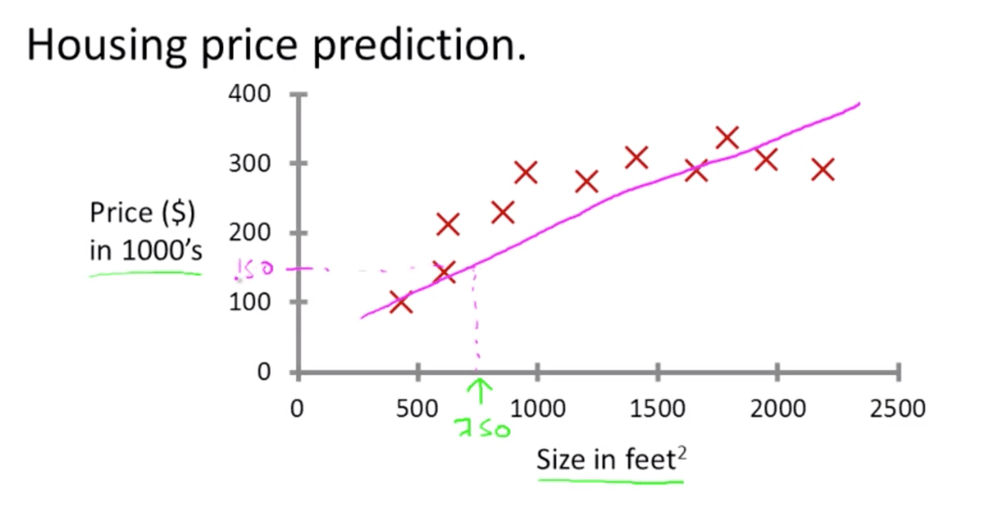

It's possible that the approach above is not the only solution, there's maybe a better one. For example, instead of plotting a straight line we can plot a quadratic function instead or a second-degree polynomial. This curve is closer to our data points than the straight line. And for the 750 square feet house, the price would be $200,000.

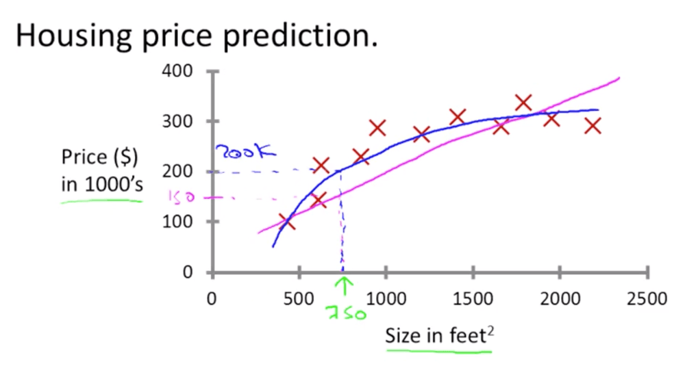

* The term supervised learning is given because the fact that we gave the algorithm a data set in which the "right answers" were given.
* The task of the algorithm is to produce more of these "right answers".
* In our example above, the "right answers" are the houses' prices. In our data set we provided the algorithm with the actual price for each house.
* Our problem above is also called the regression problem.
* Regression: predict continuous valued output, in our case the house's price.

Here's another example of supervised learning. Suppose we collect the data of patients with breast cancer. We collect the tumor size and whether that tumor is malignant or not.

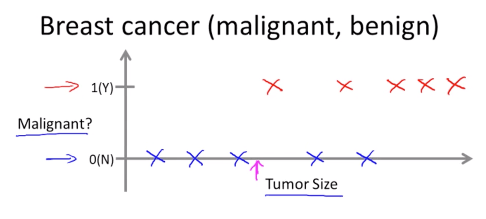

This is also an example of classification problem. Where we try to predict a discrete valued output, in our example it's whether the tumor is malignant or not.

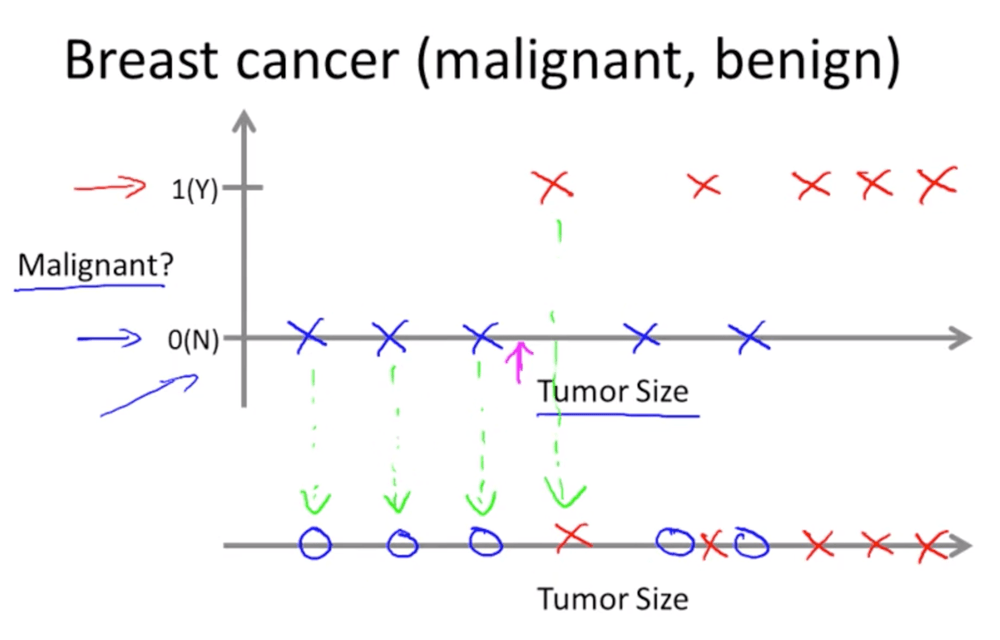

* In classification problem there can be more than two discrete outputs.
* In the example above we only use 1 feature or attribute, namely the "Tumor Size". In other machine learning algorithm, there can be more than one features or attributes. For example, we can use two features: Age and Tumor Size.

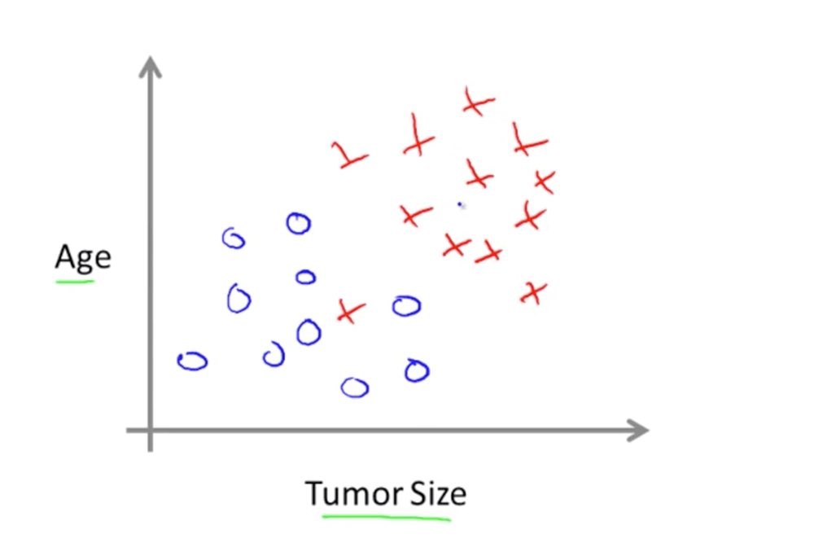

* In this case the machine learning algorithm could plot a straight line to separate the malignant data from the benign one.

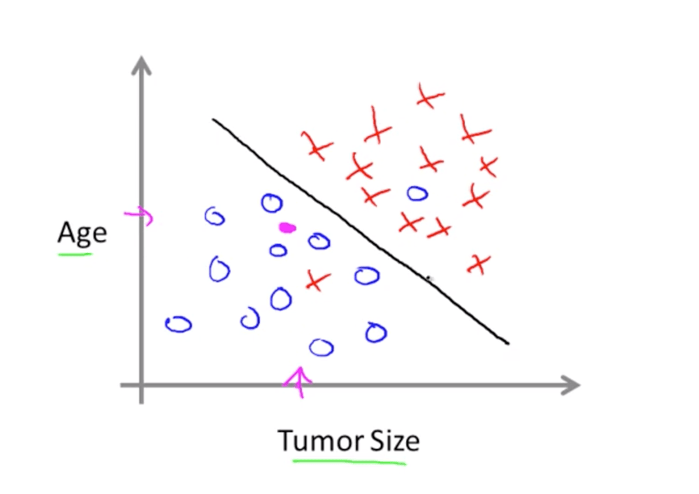

* If we then have a new patient that we would like to predict whether she has a malignant or benign cancer, we simply look at which side of the line she falls. And luckily she falls between the benign group.
* There can also be more than two features, for example we can add: clump thickness, uniformity of cell size, uniformity of cell shape.
* The Support Vector Machine or SVM algorithm can deal with infinite number of features.

## Unsupervised Learning

* In supervised learning we label the data, what's the "right answers". In our example, we labeled the data whether it's malignant or benign cancer.

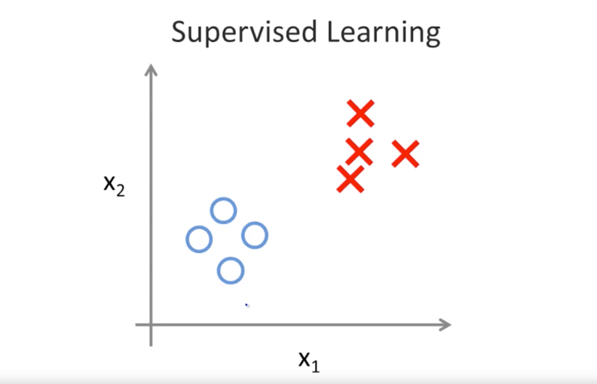

* But in an unsupervised learning, the data has no label.

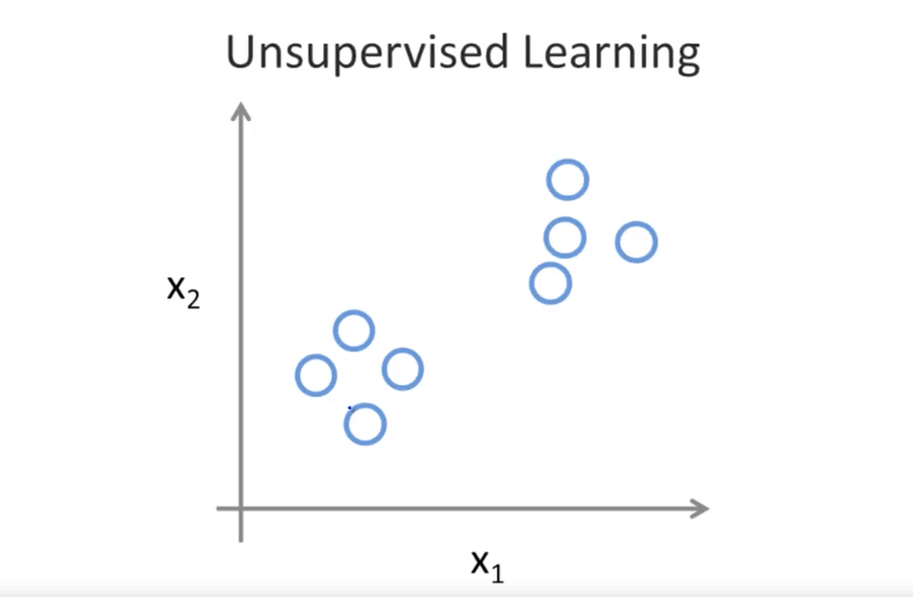

* In an unsupervised learning the algorithm task is to find the structure in the data set. In the example above, the unsupervised learning algorithm might decide to group the data into two clusters. This is also called the "clustering" algorithm.

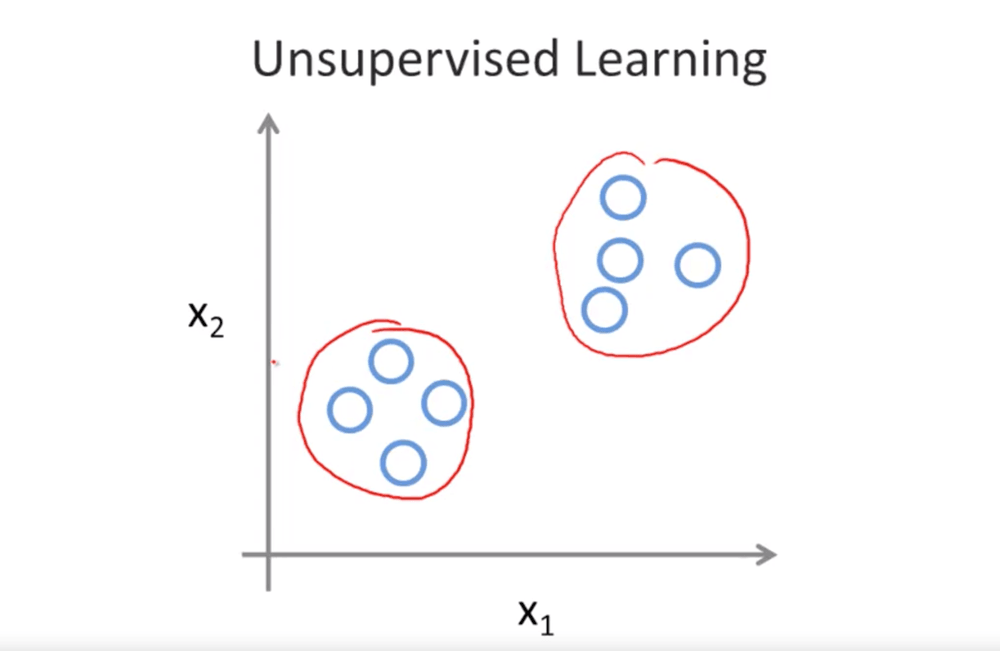

Some examples of the clustering algorithm:

* Google News where it groups similar topic.


* Group individuals based on genes expression.

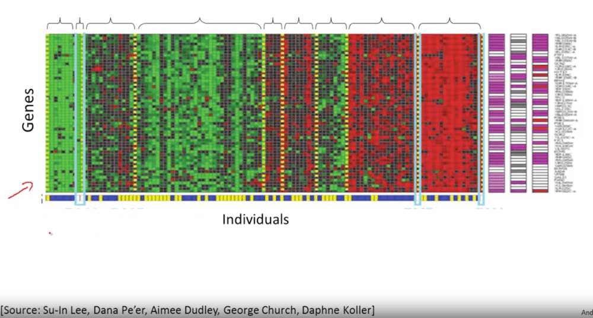

* Organize computing clusters: figuring out which machine tends to work together, this way we can make a more efficient datacenter.
* Social network analysis: given knowledge which person you emailed the most, automatically identify which group of people that know each other.
* Market segmentation: company usually have a huge data of customers, we can use unsupervised learning algorithm to find the market segmentation for each customer. This way the company can be more efficient in targeting each market segment.
* Astronomical data analysis: the clustering algorithm gives a useful theory of how the galaxies are form.

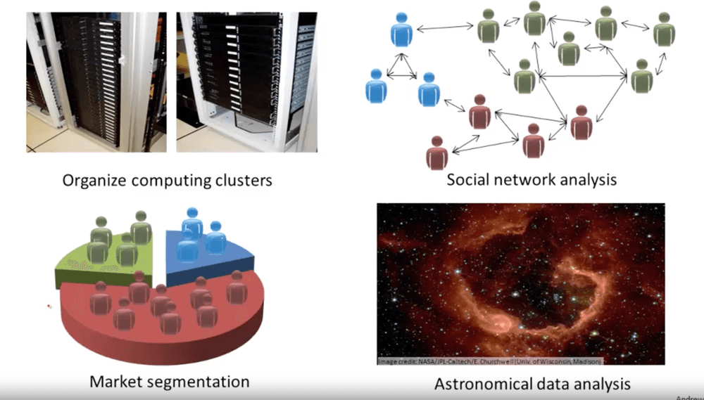

All of these are the "clustering" examples, which is one of the unsupervised learning problem. Here's another example of unsupervised learning: the cocktail party problem.

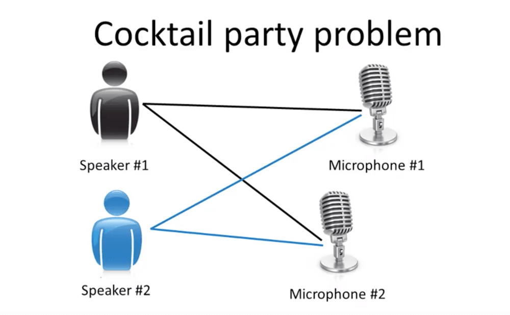

* There are two people talking at the same time. And there are two microphone recording both of the people talking. Mic #1 is closer to the Speaker #1 (Speaker #1 sounds louder here). While Mic #2 is closer to speaker #2 (Speaker #2 sounds louder here).
* We can feed the recording from Mic #1 and Mic #2 together into a Cocktail Party algorithm to separate the voice of Speaker #1 and Speaker #2.
* The Cocktail Party problem algorithm can be done in a single line of code, using SVD: Singular Value Decomposition.

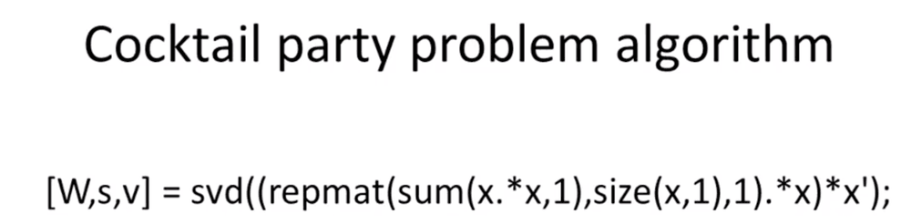

## Supervised vs Not Supervised Examples

Some more notes to tell the two apart:

* Self-driving cars is supervised classification example.
* Supervised means you have bunch of examples and you know the correct answers to some of those examples.
* Acerous vs Non-Acerous. In supervised classification, we look at features on each example. By picking up the right features, we'll have the right result.

Supervised example:

* From a bunch of tagged photos, recognize someone in a picture.
* Given someone's music choices and bunch of features of that music (tempo, genre, etc) recommend a new song. (recommender system)

Not supervised example:

* Analyze bank data for weird looking transaction and flag those for fraud. (no description about weird looking transaction)
* Cluster student into types based on learning style. (we don't know how many types there is)

Some terms:

* In machine learning, we often use "features" as an input to get "label" as an output.
* For example a song can have features like: tempo, genre, voice gender. And the output can be LIKE the song or DISLIKE the song.
* Decision surface use to clearly separate different classes on scatter plot.

## Bayes Rule

To close, a worked example of Bayes' rule with a cancer test.

```
PRIOR PROBAILITY
Let say a probability of cancer in a population is 1%. This is the prior probability: P(C) = 0.01

THE TEST EVIDENCE
- Given a person WITH a CANCER, he/she has the probability of 90% to get a POSITIVE cancer test result. This is called the test sensitivity: P(pos|C) = 0.9

- Given a person WITHOUT a CANCER, he/she has the probability of 90% to get a NEGATIVE cancer test result. This is calles the test specitivity: P(neg|Cnot) = 0.9

THE POSTERIOR PROBABILITY?
Now the qustion is, what is the probability of people to get a CANCER given POSITIVE test result?

We'll need a prior probability and test evidence to arriave at posterior probability.

Prior Probability x Test Evidence => Posterior Probability

JOINT PROBABILITY OF TWO EVENTS
P(C|pos) = P(C) * P(pos|C)
		   = 0.01 * 0.9 = 0.009

PROBABILITY NOT TO GET CANCER GIVEN POSITIVE TEST
P(Cnot|pos) = P(Cnot) * P(pos|Cnot)
			   = 0.99 * 0.1 = 0.099

To get P(pos|Cnot):
We know that P(neg|Cnot) = 0.9
Thus P(pos|Cnot) = 0.1

NORMALIZING
P(C|pos) = P(C) * P(pos|C) = 0.009
P(Cnot|pos) = P(Cnot) * P(pos|Cnot) = 0.099

the above equations also known as joint probability of two events and can be combined into:
P(pos) = P(C|pos) + P(Cnot|pos) = 0.108
```
